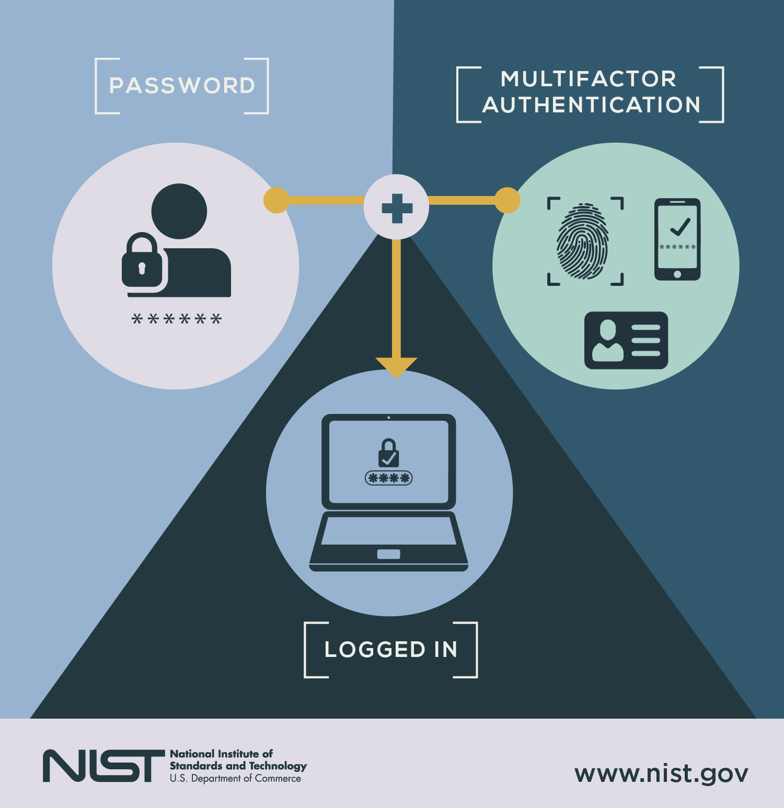
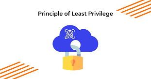

# Volledige onderzoeken iteratie 1

# 1. Hoe flexibel is het rolbeheer in elke applicatie?

#### 1.1 Google Workspace

- **Aangepaste Rol Creatie**:
    - Beschikbaar in Enterprise en Education Enterprise edities
    - Vereist Super Admin of "Manage Roles" rechten
    - Maximum van 100 aangepaste rollen per organisatie
    - Sommige rechten zijn gereserveerd voor vooraf gedefinieerde rollen
    - Aangepaste rollen hebben altijd minder rechten dan admin rollen

- **Rechten Granulariteit**:
    - Meer dan 1.000 verschillende rechten beschikbaar
    - Fijnmazige controle over specifieke diensten
    - Kan toegang tot specifieke functies binnen diensten beheren
    - Ondersteunt zowel brede als specifieke rechten sets

- **Rol Toewijzing Flexibiliteit**:
    - Kan toewijzen aan:
        - Individuele gebruikers
        - Groepen
        - Organisatorische eenheden (OUs)
    - Ondersteunt rol overerving via OUs
    - Meerdere rollen per gebruiker/groep mogelijk
    - Tijdelijke of permanente toewijzingen

- **Dynamische Rol Updates**:
    - Real-time rol wijzigingen
    - Direct effect na toewijzing
    - Ondersteuning voor bulk rolbeheer
    - Admin SDK (Software Development Kit) voor programmatisch beheer
    - Geautomatiseerde roltoewijzingen mogelijk

- **Vereisten**:
    - Enterprise of Education Enterprise licentie vereist
    - Correcte Admin Console setup
    - Juiste organisatorische structuur
    - API toegang voor Admin SDK gebruik

#### 1.1.1 Nexus Repository

- **Aangepaste Rol Creatie**:
    - Ondersteunt aangepaste rol creatie via UI (User Interface) en API (Application Programming Interface)
    - Rollen kunnen worden gemaakt op repository, repository groep, of globaal niveau
    - Geen harde limiet op aantal aangepaste rollen
    - Kan meerdere rechten combineren in enkele rollen
    - Aangepaste rollen hebben altijd minder rechten dan admin rollen

- **Rechten Granulariteit**:
    - Fijnmazige rechten voor:
        - Repository toegang
        - Component beheer
        - Beveiligingsinstellingen
        - Gebruikersbeheer
    - Kan rechten instellen op repository of component niveau
    - Ondersteunt zowel lees- als schrijfrechten

- **Rol Toewijzing Flexibiliteit**:
    - Kan toewijzen aan:
        - Individuele gebruikers
        - Groepen
        - LDAP (Lightweight Directory Access Protocol) groepen
    - Ondersteunt rol overerving
    - Meerdere rollen per gebruiker/groep
    - Kan rollen toewijzen aan specifieke repositories

- **Dynamische Rol Updates**:
    - Real-time rol wijzigingen
    - API beschikbaar voor programmatisch beheer
    - Ondersteunt bulk roltoewijzingen
    - Wijzigingen hebben direct effect

#### 1.1.2 Jenkins

- **Aangepaste Rol Creatie**:
    - Role-based Authorization Strategy plugin vereist
    - Ondersteunt globale en project-specifieke rollen
    - Kan rollen maken met specifieke rechten
    - Geen harde limiet op aantal rollen
    - Aangepaste rollen hebben altijd minder rechten dan admin rollen

- **Rechten Granulariteit**:
    - Zeer fijnmazige rechten
    - Kan beheren:
        - Job toegang
        - Build rechten
        - Weergave rechten
        - Systeem configuratie
        - Credential beheer
    - Ondersteunt patroon-gebaseerde rechten

- **Rol Toewijzing Flexibiliteit**:
    - Kan toewijzen aan:
        - Individuele gebruikers
        - Groepen
        - LDAP groepen
    - Ondersteunt rol overerving
    - Meerdere rollen per gebruiker/groep
    - Project-specifieke roltoewijzingen

- **Dynamische Rol Updates**:
    - Wijzigingen vereisen plugin herladen
    - API beschikbaar voor programmatisch beheer
    - Ondersteunt bulk roltoewijzingen
    - Wijzigingen hebben effect na herladen

#### 1.1.3 Gitea

- **Aangepaste Rol Creatie**:
    - Ingebouwd rolbeheer
    - Ondersteunt organisatie en repository rollen
    - Kan aangepaste rollen maken met specifieke rechten
    - Geen harde limiet op aantal rollen
    - Aangepaste rollen hebben altijd minder rechten dan admin rollen

- **Rechten Granulariteit**:
    - Fijnmazige rechten voor:
        - Repository toegang
        - Issue beheer
        - Pull request beheer
        - Wiki toegang
        - Instellingen beheer
    - Kan rechten instellen op repository of organisatie niveau

- **Rol Toewijzing Flexibiliteit**:
    - Kan toewijzen aan:
        - Individuele gebruikers
        - Teams
        - Organisatie leden
    - Ondersteunt rol overerving
    - Meerdere rollen per gebruiker/team
    - Organisatie-brede roltoewijzingen

- **Dynamische Rol Updates**:
    - Real-time rol wijzigingen
    - API beschikbaar voor programmatisch beheer
    - Wijzigingen hebben direct effect
    - Ondersteunt bulk roltoewijzingen

#### 1.1.4 Atlassian Producten (Jira/Confluence)

- **Aangepaste Rol Creatie**:
    - Ondersteunt aangepaste rollen in Jira en Confluence
    - Kan project-specifieke rollen maken
    - Geen harde limiet op aantal rollen
    - Vereist admin rechten
    - Aangepaste rollen hebben altijd minder rechten dan admin rollen

- **Rechten Granulariteit**:
    - Zeer fijnmazige rechten
    - Kan beheren:
        - Project toegang
        - Issue beheer
        - Space toegang
        - Content beheer
        - Administratie rechten
    - Ondersteunt zowel globale als project-specifieke rechten

- **Rol Toewijzing Flexibiliteit**:
    - Kan toewijzen aan:
        - Individuele gebruikers
        - Groepen
        - Applicatie rollen
    - Ondersteunt rol overerving
    - Meerdere rollen per gebruiker/groep
    - Project-specifieke roltoewijzingen

- **Dynamische Rol Updates**:
    - Real-time rol wijzigingen
    - API beschikbaar voor programmatisch beheer
    - Wijzigingen hebben direct effect
    - Ondersteunt bulk roltoewijzingen

#### 1.1.5 1Password

- **Aangepaste Rol Creatie**:
    - Ondersteunt aangepaste rollen in Business en Enterprise plannen
    - Kan rollen maken met specifieke kluis toegang
    - Beperkt tot vooraf gedefinieerde rechten sets
    - Maximum van 100 aangepaste rollen
    - Aangepaste rollen hebben altijd minder rechten dan admin rollen

- **Rechten Granulariteit**:
    - Kluis-niveau rechten
    - Kan beheren:
        - Kluis toegang
        - Item beheer
        - Gebruikersbeheer
        - Groepsbeheer
    - Beperkt tot vooraf gedefinieerde rechten combinaties

- **Rol Toewijzing Flexibiliteit**:
    - Kan toewijzen aan:
        - Individuele gebruikers
        - Groepen
    - Ondersteunt rol overerving
    - Meerdere rollen per gebruiker/groep
    - Kluis-specifieke roltoewijzingen

- **Dynamische Rol Updates**:
    - Real-time rol wijzigingen
    - API beschikbaar voor programmatisch beheer
    - Wijzigingen hebben direct effect
    - Ondersteunt bulk roltoewijzingen

#### 1.1.6 Email (Generiek)

- **Aangepaste Rol Creatie**:
    - Hangt af van email provider
    - Meestal beperkt tot vooraf gedefinieerde rollen
    - Basis rechten sets
    - Beperkte aanpassingsmogelijkheden
    - Aangepaste rollen hebben altijd minder rechten dan admin rollen

- **Rechten Granulariteit**:
    - Basis rechten niveaus:
        - Volledige toegang
        - Verzenden namens
        - Alleen-lezen
        - Geen toegang
    - Beperkte fijnmazige controle
    - Provider-afhankelijke mogelijkheden

- **Rol Toewijzing Flexibiliteit**:
    - Kan toewijzen aan:
        - Individuele gebruikers
        - Groepen
    - Beperkte rol combinaties
    - Basis overervingsopties
    - Provider-specifieke beperkingen

- **Dynamische Rol Updates**:
    - Wijzigingen kunnen sync tijd vereisen
    - Beperkte API ondersteuning
    - Wijzigingen zijn mogelijk niet direct
    - Basis bulk beheer

#### 1.1.7 Slack

- **Aangepaste Rol Creatie**:
    - Ondersteunt aangepaste rollen in Enterprise Grid
    - Beperkt tot vooraf gedefinieerde rechten sets
    - Kan rollen maken met specifieke kanaal toegang
    - Maximum van 100 aangepaste rollen
    - Aangepaste rollen hebben altijd minder rechten dan admin rollen

- **Rechten Granulariteit**:
    - Kanaal-niveau rechten
    - Kan beheren:
        - Kanaal toegang
        - Bericht rechten
        - Bestandsdeling
        - App beheer
    - Beperkt tot vooraf gedefinieerde rechten combinaties

- **Rol Toewijzing Flexibiliteit**:
    - Kan toewijzen aan:
        - Individuele gebruikers
        - Gebruikersgroepen
    - Ondersteunt rol overerving
    - Meerdere rollen per gebruiker/groep
    - Workspace-brede roltoewijzingen

- **Dynamische Rol Updates**:
    - Real-time rol wijzigingen
    - API beschikbaar voor programmatisch beheer
    - Wijzigingen hebben direct effect
    - Ondersteunt bulk roltoewijzingen

#### 1.1.8 GlassFrog

- **Aangepaste Rol Creatie**:
    - Rol-gebaseerd door ontwerp
    - Beperkt tot vooraf gedefinieerde rollen
    - Focus op organisatorische rollen
    - Geen aangepaste rol creatie mogelijk
    - Aangepaste rollen hebben altijd minder rechten dan admin rollen

- **Rechten Granulariteit**:
    - Rol-gebaseerde rechten
    - Kan beheren:
        - Circle toegang
        - Roltoewijzingen
        - Vergadering beheer
        - Document toegang
    - Beperkt tot vooraf gedefinieerde rechten sets

- **Rol Toewijzing Flexibiliteit**:
    - Kan toewijzen aan:
        - Individuele gebruikers
        - Rol invullers
    - Ondersteunt rol overerving
    - Één rol per persoon per circle
    - Circle-specifieke roltoewijzingen

- **Dynamische Rol Updates**:
    - Real-time rol wijzigingen
    - Beperkte API ondersteuning
    - Wijzigingen hebben direct effect
    - Handmatig rolbeheer

## 2. Hoe werkt RBAC in Keycloak?

### 2.1 Basis RBAC Structuur

- **Realms**:
    - Hoogste niveau van isolatie
    - Elke realm heeft zijn eigen users, roles en permissions
    - Kan meerdere realms hebben voor verschillende organisaties/omgevingen

- **Clients**:
    - Applicaties die zijn geïntegreerd met Keycloak
    - Elke client kan zijn eigen roles en permissions hebben
    - Ondersteunt verschillende authentication flows

- **Roles**:
    - **Client Roles**: Specifiek voor een bepaalde client
    - **Realm Roles**: Beschikbaar voor alle clients binnen een realm
    - **Composite Roles**: Roles die andere roles bevatten
    - **Default Roles**: Automatisch toegewezen aan nieuwe users

### 2.2 Role Assignment en Beheer

- **Role Assignment**:
    - Kan roles toewijzen aan:
        - Individuele users
        - Groups
        - Client-specifieke roles
    - Ondersteunt zowel directe als indirecte role assignment
    - Kan roles toewijzen via UI of API

- **Role Inheritance**:
    - Ondersteunt composite roles (roles binnen roles)
    - Kan roles combineren voor complexe permission structures
    - Automatische inheritance of permissions

### 2.3 Permissions en Policies

- **Scope-based Permissions**:
    - Kan permissions definiëren op resource niveau
    - Ondersteunt fine-grained access control
    - Kan permissions koppelen aan specifieke actions

- **Policy Enforcement**:
    - UMA (User-Managed Access) 2.0 ondersteuning
    - Kan policies definiëren voor resource access
    - Ondersteunt verschillende evaluation strategies

### 2.4 Integratie en API

- **API Support**:
    - REST API voor role management
    - Admin CLI voor script-based management
    - Support voor verschillende integration patterns

- **Protocol Support**:
    - OpenID Connect
    - OAuth 2.0
    - SAML 2.0

- **Integration Features**:
    - LDAP user federation
    - Kerberos integration
    - Social identity providers

### 2.5 Dynamisch Role Management

- **Real-time Updates**:
    - Wijzigingen hebben direct effect
    - Ondersteunt bulk operations
    - Kan roles dynamisch toewijzen/verwijderen

- **Event Handling**:
    - Kan events afvuren bij role changes
    - Ondersteunt webhooks voor notifications
    - Kan actions automatiseren bij role changes

## 3. Ondersteunt Keycloak geneste rollen?

Ja, Keycloak ondersteunt geneste rollen via zijn "Composite Roles" functionaliteit. Hier is een gedetailleerde uitleg:

1. **Composite Roles Structuur**:
    - Keycloak staat toe dat rollen andere rollen bevatten, wat een hiërarchische structuur creëert
    - Een composite role kan rechten erven van meerdere andere rollen
    - Deze overerving is automatisch en transitief (als role A role B bevat, en role B bevat role C, dan krijgt role A
      automatisch de rechten van role C)

2. **Soorten Rollen in Keycloak**:
    - **Client Roles**: Specifiek voor een bepaalde client applicatie
    - **Realm Roles**: Beschikbaar voor alle clients binnen een realm
    - **Composite Roles**: Kan zowel client als realm roles combineren
    - **Default Roles**: Automatisch toegewezen aan nieuwe gebruikers

3. **Role Inheritance Functionaliteiten**:
    - Ondersteunt zowel directe als indirecte roltoewijzing
    - Kan rollen combineren voor complexe permission structures
    - Automatische overerving van rechten van bevatte rollen
    - Kan worden beheerd via zowel UI als API

4. **Implementatie Details**:
    - Composite roles kunnen worden gemaakt en beheerd via:
        - Keycloak Admin Console (UI)
        - REST API
        - Admin CLI
    - Wijzigingen aan composite roles hebben direct effect
    - Ondersteunt bulk operaties voor rolbeheer

5. **Gebruikssituaties**:
    - Creëren van hiërarchische rolstructuren (bijv. "Manager" role die "Employee" role bevat)
    - Combineren van meerdere rolrechten in een enkele role
    - Opbouwen van complexe permission structures voor verschillende organisatieniveaus
    - Implementeren van role-based access control over meerdere applicaties

6. **Voordelen**:
    - Flexibel rolbeheer
    - Verminderde rolduplicatie
    - Eenvoudiger onderhoud van rolhiërarchieën
    - Ondersteuning voor complexe organisatiestructuren
    - Real-time permission updates

7. **Beperkingen**:
    - Hoewel Keycloak geneste rollen ondersteunt, is het belangrijk om te voorkomen dat er te complexe rolhiërarchieën
      worden gecreëerd omdat deze moeilijk te beheren kunnen worden
    - Circulaire afhankelijkheden tussen rollen moeten worden vermeden
    - Prestaties kunnen worden beïnvloed bij zeer diepe rolhiërarchieën

Deze ondersteuning voor geneste rollen maakt Keycloak bijzonder geschikt voor complexe organisatiestructuren waar rollen
rechten moeten erven van meerdere bronnen of waar hiërarchische rolrelaties vereist zijn.

## 4. Hoe goed ondersteunt Keycloak's RBAC-implementatie dynamische rolwijzigingen?

Keycloak biedt robuuste ondersteuning voor dynamische rolwijzigingen via zijn uitgebreide session management en token
exchange mogelijkheden. Het systeem is ontworpen om rolwijzigingen in real-time te verwerken terwijl de beveiliging en
prestaties behouden blijven.

### 4.1 Session Management en Token Exchange

Keycloak's dynamische rolbeheer is voornamelijk gebouwd rond zijn session management systeem. Wanneer rollen worden
gewijzigd, kan het systeem deze wijzigingen op verschillende manieren verwerken:

1. **Token Exchange**: Keycloak ondersteunt token exchange, waardoor dynamische rolupdates mogelijk zijn zonder dat
   gebruikers opnieuw moeten authenticeren. Dit is vooral nuttig in microservices-architecturen waar rolwijzigingen
   moeten worden doorgevoerd in meerdere services. Het token exchange proces is beveiligd en kan worden geconfigureerd
   om de originele gebruikerscontext te behouden terwijl de rechten worden bijgewerkt.

2. **Session Management**: Het systeem biedt uitgebreide session management mogelijkheden. Beheerders kunnen actieve
   gebruikerssessies bekijken en beheren, inclusief de mogelijkheid om sessies ongeldig te maken wanneer rolwijzigingen
   direct effect moeten hebben. Dit is cruciaal voor beveiligingsgevoelige omgevingen waar rolwijzigingen direct van
   kracht moeten worden.

### 4.2 Auditing en Monitoring

Het auditing systeem in Keycloak is geschikt voor het bijhouden van rolwijzigingen. Het biedt:

1. **Uitgebreide Event Logging**: Elke rolwijziging wordt gelogd met gedetailleerde informatie over wie de wijziging
   heeft aangebracht, wanneer deze is aangebracht en welke specifieke wijzigingen hebben plaatsgevonden.

2. **Real-time Monitoring**: De Admin Console biedt real-time inzicht in rolwijzigingen en hun effecten op
   gebruikerssessies. Dit stelt beheerders in staat om snel problemen te identificeren en te reageren die kunnen
   ontstaan door rolwijzigingen.

### 4.3 Prestaties en Schaalbaarheid

Keycloak's architectuur ondersteunt dynamische rolwijzigingen op schaal:

1. **Horizontale Schaling**: Het systeem kan worden geïmplementeerd in een gedistribueerde omgeving, waardoor het
   mogelijk is om grote aantallen rolwijzigingen te verwerken over meerdere instanties.

2. **Caching en Prestaties**: Rolwijzigingen worden efficiënt verwerkt door een combinatie van caching-mechanismen en
   geoptimaliseerde token generatie. Dit zorgt ervoor dat rolupdates de systeemprestaties niet beïnvloeden.

### 4.4 Integratiemogelijkheden

De integratiemogelijkheden van het systeem zijn cruciaal voor dynamisch rolbeheer:

1. **User Federation**: Keycloak ondersteunt verschillende user federation opties, waardoor rolwijzigingen kunnen worden
   gesynchroniseerd met externe systemen zoals LDAP of Active Directory. Dit zorgt voor consistentie in de gehele
   authenticatie-infrastructuur.

2. **API Ondersteuning**: De REST API biedt programmatische toegang tot rolbeheerfuncties, waardoor automatisering van
   rolwijzigingen en integratie met bestaande systemen mogelijk is.

### 4.5 Real-time Rol Updates

- **Direct Effect**:
    - Rolwijzigingen hebben direct effect na toewijzing
    - Wijzigingen worden real-time doorgevoerd in alle geïntegreerde applicaties
    - Token updates worden automatisch verwerkt via session management
    - Gebruikerssessies kunnen worden beheerd en ongeldig gemaakt indien nodig

- **Bulk Operaties**:
    - Ondersteuning voor bulk roltoewijzingen via Admin REST API
    - Kan meerdere gebruikers gelijktijdig bijwerken
    - Efficiënte verwerking van grootschalige rolwijzigingen
    - Token exchange mogelijkheden voor rolupdates

### 4.6 Dynamische Rolbeheer Functies

- **Roltoewijzingsmethoden**:
    - UI-gebaseerd rolbeheer via Admin Console
    - REST API voor programmatische controle
    - Admin CLI voor script-gebaseerd beheer
    - Token exchange voor dynamische rolupdates

- **Automatiseringsmogelijkheden**:
    - Uitgebreid event auditing systeem
    - Aangepaste event listeners voor rolwijzigingen
    - Integratie met externe systemen via federation
    - Geautomatiseerde rolprovisioning via API

### 4.7 Rolwijziging Triggers

- **Event-gebaseerde Updates**:
    - Gebruikersattribuutwijzigingen worden bijgehouden in audit logs
    - Groepslidmaatschapswijzigingen
    - Session-gebaseerde rolupdates
    - Token exchange voor rolwijzigingen

- **Integratiepunten**:
    - LDAP/Active Directory synchronisatie
    - Aangepaste user storage federation
    - Externe identity providers
    - API-gebaseerde integraties met token exchange

### 4.8 Prestatieoverwegingen

- **Schaalbaarheid**:
    - Horizontale schaling ondersteuning
    - Caching-mechanismen voor rolopzoekingen
    - Geoptimaliseerde token generatie en exchange
    - Gedistribueerde implementatie met juiste tuning

- **Beperkingen**:
    - Token grootte overwegingen bij veel rollen
    - Session management overhead
    - Netwerklatentie in gedistribueerde setups
    - Database prestaties bij frequente updates

### 4.9 Monitoring en Auditing

- **Wijzigingsregistratie**:
    - Uitgebreid audit logging systeem
    - Gedetailleerde event tracking
    - Gebruikerssession monitoring
    - Rolwijzigingsgeschiedenis

- **Probleemoplossing**:
    - Real-time monitoring via Admin Console
    - Gedetailleerde audit logs voor debugging
    - Prestatiemetrieken en tuning
    - Session management tools

# Security Features in Keycloak

## 5. Policies (Beleidsregels)


### 5.1 Beleidswijzigingen

Keycloak biedt uitgebreide mogelijkheden om beleidswijzigingen te loggen en naleving te controleren. Hier zijn enkele
belangrijke aspecten:

* **Audit logging:** Keycloak registreert beleidswijzigingen en toegangsverzoeken in audits logs, die beheerders kunnen
  analyseren om verdachte activiteiten en te detecteren.
* **Event listener SPI:** Hiermee kunnen aangepaste loggingmechanismen worden geimplementeerd om beleidswijzigingen vast
  te leggen.
* **Compliance monitoring:** Organisaties kunnen Keycloak integreren met SIEM-tools zoals Splunk of ELK, om nalevering
  te controleren en beveiligingsincidenten te detecteren.
* **Automatische beleidsvalidatie:** Keycloak kan beleidsregels afdwingen via vooraf gedefinieerde
  autorisatiemechanismen, zoals RBAC en ABAC.

### 5.2 Sterke toegangscontrole in Keycloak

Factoren die bijdragen aan een robuuste toegangscontrole in Keycloak zijn onder andere:

* **Fijnmazige autorisatie:** Gebruik *RBAC*, *ABAC*, *CBAC* en andere mechanismen om toegang nauwkeurig te beheren.
* **Dynamische beleidsregels:** Pas toegangsregels aan op basis van context, zoals locatie, apparaat en risiconiveau.
* **Tokenbeheer:** Zorg voor veilige configuratie van *OAuth 2.0 en OpenID connect tokens* om sessiekaping te voorkomen.
* **Regelmatige audits:** Controleer en herzie toegangsrechten om ongeautoriseerde toegang te minimaleren.

#### 5.2.1 Role-Based acces control (RBAC)

* Gebruikersrollen bepalen welke acties een gebruiker mag uitvoeren (Bijv. Admin, Gebruiker, Beheerder)
* **Toegangsbeheer per rol:** Elke rol heeft specifieke rechten, waardoor gebruikers alleen kunnen doen wat hun rol
  toestaat.
* **Rolhiërarchie:** Rollen kunnen worden genest of overgeërfd, om complexere autorisatiemodellen te maken.

#### 5.2.2 Attribute-Based Access Control (ABAC)

* Dynamische toegangcontrole gebaseerd op gebruikersattributen zoals locatie, apparaat, of tijdstip van de dag.
  **Voorbeeld:** Een gebruiker kan alleen documenten bewerken als ze "Manager" zijn en zich binnen kantooruren
  aanmelden.
* **Voordelen:** Flexibeler dan RBAC omdat het rekening houdt met contextuele gegevens

#### 5.2.3 Context-Based Access Control (CBAC)

* **Beoordeling van sessiecontext:** Om te bepalen of een gebruiker toegang mag krijgen.
* **Factoren:** IP-adres, sessietijd en apparaatstatus.
* **Use-case:** Als een gebruiker zich aanmeldt vanaf een onbekend apparaat, kan Keycloak een extra MFA-verificatie
  vereisen.

### 5.3 Sterke authenticatie in Keycloak

* **Multi-Factor Authentication (MFA):** Extra verificatiestappen zoals TOTP, WebAuthn of SMS-verificatie.
* **Federatieve identiteit:** Intergratie met externe identiy providers (IdP) zoals, Azure DB of Okta zorgt voor veilige
  authenticatie.

### 5.4 Tokenbeheer en Sessiebeheer

* **Veilige OAuth 2.0 en OpenID connect tokens:** Correcte configuratie voorkomt sessiekaping en token misbruik.
* **Sessietijdbeheer:** Beperking van sessieduur en automatische vernieuwing van tokens voorkomt ongeautoriseerde
  toegang.

## 6. MFA (Multi-Factor Authentication)



### 6.1 Wat is MFA?

MFA staat voor Multi-Factor-Authenticatie. Dit is een beveiligingsmaatregel die vereist dat gebruikers zich
identificeren met meer dan één bewijs van identiteit voordat ze toegang krijgen tot een systeem of applicatie. Het doel
van MFA is om de kans op ongeautoriseerde toegang te verkleinen door meerdere lagen van beveiliging toe te voegen.

### 6.2 MFA methodes

#### 6.2.1 SMS-authenticatie

* Gebruikers kunnen inloggen met hun telefoonnummer en een eenmalige code die naar hen wordt verzonden via SMS.
* Minder veilig vanwege risico's zoals SIM-swapping en phishing-aanvallen.

#### 6.2.2 OTP (One-Time Password)

* **TOTP(Time-Based One-Time password):** Code wordt gegenereerd door authenticator apps zoals Google authenticator, en
  Microsoft authenticator.
* **HOTP(HMAC-Based One-Time password):** OTP's gebaseerd op een teller in plaats van tijd, minder gangbaar dan TOTP.

#### 6.2.3 Hardware tokens

* **YubiKey** of andere fysieke beveiligingssleutels die FIDO2/WebAuthn ondersteunen.
* Zeer veilig, omdat ze phishing-aanvallen helpen voorkomen.
  ##### 6.2.3.1 FIDO2/WebAuthn
       * FIDO2 is een open standaard voor sterke authenticatie zonder wachtwoord.
       * WebAuthn is de API die het mogelijk maakt om FIDO2-compatibele apparaten te gebruiken voor authenticatie in webapplicaties.
       * Het biedt een veilige manier om gebruikers te verifiëren zonder dat ze hun wachtwoord hoeven in te voeren.

#### 6.2.4 Email-authenticatie

* Een eenmalige code wordt naar het geregistreerde e-mailadres van de gebruiker gestuurd.
* Handig, maar kwetsbaar als e-mailaccount niet goed beveiligd is.

#### 6.2.5 Biometrische authenticatie

* Vingerafdrukken, gezichtsherkenning of irisscans.
* Vereist compatibele hardware en browsers.

#### 6.2.6 Pushmeldingen

* Gebruikers ontvangen een melding op hun telefoon en moeten goedkeuring geven via een app zoals Duo Security.
* Gebruiksvriendelijk en veilig.

#### 6.2.7 Identity provider (IDP) verificatie

* MFA via een externe IDP zoals Okta of Azure AD.
* Handig voor organisaties die federatieve authenticatie gebruiken.
  ##### 6.2.7.1 Federatieve authenticatie
       * Federatieve authenticatie is een methode waarmee gebruikers toegang kunnen krijgen tot meerdere diensten met slechts één keer inloggen.

### 6.3 MFA Uitdagingen & best practices.

#### 6.3.1 Uitdagingen

Multi-Factor Authentication biedt extra beveiliging, maar brengt ook enkele uitdagingen met zich mee:

* **Gebruikerservaring:** MFA kan als omslachtig worden ervaren, vooral als gebruikers meerdere verificatiestappen
  moeten doorlopen.
* **Adoptie en acceptatie:** Sommige gebruikers vinden MFA frustrerend en vermijden het, wat de effectiviteit
  vermindert.
* **Beheer van herstelopties:** Als een gebruiker zijn MFA-methode verliest (bijv. telefoon met authenticator-app), moet
  er een veilig herstelproces zijn.
* **Compatibiliteit:** Niet alle applicaties en systemen ondersteunen alle MFA-methoden, wat integratieproblemen kan
  veroorzaken.
* **Kosten en implementatie:** Het opzetten van MFA vereist tijd en middelen, vooral bij grote organisaties.
* **Phishing en social engineering:** Aanvallers kunnen gebruikers misleiden om hun MFA-codes te delen, waardoor de
  beveiliging wordt omzeild.

#### 6.3.2 Best practices

Om deze uitdagingen te minimaliseren, zijn er enkele best practices:

* **Gebruik een combinatie van MFA-methoden:** Bijvoorbeeld, TOTP en hardware tokens voor extra beveiliging.
* **Maak MFA verplicht voor kritieke accounts:** Beheerders en gebruikers met verhoogde rechten moeten MFA verplicht
  gebruiken.
* **Bied gebruiksvriendelijke opties:** Pushmelding en biometrische verificatie kunnen de gebruikservaring verbeteren.
* **Implementeer adaptieve MFA:** Pas MFA aan op basis van risiconiveau, zoals locatie of apparaat vertrouwen.
* **Educatie en bewustwording:** Train gebruikers om phishing-aanvallen te herkennen en veilig om te gaan met MFA.
* **Regelmatige audits en monitoring:** Controleer MFA-instelling en logs om verdachte activiteiten te detecteren.

### 6.4 Hoe werkt MFA in Keycloak?

MFA wordt ondersteund in Keycloak als extra beveiligingslaag voor gebruikersauthenticatie.

#### 6.4.1 Configuratie MFA

* Beheerders kunnen MFA instellen via de **Keycloak Admin Console**.
* MFA wordt geconfigureerd binnen de **Authenticatieflows**, waar je kunt bepalen wanneer en hoe MFA wordt afgedwongen.
* Je kunt verschillende verificatiemethodes kiezen, zoals **TOTP**, **/SMS**, **e-mail** en **hardware tokens**.
  ##### 6.4.1.1 Slechte configuratie risico's
        * Geen MFA betekent dat aanvallers gemmakkelijker accounts compromitteren.
        * Onbeveiligde federative authenticattie dit kan leiden tot ongeautoriseerde toegang tot meerdere applicaties.

#### 6.4.2 MFA in de authenticatieflow

* Wanneer een gebruiker inlogt, wordt eerst de standaard gebruikersnaam/wachtwoord verificatie uitgevoerd.
* Als MFA is ingeschakeld, wordt een extra verificatiestap vereist voordat toegang wordt verleend.
* De gebruiker moet de gekozen MFA-methode voltooien, zoals het invoeren van een OTP-code of het goedkeuren van een
  pushmelding.

#### 6.4.3 Ondersteunde methoden van MFA in Keycloak

* **TOTP**
* **SMS**
* **E-mail**
* **WebAuthn**
* **Pushmeldingen via externe providers** zoals Duo Security of Microsoft Authenticator.

#### 6.4.4 Beheer en herstel

* Beheerders kunnen MFA instellen als **Optioneel** of **Verplicht** voor specifieke gebruikers of rollen.
* Er moeten herstelopties beschikbaar zijn, zoals **backup-codes** of een administratieve reset bij verlies van een
  MFA-methode.



## 7. Least privilege configuratie

### 7.1 Least privilege

Het least privilege principe betekent dat elke gebruiker of systeemcomponent alleen toegang krijgt tot de middelen die
strikt noodzakelijk zijn voor hun functie.
Dit voorkomt dat gebruikers onnodige rechten hebben die kunnen leiden tot misbruik of beveiligingslekken.

#### 7.1.1 Waarom is Least privilege belangrijk?

* **Beperkt aanvallen:** Minder rechten betekent minder mogelijkheden voor aanvallers om toegang te krijgen tot kritieke
  systemen.
* **Voorkomt laterale beweging:** Aanvallers kunnen zich niet eenvoudig door een netwerk bewegen als ze beperkte rechten
  hebben.
* **Minimaliseert insider threats:** Voorkomt dat kwaadwillende of nalatige medewerkers gevoelige gegevens kunnen
  benaderen.
* **Voldoet aan regelgeving:** Veel compliance-standaarden zoals, GDPR, HIPPA en ISO 27001 vereisen en strikt
  toegangsbeheer.

### 7.2 Rollen structuur Keycloak

Keycloak gebruikt een rol gebaseerd autorisatiemodel (RBAC) om toegangsrechten te beheren.
Dit model is gebaseerd op het toewijzen van rollen aan gebruikers, waarbij elke rol specifieke rechten en premises
heeft.

#### 7.2.1 Belangrijke componenten van rollen in Keycloak

* **Realm Rollen:** Globale rollen die gelden voor alle gebruikers binnen een Keycloak-realm.
* **Client Rollen:** Specifieke rollen die alleen van toepassing zin binnen een bepaalde applicatie (client).
* **Gebruikersgroepen:** Groepen waarin gebruikers worden ingedeeld, zodat ze automatisch bepaalde rollen krijgen.
* **Composite Rollen:** Rollen die bestaan uit meerdere subrollen, waardoor complexe autorisatiemodellen mogelijk zijn

#### 7.2.2 Hoe rollen worden toegewezen

* **Handmatig** via de Keycloak Admin Console.
* **Dynamisch** via identity Providers (IdP) zoals, Azure AD of Okta.
* **Automatisch** via beleidregels en scripts die rollen toewijzen op basis van attributen zoals functie, locatie of
  risiconiveau.

### 7.3 Uitdagingen en best practices Least privilege in Keycloak

#### 7.3.1 Uitdagingen

* **Overtoewijzing van rechten:** Gebruikers krijgen vaak meer rechten dan nodig, wat beveiligingsrisico's verhoogt.
* **Complexiteit van rolbeheer:** Het beheren van honderden rollen en permissies kan lastig zijn zonder een goed beleid.
* **Gebrek aan monitoring:** Zonder audit logs en monitoring kunnen ongeautoriseerde rechten onopgemerkt blijven.
* **Verouderde rollen:** Rollen die niet regelmatig worden herzien kunnen leiden tot ongewenste toegang.

#### 7.3.2 Best practices

* **Gebruik fijnmazige autorisatie:** Combineer RBAC, ABAC en CBAC om toegangscontrole te verfijnen.
* **Voer regelmatige audits uit:** Controleer en herzie rollen en permissies om overtoewijzing te voorkomen.
* **Implementeer Just-In-Time (JIT) toegang:** Geef tijdelijke toegang tot gevoelige systemen in plaats van permanente
  rechten.
* **Gebruik dynamische beleidregels:** Pas toegangsrechten aan op basis van risiconiveau, zoals locatie of apparaat.
* **Monitor en log toegangsverzoeken:** Gebruik SIEM-tools zoals Splunk, Elk of Azure Sentinel om verdachte activiteiten
  te detecteren.

# 8.SCIM/ API synchronisatie

### 8.1 Wat is SCIM?

SCIM staat voor **S**ystem for **C**ross-domain **I**dentity **M**anagement.
Het is een specificatie die "ontworpen is om het beheer van gebruikersidentiteiten in cloudgebaseerde applicaties en
services te vereenvoudigen".
Het is gebaseerd op bestaande implementaties, zoals op het gebied van authenticatie-, autorisatie- en privacymodellen.
Dit zou kosten verlagen en de complexiteit van gebruikersbeheer verminderen.

([scim.cloud](https://scim.cloud/))

### 8.2 Ondersteunt Keycloak SCIM?

[Keycloak ondersteunt SCIM niet standaard](https://github.com/keycloak/keycloak/issues/13484): daar is een plugin voor
nodig, zoals [SCIM for Keycloak](https://scim-for-keycloak.de/).

### 8.3 Wordt SCIM ondersteund door de doelapplicaties?

#### 8.3.1 Google

Dit is niet heel duidelijk gedocumenteerd.
Er is wel
een [Reddit post](https://www.reddit.com/r/gsuite/comments/15y7016/saml_sso_and_scim_auto_provisioning_integration/) die
verwijst naar [een lijst van applicaties die SCIM ondersteunen](https://support.google.com/a/topic/10018788), maar dit
zijn niet allemaal Google applicaties.

Conclusie: **onbekend** ❔

#### 8.3.2 Nexus

[Geen ondersteuning voor SCIM](https://help.sonatype.com/en/user-authentication.html#:~:text=SCIM%20Not%20Supported,identity%20provider%20and%20Nexus%20Repository.).

Conclusie: **nee** ❌

#### 8.3.3 Jenkins

Ook Jenkins ondersteunt SCIM niet. Er is wel
een [plugin voor SAML Single Sign On (SSO)](https://plugins.jenkins.io/miniorange-saml-sp/).
Dit biedt de mogelijkheid om Jenkins te laten authenticeren via Keycloak.
Dit zou dan echter niet volgens SCIM gaan, dus de conclusie is toch negatief.

Conclusie: **nee** ❌

#### 8.3.4 Gitea

[(Nog) geen ondersteuning voor SCIM](https://github.com/go-gitea/gitea/issues/23794#issue-1646128434).
Er is ook geen plugin te vinden die het implementeert.

Conclusie: **nee** ❌

#### 8.3.5 Atlassian

[Ondersteunt SCIM](https://support.atlassian.com/provisioning-users/docs/understand-user-provisioning/).
Er is tevens een uitgebreide documentatiepagina, wat zeker een pluspunt is.

Conclusie: **ja** ✅

#### 8.3.6 1Password

[Ondersteunt SCIM in de Business versie](https://support.1password.com/scim/#:~:text=With%201Password%20Business%2C%20you%20can%20automate%20many%20common%20administrative%20tasks%20by%20connecting%20your%20identity%20provider%20with%20your%201Password%20account%20using%201Password%20SCIM%20Bridge.).
Ook 1Password beschikt
over [uitgebreide documentatie op het gebied van SCIM](https://support.1password.com/scim-best-practices/).

Conclusie: **ja** _(in de Business versie)_ ✅

#### 8.3.7 Slack

[Ondersteunt SCIM](https://slack.com/intl/en-gb/help/articles/212572638-Manage-members-with-SCIM-provisioning#:~:text=Slack%20supports%20member%20provisioning%20with,alongside%20a%20supported%20identity%20provider.).
Er is zelfs [specificatie documentatie voor het bouwen van een eigen script voor SCIM](https://api.slack.com/scim).

Conclusie: **ja** ✅

#### 8.3.8 Glassfrog

Er is online niks te vinden over of er ondersteuning is voor SCIM.
We gaan er dus van uit dat er ook geen ondersteuning is.

Conclusie: **nee** ❌

### 8.4 Wat zijn de voor- en nadelen van het gebruik van SCIM t.o.v. een custom API-sync?

|                  | SCIM | Custom API-sync |
|------------------|------|-----------------|
| Onderhoud        | +    | -               |
| Uitbreidbaarheid | -    | +               |
| Beveiliging      | +    | -               |

SCIM scoort hoog op onderhoud en beveiliging, omdat het een al bestaand systeem is. Developers ervan doen het grootste
deel van het onderhoud dus al voor je. Ook is er door hun nagedacht over security, en hier zullen ook updates voor
uitgevoerd worden. Als je een custom API-sync zou gebruiken, moet je dit allemaal zelf doen.
Wat betreft uitbreidbaarheid is een custom API-sync wel ideaal, omdat je dat systeem volledig in eigen handen hebt. Je
bent dus vrij om aan te passen of toe te voegen wat je maar wilt.

### 8.5 Technische beschrijving van de werking van SCIM met Atlassian en Keycloak

Als eerste wordt er een gebruikersobject gewijzigd in Keycloak (bijv. registratie, activatie, etc.). De Keycloak SCIM
plugin stuurt vervolgens een SCIM call naar Atlassian. De hoofd-endpoint hiervoor is
`https://api.atlassian.com/scim/directory/{directory_id}`. Authenticatie wordt gedaan middels een Bearer-token. Dit is
een API-token die gegenereerd is in Atlassian.

Stel er wordt een gebruiker aangemaakt, dan zou bijvoorbeeld de volgende API-request gebruikt kunnen worden:

```http
POST https://api.atlassian.com/scim/directory/{directory_id}/Users
Authorization: Bearer <api_token>
Content-Type: application/json

{
  "schemas": ["urn:ietf:params:scim:schemas:core:2.0:User"],
  "userName": "voorbeeld@voorbeeld.nl",
  "name": {
    "givenName": "Voorbeeld",
    "familyName": "Voorbeeld"
  },
  "emails": [
    {
      "value": "voorbeeld@voorbeeld.nl",
      "primary": true
    }
  ],
  "active": true
}
```

### 8.6 Kan SCIM ook rollen en permissies tussen systemen synchroniseren?

SCIM is ontworpen om identiteiten, zoals gebruikers en groepen, te synchroniseren tussen systemen. Een groep kan bestaan
uit meerdere rollen, dus je zou op die manier rollen kunnen synchroniseren. Ook is het mogelijk om attributen toe te
voegen aan gebruikers of groepen. Dit biedt echter geen precies permissiebeheer, dus het op deze manier doen zou niet
ideaal zijn. Het zou dus eventueel wel kunnen, maar gezien de hoeveelheid applicaties zou dit niet bepaald een geschikte
oplossing zijn.

## 8.7 Wat zijn de implicaties voor beveiliging van beide oplossingen?

SCIM gebruikt meestal OAuth2 bearer tokens of een API-token. Als je een custom API-sync zou gebruiken, zou je ook wat
anders kunnen kiezen. Hiermee ben je echter wel verantwoordelijk voor een veilige implementatie.

Wat betreft toegangsbeheer is een custom API-sync wel logischer, omdat je dan volledige, precieze controle hebt over wie
waarbij kan.
Met SCIM ben je gelimiteerd tot gebruikers en groepen.

Daarnaast heeft SCIM al ondersteuning voor sommige applicaties. Met een custom API-sync ben je afhankelijk van de API's
van de doelapplicaties, en daar moet je je dan ook in verdiepen. Dit kan dus meer tijd kosten.

# 9. Gebruiker migratie

### 9.1 Ophalen data

De eerste stap bij het overzetten van data is om de data op te halen waar het momenteel opgeslagen wordt.
<br>
Aangezien Keycloak alleen username en password als required heeft bij het aanmaken van een account, kan alle data van
één applicatie komen.
Het ophalen van de data wordt gedaan via de API-endpoints van de desbetreffence applicatie. <br>
Er is gekozen om Jira te gebruiken om alle gebruikersdata op te halen. Zie
de [desbetreffende ARD](../../software-guidebook%2F13-decision-log%2F0001-source-data-migration.md) voor meer uitleg.
Dit wordt gedaan door een POST-request te sturen naar ``` <Jira-base-url>/rest/api/2/user/search?username=.``` met een
admin- username en password.
<br>Hierbij ontvangt de Spring Boot applicatie een string die een array met alle users in een JSON format bevat. Dit zou
er dan bijvoorbeeld zo uitzien:

```JSON 
[
  {
    "self": "http://localhost:8080/rest/api/2/user?username=gort",
    "key": "JIRAUSER10101",
    "name": "gort",
    "emailAddress": "gert@gmail.com",
    "avatarUrls": {
      "48x48": "https://www.gravatar.com/avatar/e7992aa2b59230b746ed1c2d486ac0f3?d=mm&s=48",
      "24x24": "https://www.gravatar.com/avatar/e7992aa2b59230b746ed1c2d486ac0f3?d=mm&s=24",
      "16x16": "https://www.gravatar.com/avatar/e7992aa2b59230b746ed1c2d486ac0f3?d=mm&s=16",
      "32x32": "https://www.gravatar.com/avatar/e7992aa2b59230b746ed1c2d486ac0f3?d=mm&s=32"
    },
    "displayName": "gert jansen",
    "active": true,
    "deleted": false,
    "timeZone": "Etc/UTC",
    "locale": "en_US"
  },
  {
    "self": "http://localhost:8080/rest/api/2/user?username=jan",
    "key": "JIRAUSER10000",
    "name": "jan",
    "emailAddress": "jan@gmail.com",
    "avatarUrls": {
      "48x48": "http://localhost:8080/secure/useravatar?avatarId=10341",
      "24x24": "http://localhost:8080/secure/useravatar?size=small&avatarId=10341",
      "16x16": "http://localhost:8080/secure/useravatar?size=xsmall&avatarId=10341",
      "32x32": "http://localhost:8080/secure/useravatar?size=medium&avatarId=10341"
    },
    "displayName": "jan",
    "active": true,
    "deleted": false,
    "timeZone": "Etc/UTC",
    "locale": "en_US"
  },
  {
    "self": "http://localhost:8080/rest/api/2/user?username=peter",
    "key": "JIRAUSER10100",
    "name": "peter",
    "emailAddress": "peter@pan.nl",
    "avatarUrls": {
      "48x48": "https://www.gravatar.com/avatar/18e9e9adb844123fcf10b8a33d81d46f?d=mm&s=48",
      "24x24": "https://www.gravatar.com/avatar/18e9e9adb844123fcf10b8a33d81d46f?d=mm&s=24",
      "16x16": "https://www.gravatar.com/avatar/18e9e9adb844123fcf10b8a33d81d46f?d=mm&s=16",
      "32x32": "https://www.gravatar.com/avatar/18e9e9adb844123fcf10b8a33d81d46f?d=mm&s=32"
    },
    "displayName": "peter pan",
    "active": true,
    "deleted": false,
    "timeZone": "Etc/UTC",
    "locale": "en_US"
  }
]  
```

Omdat dit een string is, moet dit eerst omgezet worden naar de
Record [UserData](..%2F..%2Fwalking-skeleton%2Fsrc%2Fmain%2Fjava%2Fwalking-skeleton%2Frollen-beheer%2Fdatatransfer%2Fdomain%2FUserData.java)
met behulp van
de [JiraUserParser](..%2F..%2Fwalking-skeleton%2Fsrc%2Fmain%2Fjava%2Fwalking-skeleton%2Frollen-beheer%2Fdatatransfer%2FJsonParser%2FJiraUserParser.java).

### 9.2 Uploaden

#### 9.2.1 Keycloak

Voor het uploaden naar keycloak is een API-key nodig.
Dit wordt opgehaald in de getAccessToken functie in
de [KeycloakUserService](..%2F..%2Fwalking-skeleton%2Fsrc%2Fmain%2Fjava%2Fwalking-skeleton%2Frollen-beheer%2Fdatatransfer%2Fservice%2FKeycloakUserService.java)
door een POST-request naar ``` <Keycloak-base-url>/realms/master/protocol/openid-connect/token ``` te sturen.
<br>
Deze POST-request bevat een client_id, en admin- username en password.
De admin-cli is een client die automatisch in een Keycloak applicatie staat.

Met de API-key, een realm en de list van UserData wordt er voor elke user een POST-request gestuurd naar
``` <Keycloak-base-url>/admin/realms/<realm>/users ```. <br>
Omdat het niet mogelijk is om het wachtwoord op te halen van elke user, wordt er een tijdelijk wachtwoord ingesteld en
een flag toegevoegd waardoor alle users een nieuw wachtwoord in moeten stellen.
De flag wordt toegevoegd met
``` user.put("requiredActions", List.of("UPDATE_PASSWORD")); ```
<br>

#### 9.2.2 Locale database

Er is geen prototype gemaakt voor de locale database, aangezien dat best voor zichzelf spreekt. Indien de data
beschikhaar is binnen de Spring Boot applicatie kan dit via Spring Data JDBC makkelijk aan een database worden
toegevoegd.

### 9.3 Conclusie

Gebruikersdata kan automatisch overgezet worden van huidige applicaties naar keycloak met de API-endpoints.
<br>
Een Keycloak account zal de volgende eigenschappen hebben:

- Keycloak username: Jira email
- Keycloak first name: Jira name
- Keycloak password: Tijdelijk wachtwoord
- Elke gebruiker heeft een flag dat het wachtwoord van zijn account verandert moet worden.

# 10. Gebruiker rollen & permissies

### 10.1 Rollen:

Zie bestand RollenTable.md in producten/onderzoeken/RollenSpike/RollenTable.md voor table

#### 10.1.1 Google Workspace:

- **Super Admin** kan alle instellingen beheren, gebruikers toevoegen/verwijderen en rechten aanpassen.
- **Admin** (afhankelijk van type) kan specifieke beheerfuncties uitvoeren, zoals groepsbeheer of
  gebruikersondersteuning.
- **Standaard User** kan inloggen, documenten openen en gedeelde bestanden bewerken.

#### 10.1.2 Atlassian (Jira):

- **Jira-SysteemBeheerders** kunnen nieuwe projecten aanmaken, gebruikersrollen toewijzen en workflows configureren.
- **Ontwikkelaars** kunnen issues aanmaken, toewijzen en de voortgang bijwerken.
- **Gebruikers** kunnen issues bekijken en commentaar geven, maar geen wijzigingen aanbrengen.

#### 10.1.3 Gitea (SonaType):

- **Admin Team** kan repositories beheren, teams aanmaken en instellingen aanpassen.
- **General Team** kan code inzien, pull requests indienen en bijdragen aan goedgekeurde projecten.

#### 10.1.4 Nexus:

- **Admin** kan repositories aanmaken, gebruikersrollen beheren en systeeminstellingen aanpassen.
- **Anonymous** gebruikers kunnen openbare content inzien zonder in te loggen.

#### 10.1.5 Jenkins:

- **Admin** kan pijplijnen configureren, gebruikersrechten instellen en builds beheren.
- **Developer** kan build scripts aanmaken en aanpassen, maar geen rechten wijzigen.
- **Viewer** kan de build status volgen, logs bekijken, maar geen wijzigingen aanbrengen.

#### 10.1.6 Keycloak:

- **Admin** kan nieuwe clients configureren, gebruikersrechten beheren en authenticatieflows aanpassen.
- **User** kan toegang krijgen tot beveiligde applicaties via single sign-on (SSO).
- **Employee** kan toegang krijgen tot bedrijfsapplicaties binnen het systeem, maar heeft geen beheerrechten.

#### 10.1.7 GlassFrog:

- **Admin** kan cirkels en rollen beheren, nieuwe gebruikers toevoegen en rollen aanpassen.
- **Role-Filler** kan specifieke taken binnen een cirkel uitvoeren, maar heeft geen toegang tot beheertaken.

--------------------------------------------------

### 10.2 Rollen & Rechten Inventariseren

Definieer gebruikersgroepen (Admin, Manager, Gebruiker, etc.)(Uitleg over wat deze groepen zijn)

#### 10.2.1 Administrators:

- **Systeembeheerder:** Heeft volledige toegang tot alle systeeminstellingen, gebruikersbeheer en veiligheidsopties.
- **Applicatiebeheerder:** Beheert specifieke applicatie-instellingen en gebruikersrechten binnen die applicatie.
- **Beveiligingsbeheerder:** Verantwoordelijk voor toegangscontrole, auditlogs en beveiligingsconfiguraties.

#### 10.2.2 Ontwikkelaars:

- **Backend Developer:** Heeft toegang tot server-side code, API's en systeemintegraties.
- **Frontend Developer:** Werkt aan de gebruikersinterface en client-side logica.
- **Full-Stack Developer:** Combineert de bevoegdheden van zowel backend- als frontend ontwikkelaars.
- **DevOps Engineer:** Heeft toegang tot CI/CD-pijplijnen, systeemmonitoring en infrastructuurbeheer.
  7

#### 10.2.3 Projectleiders/Product Owners:

- **Product Owner:** Verantwoordelijk voor het beheren van productbacklogs en het prioriteren van features.
- **Scrum Master:** Faciliteert het ontwikkelproces en ondersteunt het team bij het bereiken van sprintdoelen.
- **Project Manager:** Houdt toezicht op de voortgang, planning en rapportage van projecten.

#### 10.2.4 Operationele Gebruikers:

- **Supportmedewerker:** Heeft toegang tot gebruikersbeheer en ondersteuningssystemen.
- **Systeemmonitor:** Toegang tot monitoring dashboards en logbestanden om systeemstatus te controleren.
- **Servicedesk Medewerker:** Beantwoordt gebruikersvragen en registreert problemen.

#### 10.2.5 Gasten/Externe Gebruikers:

- **Gastgebruiker:** Beperkte toegang tot publieke of gedeelde content, vaak alleen voor inzage.
- **Externe Samenwerker:** Tijdelijke toegang tot specifieke projecten of bestanden, zonder beheerrechten.
- **Adviseur/Consultant:** Kan projectrapporten bekijken en feedback geven, maar geen bewerkingen uitvoeren.

### 10.3 Taken per rol in kaart brengen:

#### 10.3.1 **Administrators**

- Beheren van gebruikersaccounts en rollen in het systeem.
- Configureren van systeeminstellingen en beveiligingsopties.
- Monitoren van systeemactiviteit en logbestanden.
- Onderhouden van de infrastructuur (bijvoorbeeld servers en netwerken).
- Implementeren van beveiligingsupdates en patches.

#### 10.3.2 **Ontwikkelaars**

- Schrijven en testen van code voor nieuwe functies.
- Fixen van bugs en uitvoeren van code reviews.
- Bijdragen aan technische documentatie.
- Integreren van API's en externe diensten.
- Samenwerken met andere ontwikkelaars via versiebeheersystemen (zoals Git).

#### 10.3.3 **Projectleiders/Product Owners**

- Plannen en coördineren van projectactiviteiten.
- Stellen van prioriteiten voor ontwikkelteams.
- Communiceren met stakeholders over voortgang en problemen.
- Opstellen en beheren van productbacklogs.
- Zorgen voor de naleving van projectdoelen en deadlines.

#### 10.3.4 **Operationele Gebruikers**

- Uitvoeren van dagelijkse taken binnen applicaties (bijvoorbeeld data invoeren).
- Gebruik maken van rapportage- en analysetools.
- Monitoren van operationele processen.
- Melden van problemen of storingen aan de technische teams.
- Gebruiken van door ontwikkelaars gemaakte tools en applicaties.

#### 10.3.5 **Gasten/Externe Gebruikers**

- Beperkt toegang tot specifieke delen van de applicatie.
- Raadplegen van openbare gegevens en documenten.
- Eventueel gebruik maken van specifieke self-service functies.
- Geen rechten om gegevens te wijzigen of instellingen aan te passen.
- Alleen toegang met goedkeuring van een administrator.

--------------------------------------------------

### 10.4 Structuur Ontwerpen & Validatie

#### 10.4.1 Randgevallen, Risico’s en Beperkingen

##### 10.4.1.1 **Randgevallen:**

- **Ongeautoriseerde toegang:**
  Een gebruiker met onvoldoende rechten probeert toegang te krijgen tot een beheerderspagina.
  of een gastgebruiker probeert wijzigingen aan te brengen in een project.

- **Vergeten roltoewijzing:**
  Een nieuwe medewerker wordt aangemaakt zonder een toegewezen rol, wat kan leiden tot onverwachte toegang of
  beperkingen.

- **Verkeerde roltoewijzing:**
  Een ontwikkelaar wordt per ongeluk een admin-rol toegewezen, wat leidt tot ongeoorloofde configuratiewijzigingen.

- **Oude gebruikersaccounts:**
  Inactieve of voormalige medewerkers hebben nog steeds toegang tot systemen door ontbrekende accountverwijdering.

- **Tijdelijke rechten:**
  Een tijdelijke rol wordt toegekend (bijv. voor een consultant), maar niet tijdig ingetrokken, wat risico's oplevert.

##### 10.4.1.2  **Risico’s:**

- **Beveiligingsrisico:**
  Administrators die hun wachtwoord delen of zwakke wachtwoorden gebruiken, waardoor kwaadwillenden toegang krijgen tot
  het systeem.

- **Dataverlies:**
  Onbevoegde gebruikers die gegevens kunnen verwijderen of wijzigen, omdat de rechten niet goed zijn geconfigureerd.

- **Onjuist rolbeheer:**
  Verkeerd toewijzen van rollen kan leiden tot bevoegdheidsescalatie of functieverlies.

- **Privacyrisico’s:**
  Operationele gebruikers die toegang hebben tot persoonsgegevens zonder dat dit noodzakelijk is voor hun taken.

##### 10.4.1.3  **Beperkingen:**

- **RBAC-granulariteit:**
  Niet alle benodigde taken passen altijd binnen één rol, wat kan leiden tot conflicten bij de roltoewijzing.

- **Complexiteit:**
  Te veel gedetailleerde rollen maken het beheer ingewikkeld en foutgevoelig.

- **Gebrek aan flexibiliteit:**
  Starre rolmodellen passen mogelijk niet goed bij organisaties met veel variatie in verantwoordelijkheden.

- **Rolveranderingen:**
  Bij functiewijzigingen moeten rollen handmatig aangepast worden, wat fouten kan veroorzaken.

- **Afhankelijkheid van correcte configuratie:**
  Als rollen en rechten niet correct zijn gedefinieerd of toegewezen, kunnen gebruikers te veel of te weinig toegang
  krijgen.

--------------------------------------------------

## 11. Bronnen

### Google Workspace

- [Google Cloud RBAC Documentation](https://cloud.google.com/chronicle/docs/administration/rbac)
- [Google Workspace Admin Help - Manage custom roles](https://support.google.com/a/answer/7519580?hl=en)
- [Google Workspace Admin SDK - Manage Roles](https://developers.google.com/workspace/admin/directory/v1/guides/manage-roles)

### Nexus Repository

- [Nexus Repository Manager 3 Documentation](https://help.sonatype.com/repomanager3)
- [Nexus Repository Manager 3 Security](https://help.sonatype.com/repomanager3/security)
- [Sonatype Nexus Repository](https://www.sonatype.com/products/sonatype-nexus-repository)

### Jenkins

- [Jenkins Documentation](https://www.jenkins.io/doc/)
- [Role-based Authorization Strategy Plugin](https://plugins.jenkins.io/role-strategy/)

### Gitea

- [Gitea Documentation](https://docs.gitea.io/)
- [Gitea Permissions Guide](https://docs.gitea.com/usage/permissions)
- [Gitea RBAC Implementation](https://gitea.com/tango/rbac)

### Atlassian Products

- [Atlassian Documentation](https://www.atlassian.com/software)
- [Jira Software Documentation](https://www.atlassian.com/software/jira/guides)
- [Confluence Documentation](https://www.atlassian.com/software/confluence/guides)

### Keycloak

- [Keycloak Documentation](https://www.keycloak.org/documentation)
- [Keycloak Server Administration Guide - Roles](https://www.keycloak.org/docs/latest/server_admin/#_roles)
- [Keycloak REST API Documentation](https://www.keycloak.org/docs-api/latest/rest-api/index.html)
- [Keycloak Events and Audit](https://www.keycloak.org/docs/latest/server_admin/#configuring-auditing-to-track-events)
- [Keycloak Audit](https://skycloak.io/blog/auditing-in-keycloak-how-to-catch-them-all/)
- [Keycloak Performance and Scaling](https://www.keycloak.org/getting-started/getting-started-scaling-and-tuning)
- [Keycloak Token Management](https://www.keycloak.org/docs/latest/server_admin/#managing-user-sessions)
- [Keycloak config Token](https://www.keycloak.org/securing-apps/token-exchange)
- [Keycloak User Federation](https://www.keycloak.org/docs/latest/server_admin/index.html#_user-storage-federation)

### General RBAC Information

- [Kubernetes RBAC Documentation](https://kubernetes.io/docs/reference/access-authn-authz/rbac/)
- [Microsoft Azure RBAC Overview](https://learn.microsoft.com/en-us/azure/role-based-access-control/overview)
- [Imperva RBAC Guide](https://www.imperva.com/learn/data-security/role-based-access-control-rbac/)
- [NIST RBAC Guide](https://csrc.nist.gov/projects/role-based-access-control)
- [RBAC Best Practices](https://www.csoonline.com/article/3060782/role-based-access-control-rbac-defined.html)

### Security features Keycloak

- [MFA in Keycloak](https://documentation.cloud-iam.com/resources/keycloak-authentications/mfa.html)
- [MFA methodes](https://frontegg.com/blog/multi-factor-authentication-types)
- [MFA](https://www.onelogin.com/learn/what-is-mfa)
- [MFA Medium](https://medium.com/%40bkamaraj/keycloak-mfa-using-mobile-authenticator-setup-572e9f31f36d)
- [Beleidswijzigingen](https://www.keycloak.org/docs/latest/authorization_services/index.html)
- [Beleidswijzigingen toegangscontrole](https://docs.redhat.com/en/documentation/red_hat_build_of_keycloak/24.0/html/authorization_services_guide/policy_overview)
- [Least privilege MBO Cybersecurity](https://mbocybersecurity.nl/woordenboek/least-privilege/)
- [Least privilege in Keycloak](https://www.keycloak.org/docs/latest/server_admin/index.html#_least-privilege)
- [Least privilege zero trust](https://nl.insight.com/nl_NL/content-and-resources/2024/articles/2024-08-zero-trust-en-de-rol-van-least-privilege-access.html#)
- [Permissies in keycloak](https://www.permit.io/blog/configuring-keycloak-authorization-best-practices)
- [Auditing in Keycloak](https://skycloak.io/blog/auditing-in-keycloak-how-to-catch-them-all/)
- [Best practices Client scope in Keycloak](https://github.com/keycloak/keycloak/discussions/19869?utm_source=chatgpt.com)
- [Auditing best practices in Keycloak](https://skycloak.io/blog/keycloak-auditing-best-practices-for-security/)

### User migration

- [Jira API documentation](https://developer.atlassian.com/cloud/jira/platform/rest/v3/intro/)
- [Jira Docker container](https://hub.docker.com/r/atlassian/jira-software)
- [Confluence Docker container](https://hub.docker.com/r/atlassian/confluence)
- [Jenkins Docker container](https://hub.docker.com/r/jenkins/jenkins)
- [Nexus Docker container](https://hub.docker.com/r/sonatype/nexus3/)
- [Gitea Docker container](https://docs.gitea.com/installation/install-with-docker)
- [Keycloak Docker container](https://www.keycloak.org/getting-started/getting-started-docker)
- [Keycloak API documentation](https://www.keycloak.org/docs-api/latest/rest-api/index.html)
- [ChatGPT mening over beste applicatie (1e prompt)](https://chatgpt.com/c/681b16a6-1684-8005-8524-ed6d4703f8b9)