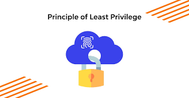

# 1. Security features in Keycloak

#### Beschrijving: MFA, policies en "least privilege" configureren.

#### Onderzoekvraag: Hoe dwing je beveiligingsprincipes af binnen Keycloak?

#### Type spike: Kennis

# 2. Policies (Beleidsregels)

## 2.1 Beleidswijzigingen

Keycloak biedt uitgebreide mogelijkheden om beleidswijzigingen te loggen en naleving te controleren. Hier zijn enkele
belangrijke aspecten:

* **Audit logging:** Keycloak registreert beleidswijzigingen en toegangsverzoeken in audits logs, die beheerders kunnen
  analyseren om verdachte activiteiten en te detecteren.
* **Event listener SPI:** Hiermee kunnen aangepaste loggingmechanismen worden geimplementeerd om beleidswijzigingen vast
  te leggen.
* **Compliance monitoring:** Organisaties kunnen Keycloak integreren met SIEM-tools zoals Splunk of ELK, om nalevering
  te controleren en beveiligingsincidenten te detecteren.
* **Automatische beleidsvalidatie:** Keycloak kan beleidsregels afdwingen via vooraf gedefinieerde
  autorisatiemechanismen, zoals RBAC en ABAC.

## 2.2 Sterke toegangscontrole in Keycloak

Factoren die bijdragen aan een robuuste toegangscontrole in Keycloak zijn onder andere:

* **Fijnmazige autorisatie:** Gebruik *RBAC*, *ABAC*, *CBAC* en andere mechanismen om toegang nauwkeurig te beheren.
* **Dynamische beleidsregels:** Pas toegangsregels aan op basis van context, zoals locatie, apparaat en risiconiveau.
* **Tokenbeheer:** Zorg voor veilige configuratie van *OAuth 2.0 en OpenID connect tokens* om sessiekaping te voorkomen.
* **Regelmatige audits:** Controleer en herzie toegangsrechten om ongeautoriseerde toegang te minimaleren.

### 2.2.1 Role-Based acces control (RBAC)

* Gebruikersrollen bepalen welke acties een gebruiker mag uitvoeren (Bijv. Admin, Gebruiker, Beheerder)
* **Toegangsbeheer per rol:** Elke rol heeft specifieke rechten, waardoor gebruikers alleen kunnen doen wat hun rol
  toestaat.
* **Rolhiërarchie:** Rollen kunnen worden genest of overgeërfd, om complexere autorisatiemodellen te maken.

### 2.2.2 Attribute-Based Access Control (ABAC)

* Dynamische toegangcontrole gebaseerd op gebruikersattributen zoals locatie, apparaat, of tijdstip van de dag.
  **Voorbeeld:** Een gebruiker kan alleen documenten bewerken als ze "Manager" zijn en zich binnen kantooruren
  aanmelden.
* **Voordelen:** Flexibeler dan RBAC omdat het rekening houdt met contextuele gegevens

### 2.2.3 Context-Based Access Control (CBAC)

* **Beoordeling van sessiecontext:** Om te bepalen of een gebruiker toegang mag krijgen.
* **Factoren:** IP-adres, sessietijd en apparaatstatus.
* **Use-case:** Als een gebruiker zich aanmeldt vanaf een onbekend apparaat, kan Keycloak een extra MFA-verificatie
  vereisen.

## 2.3 Sterke authenticatie in Keycloak

* **Multi-Factor Authentication (MFA):** Extra verificatiestappen zoals TOTP, WebAuthn of SMS-verificatie.
* **Federatieve identiteit:** Intergratie met externe identiy providers (IdP) zoals, Azure DB of Okta zorgt voor veilige
  authenticatie.

## 2.4 Tokenbeheer en Sessiebeheer

* **Veilige OAuth 2.0 en OpenID connect tokens:** Correcte configuratie voorkomt sessiekaping en token misbruik.
* **Sessietijdbeheer:** Beperking van sessieduur en automatische vernieuwing van tokens voorkomt ongeautoriseerde
  toegang.

# 3. MFA (Multi-Factor Authentication)

## 3.1 Wat is MFA?

MFA staat voor Multi-Factor-Authenticatie. Dit is een beveiligingsmaatregel die vereist dat gebruikers zich
identificeren met meer dan één bewijs van identiteit voordat ze toegang krijgen tot een systeem of applicatie. Het doel
van MFA is om de kans op ongeautoriseerde toegang te verkleinen door meerdere lagen van beveiliging toe te voegen.

## 3.2 MFA methodes

### 3.2.1 SMS-authenticatie

* Gebruikers kunnen inloggen met hun telefoonnummer en een eenmalige code die naar hen wordt verzonden via SMS.
* Minder veilig vanwege risico's zoals SIM-swapping en phishing-aanvallen.

### 3.2.2 OTP (One-Time Password)

* **TOTP(Time-Based One-Time password):** Code wordt gegenereerd door authenticator apps zoals Google authenticator, en
  Microsoft authenticator.
* **HOTP(HMAC-Based One-Time password):** OTP's gebaseerd op een teller in plaats van tijd, minder gangbaar dan TOTP.

### 3.2.3 Hardware tokens

* **YubiKey** of andere fysieke beveiligingssleutels die FIDO2/WebAuthn ondersteunen.
* Zeer veilig, omdat ze phishing-aanvallen helpen voorkomen.
  #### 3.2.3.1 FIDO2/WebAuthn
       * FIDO2 is een open standaard voor sterke authenticatie zonder wachtwoord.
       * WebAuthn is de API die het mogelijk maakt om FIDO2-compatibele apparaten te gebruiken voor authenticatie in webapplicaties.
       * Het biedt een veilige manier om gebruikers te verifiëren zonder dat ze hun wachtwoord hoeven in te voeren.

### 3.2.4 Email-authenticatie

* Een eenmalige code wordt naar het geregistreerde e-mailadres van de gebruiker gestuurd.
* Handig, maar kwetsbaar als e-mailaccount niet goed beveiligd is.

### 3.2.5 Biometrische authenticatie

* Vingerafdrukken, gezichtsherkenning of irisscans.
* Vereist compatibele hardware en browsers.

### 3.2.6 Pushmeldingen

* Gebruikers ontvangen een melding op hun telefoon en moeten goedkeuring geven via een app zoals Duo Security.
* Gebruiksvriendelijk en veilig.

### 3.2.7 Identity provider (IDP) verificatie

* MFA via een externe IDP zoals Okta of Azure AD.
* Handig voor organisaties die federatieve authenticatie gebruiken.
  #### 3.2.7.1 Federatieve authenticatie
       * Federatieve authenticatie is een methode waarmee gebruikers toegang kunnen krijgen tot meerdere diensten met slechts één keer inloggen.

## 3.3 MFA Uitdagingen & best practices.

### 3.3.1 Uitdagingen

Multi-Factor Authentication biedt extra beveiliging, maar brengt ook enkele uitdagingen met zich mee:

* **Gebruikerservaring:** MFA kan als omslachtig worden ervaren, vooral als gebruikers meerdere verificatiestappen
  moeten doorlopen.
* **Adoptie en acceptatie:** Sommige gebruikers vinden MFA frustrerend en vermijden het, wat de effectiviteit
  vermindert.
* **Beheer van herstelopties:** Als een gebruiker zijn MFA-methode verliest (bijv. telefoon met authenticator-app), moet
  er een veilig herstelproces zijn.
* **Compatibiliteit:** Niet alle applicaties en systemen ondersteunen alle MFA-methoden, wat integratieproblemen kan
  veroorzaken.
* **Kosten en implementatie:** Het opzetten van MFA vereist tijd en middelen, vooral bij grote organisaties.
* **Phishing en social engineering:** Aanvallers kunnen gebruikers misleiden om hun MFA-codes te delen, waardoor de
  beveiliging wordt omzeild.

### 3.3.2 Best practices

Om deze uitdagingen te minimaliseren, zijn er enkele best practices:

* **Gebruik een combinatie van MFA-methoden:** Bijvoorbeeld, TOTP en hardware tokens voor extra beveiliging.
* **Maak MFA verplicht voor kritieke accounts:** Beheerders en gebruikers met verhoogde rechten moeten MFA verplicht
  gebruiken.
* **Bied gebruiksvriendelijke opties:** Pushmelding en biometrische verificatie kunnen de gebruikservaring verbeteren.
* **Implementeer adaptieve MFA:** Pas MFA aan op basis van risiconiveau, zoals locatie of apparaat vertrouwen.
* **Educatie en bewustwording:** Train gebruikers om phishing-aanvallen te herkennen en veilig om te gaan met MFA.
* **Regelmatige audits en monitoring:** Controleer MFA-instelling en logs om verdachte activiteiten te detecteren.

## 3.4 Hoe werkt MFA in Keycloak?

MFA wordt ondersteund in Keycloak als extra beveiligingslaag voor gebruikersauthenticatie.

### 3.4.1 Configuratie MFA

* Beheerders kunnen MFA instellen via de **Keycloak Admin Console**.
* MFA wordt geconfigureerd binnen de **Authenticatieflows**, waar je kunt bepalen wanneer en hoe MFA wordt afgedwongen.
* Je kunt verschillende verificatiemethodes kiezen, zoals **TOTP**, **/SMS**, **e-mail** en **hardware tokens**.
  #### 3.4.1.1 Slechte configuratie risico's
        * Geen MFA betekent dat aanvallers gemmakkelijker accounts compromitteren.
        * Onbeveiligde federative authenticattie dit kan leiden tot ongeautoriseerde toegang tot meerdere applicaties.

### 3.4.2 MFA in de authenticatieflow

* Wanneer een gebruiker inlogt, wordt eerst de standaard gebruikersnaam/wachtwoord verificatie uitgevoerd.
* Als MFA is ingeschakeld, wordt een extra verificatiestap vereist voordat toegang wordt verleend.
* De gebruiker moet de gekozen MFA-methode voltooien, zoals het invoeren van een OTP-code of het goedkeuren van een
  pushmelding.

### 3.4.3 Ondersteunde methoden van MFA in Keycloak

* **TOTP**
* **SMS**
* **E-mail**
* **WebAuthn**
* **Pushmeldingen via externe providers** zoals Duo Security of Microsoft Authenticator.

### 3.4.4 Beheer en herstel

* Beheerders kunnen MFA instellen als **Optioneel** of **Verplicht** voor specifieke gebruikers of rollen.
* Er moeten herstelopties beschikbaar zijn, zoals **backup-codes** of een administratieve reset bij verlies van een
  MFA-methode.

## 4. Least privilege configuratie

## 4.1 Least privilege

Het least privilege principe betekent dat elke gebruiker of systeemcomponent alleen toegang krijgt tot de middelen die
strikt noodzakelijk zijn voor hun functie.
Dit voorkomt dat gebruikers onnodige rechten hebben die kunnen leiden tot misbruik of beveiligingslekken.

### 4.1.1 Waarom is Least privilege belangrijk?

* **Beperkt aanvallen:** Minder rechten betekent minder mogelijkheden voor aanvallers om toegang te krijgen tot kritieke
  systemen.
* **Voorkomt laterale beweging:** Aanvallers kunnen zich niet eenvoudig door een netwerk bewegen als ze beperkte rechten
  hebben.
* **Minimaliseert insider threats:** Voorkomt dat kwaadwillende of nalatige medewerkers gevoelige gegevens kunnen
  benaderen.
* **Voldoet aan regelgeving:** Veel compliance-standaarden zoals, GDPR, HIPPA en ISO 27001 vereisen en strikt
  toegangsbeheer.

## 4.2 Rollen structuur Keycloak

Keycloak gebruikt een rol gebaseerd autorisatiemodel (RBAC) om toegangsrechten te beheren.
Dit model is gebaseerd op het toewijzen van rollen aan gebruikers, waarbij elke rol specifieke rechten en premises
heeft.

### 4.2.1 Belangrijke componenten van rollen in Keycloak

* **Realm Rollen:** Globale rollen die gelden voor alle gebruikers binnen een Keycloak-realm.
* **Client Rollen:** Specifieke rollen die alleen van toepassing zin binnen een bepaalde applicatie (client).
* **Gebruikersgroepen:** Groepen waarin gebruikers worden ingedeeld, zodat ze automatisch bepaalde rollen krijgen.
* **Composite Rollen:** Rollen die bestaan uit meerdere subrollen, waardoor complexe autorisatiemodellen mogelijk zijn

### 4.2.2 Hoe rollen worden toegewezen

* **Handmatig** via de Keycloak Admin Console.
* **Dynamisch** via identity Providers (IdP) zoals, Azure AD of Okta.
* **Automatisch** via beleidregels en scripts die rollen toewijzen op basis van attributen zoals functie, locatie of
  risiconiveau.

## 4.3 Uitdagingen en best practices Least privilege in Keycloak

### 4.3.1 Uitdagingen

* **Overtoewijzing van rechten:** Gebruikers krijgen vaak meer rechten dan nodig, wat beveiligingsrisico's verhoogt.
* **Complexiteit van rolbeheer:** Het beheren van honderden rollen en permissies kan lastig zijn zonder een goed beleid.
* **Gebrek aan monitoring:** Zonder audit logs en monitoring kunnen ongeautoriseerde rechten onopgemerkt blijven.
* **Verouderde rollen:** Rollen die niet regelmatig worden herzien kunnen leiden tot ongewenste toegang.

### 4.3.2 Best practices

* **Gebruik fijnmazige autorisatie:** Combineer RBAC, ABAC en CBAC om toegangscontrole te verfijnen.
* **Voer regelmatige audits uit:** Controleer en herzie rollen en permissies om overtoewijzing te voorkomen.
* **Implementeer Just-In-Time (JIT) toegang:** Geef tijdelijke toegang tot gevoelige systemen in plaats van permanente
  rechten.
* **Gebruik dynamische beleidregels:** Pas toegangsrechten aan op basis van risiconiveau, zoals locatie of apparaat.
* **Monitor en log toegangsverzoeken:** Gebruik SIEM-tools zoals Splunk, Elk of Azure Sentinel om verdachte activiteiten
  te detecteren.

## 5. ADR - Vergelijking Keycloak met andere IAM-oplossingen

**Datum:** 07-05-2025  
**Status:** Accepted

### Context

Voor het implementeren van Identity & Access Management (IAM) in onze applicatie is er een keuze te maken tussen het
gebruik van een bestaande oplossing zoals Keycloak, of het bouwen van een eigen custom IAM-systeem.  
Deze ADR vergelijkt de twee opties op basis van relevante criteria.

#### Considered Options

| Forces                                 | Keycloak | Custom IAM |
|----------------------------------------|----------|------------|
| Authenticatie methoden (MFA, SSO, etc) | ++       | +-         |
| Security audits & compliance           | ++       | -+         |
| Snelheid van implementatie             | ++       | --         |
| Onderhoudsbelasting                    | +-       | --         |
| Flexibiliteit in features              | +-       | ++         |
| Integratie met externe services        | ++       | +-         |
| Beheer en configuratiegemak            | +-       | +-         |
| Beveiliging bij zero-day exploits      | +-       | -+         |
| Audit logging en monitoring            | ++       | +-         |
| Toekomstige schaalbaarheid             | ++       | +-         |
| Risico op fouten (bugs, exploits)      | ++       | --         |
| Kosten                                 | ++       | --         |
| Ondersteuning en community             | ++       | 0          |
| Onderhoudbaarheid                      | +-       | 0          |

### Decision

We kiezen voor Keycloak vanwege de uitgebreide standaardfunctionaliteit, korte implementatietijd en bewezen security.
Een custom IAM-oplossing biedt meer flexibiliteit, maar vereist te veel ontwikkel- en onderhoudswerk.

### Consequences

* Snelle implementatie met minder risico's

* Minder ontwikkelcapaciteit nodig voor IAM

* Beperkte controle over zeer specifieke functionaliteiten

* Afhankelijkheid van een externe open-source tool

*Legenda:*

* ++ Zeer tevreden
* +- Tevreden
* 0 Neutraal
* -+ Ontevreden
* -- Zeer ontevreden

## Bronnen

* [MFA in Keycloak](https://documentation.cloud-iam.com/resources/keycloak-authentications/mfa.html)
* [MFA methodes](https://frontegg.com/blog/multi-factor-authentication-types)
* [MFA](https://www.onelogin.com/learn/what-is-mfa)
* [MFA Medium](https://medium.com/%40bkamaraj/keycloak-mfa-using-mobile-authenticator-setup-572e9f31f36d)
* [Beleidswijzigingen](https://www.keycloak.org/docs/latest/authorization_services/index.html)
* [Beleidswijzigingen toegangscontrole](https://docs.redhat.com/en/documentation/red_hat_build_of_keycloak/24.0/html/authorization_services_guide/policy_overview)
* [Least privilege MBO Cybersecurity](https://mbocybersecurity.nl/woordenboek/least-privilege/)
* [Least privilege in Keycloak](https://www.keycloak.org/docs/latest/server_admin/index.html#_least-privilege)
* [Least privilege zero trust](https://nl.insight.com/nl_NL/content-and-resources/2024/articles/2024-08-zero-trust-en-de-rol-van-least-privilege-access.html#)
* [Permissies in keycloak](https://www.permit.io/blog/configuring-keycloak-authorization-best-practices)
* [Auditing in Keycloak](https://skycloak.io/blog/auditing-in-keycloak-how-to-catch-them-all/)
* [Best practices Client scope in Keycloak](https://github.com/keycloak/keycloak/discussions/19869?utm_source=chatgpt.com)
* [Auditing best practices in Keycloak](https://skycloak.io/blog/keycloak-auditing-best-practices-for-security/)