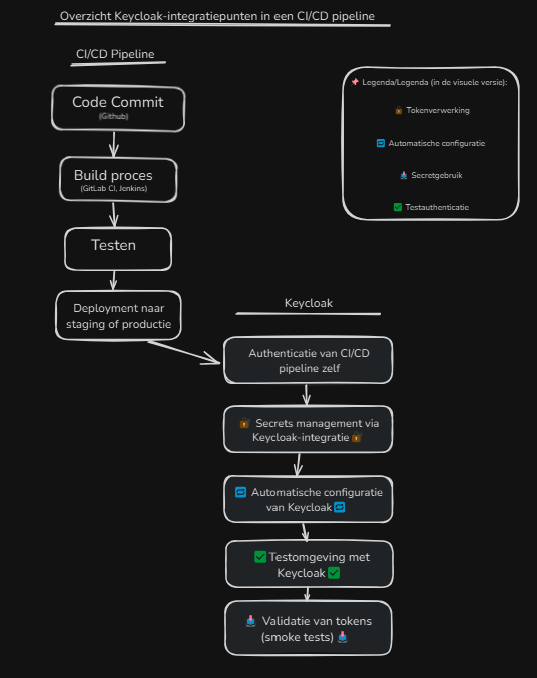

# Documentatieonderzoek Keycloak #111 

Ik heb niks specifieks kunnen vind over Git CI/CD-pipeline in de officiële documentatie over keycloak, 
maar ik heb wel relevante posts gevonden hierover.

Heb een post gevonden over GITLAB CI/CD + Keycloak waar een user het [werkend](https://gitlab.com/gitlab-org/gitlab/-/issues/273753) krijgt

Ook heb ik een [post](https://stackoverflow.com/questions/61893539/using-keycloak-as-gitlab-ci-service/61942345#61942345) gevonden over het gebruiken van keycloak met gitlab CI service

Ik heb [gelezen](https://www.keycloak.org/server/configuration?utm_source=chatgpt.com) is dat keycloak wel gebruik kan maken van een CI/CD-pipeline via de documentatie van Axual. Deze beschrijft hoe je een gebruiker kunt aanmaken in Keycloak, 
een JWT-token kunt verkrijgen en deze kunt gebruiken voor geautomatiseerde interacties met andere services. Hiervoor moet je wel een specifieke gebruiker hebben of aanmaken in keycloak.

Ook heb ik [gelezen](https://medium.com/%40assahbismarkabah/keycloak-config-cli-a-guide-to-remote-state-management-03a2bcfdc27d) over een tool in keycloak die is ontworpen om Keycloak-configurations te beheren via JSON-bestanden.

Ook biedt de Keycloak [documentatie](https://www.keycloak.org/server/configuration?utm_source=chatgpt.com) een uitgebreide uitleg over hoe je een Keycloak-configuratie kunt beheren via meerdere voorbeelden.

Aan de hand van deze [post](https://forum.gitlab.com/t/connecting-gitlab-with-keycloak/125361?utm_source=chatgpt.com) heb ik begrepen dat gitlab wel mogelijk is om keycloak te gebruiken voor authenticatie en autorisatie, maar dat het niet zo eenvoudig is als het lijkt.

--------

# CI/CD pipeline onderzoek #112

Jenkins heeft een stuk hierover in hun [documentatie](https://www.jenkins.io/doc/book/system-administration/authenticating-scripted-clients/) die spreekt over het gebruik van meerden authenticatie methoden in hun CI/CD pipeline.
Hierbij heb ik gelezen dat Jenkins gebruik maakt van HTTP Basic Authentication met een API-token in plaats van wachtwoorden om beveiligingsrisico's te minimaliseren

Ook heb ik meerderen videos [gevonden](https://www.google.com/search?q=ci%2Fcd+jenkins+auth&client=opera-gx&hs=7sa&sca_esv=d57c1a3d738cc115&sxsrf=AHTn8zquWgLWuYAjpFZabNTuTqNKXvF4xg%3A1747226649356&ei=GZAkaIDKFamN9u8PwNPL6QM&oq=ci%2Fcd+jenskins+auth+&gs_lp=Egxnd3Mtd2l6LXNlcnAiFGNpL2NkIGplbnNraW5zIGF1dGggKgIIADIKECEYoAEYwwQYCjIKECEYoAEYwwQYCkjPR1CyEViMPHACeACQAQCYAV6gAaMIqgECMTe4AQPIAQD4AQGYAhKgApwIwgIKEAAYsAMY1gQYR8ICBBAjGCfCAggQABiABBiiBMICBxAjGLACGCfCAggQIRigARjDBMICCBAAGAUYBxgewgIGEAAYBRgewgIGEAAYCBgewgILEAAYgAQYhgMYigXCAgUQABjvBZgDAIgGAZAGCJIHAjE4oAfKObIHAjE2uAeVCA&sclient=gws-wiz-serp) over hoe je jenkins bouwt met een CI/CD-pipeline.

Veder heb ik ook een plugin gevonden voor jenkins naar keycloak genaamd [Keycloak Authentication Plugin](https://plugins.jenkins.io/keycloak/) die het mogelijk maakt om keycloak te gebruiken voor authenticatie in jenkins.

Ik heb een [blog](https://docs.databricks.com/gcp/en/dev-tools/ci-cd/jenkins) gevonden die bespreekt hoe je jenkins kunt gebruiken met keycloak en hoe je een CI/CD-pipeline kunt opzetten met Jenkins en Keycloak.
 
Je kan ook een pipeline opzetten met Gitlab CI/CD ik heb hier documentatie over [gevonden](https://docs.gitlab.com/ee/user/project/pipelines/) die uitlegt hoe je een pipeline kunt opzetten met Gitlab CI/CD maar hiervoor moest je ingelogd zijn met een gitlab account.
Daarom heb ik hier ook een extra [link](https://www.jetbrains.com/teamcity/?source=google&medium=cpc&campaign=EMEA_en_NL_TeamCity_Search_RLSA&term=ci%2Fcd%20tools&content=512507880219&gad_source=1&gad_campaignid=12690825742&gclid=CjwKCAjw_pDBBhBMEiwAmY02NoS4hgzdRV5S8MIo6inRr8sKwS9XebSCrNRQc-b7bHnjaAOaKIDdmBoCCckQAvD_BwE) voor.

Deze reddit [post](https://www.reddit.com/r/KeyCloak/comments/1ih3hy1/keycloak_gitlab_ce_authorization_not_checking/) gaat over hoe keycloak via Gitlab CE niet goed rollen bekijkt

Ik heb op de officiële [keycloak](https://www.keycloak.org/docs/latest/securing_apps/index.html#_gitlab) documentatie gelezen dat keycloak kan worden gebruikt met Gitlab CE en dat je een service account moet aanmaken in keycloak om deze te kunnen gebruiken met Gitlab CE.

Tenslotte heb ik ook op de officiële [keycloak](https://docs.gitlab.com/administration/auth/oidc/) website gelezen dat je via OpenID Connect (OIDC) keycloak kan gebruiken met Gitlab CE en als een authentication provider.

-----------

# Integratievoorbeelden verzamelen #113

Hieronder heb ik een aantal voorbeelden en best practices verzameld van hoe je keycloak kan gebruiken met Jenkins CI/CD-pipelines.
- [KeycloakJenkinsVoorbeeld1](https://wiki.jenkins-ci.org/display/JENKINS/Plugin+tutorial) mogelijk is deze verouderd als je een nieuwere versie gebruikt.
- [KeycloakJenkinsVoorbeeld2](https://www.youtube.com/watch?v=sqg-sbNroUs)Video over hoe je keycloak kan gebruiken met jenkins
- [KeycloakJenkinsVoorbeeld3](https://www.jenkins.io/doc/book/pipeline/pipeline-best-practices/) Wat best practices zijn voor het gebruik van een pipeline met keycloak

Hoewel er geen officiële documentatie is over keycloak met gitlab heb ik wel een aantal best practices gevonden en voorbeelden van hoe je keycloak kan gebruiken met gitlab.
- [KeycloakGitLabVoorbeeld1](https://about.gitlab.com/blog/2023/02/28/oidc/?utm_source=chatgpt.com) Vermijd het gebruik van langlevende credentials dit stuk praat over kortlevende credentials
- [KeycloakGitLabVoorbeeld2](https://hannaske.net/blog/use-a-self-hosted-gitlab-as-identity-provider-in-keycloak/?utm_source=chatgpt.com) Een self-gehoste gitlab gebruiken als identity provider in keycloak voor de pipeline.
- [KeycloakGitLabVoorbeeld3](https://www.keycloak.org/docs/latest/securing_apps/index.html#_gitlab) Dit stuk gaat over hoe je keycloak kan gebruiken met gitlab CE en dat je een service account moet aanmaken in keycloak om deze te kunnen gebruiken met Gitlab CE.

---------

# Technische mogelijkheden samenvatten #114
Hieronder heb ik een samenvatting gemaakt van de technische mogelijkheden van keycloak met CI/CD-pipelines aan de hand van online-informatie
## Keycloak met Jenkins CI/CD-pipelines
Tijdens mijn onderzoek heb ik ontdekt dat de officiële Keycloak-documentatie geen specifieke sectie biedt voor CI/CD-integraties. Gelukkig zijn er diverse community-posts en tools die waardevolle inzichten geven voor het gebruik van Keycloak binnen Jenkins-pijplijnen.

Voor Jenkins geldt dat het uitvoeren van shell-commando’s in een pipeline mogelijk is, waarmee je de Keycloak CLI (`kc.sh`) of de Admin REST API kunt aanroepen om realms, clients of rollen als JSON te importeren en exporteren. Door deze stappen in een dedicated `stage` op te nemen en uit te voeren in een Keycloak-Dockercontainer, zet je eenvoudig configuration-as-code op.

Een andere belangrijke tool is **keycloak-config-cli**, waarmee je Keycloak-instellingen beheert via JSON- of YAML-bestanden in je Git-repository. In een Jenkins-pipeline clone je de repository, bouw je de JAR van keycloak-config-cli en voer je vervolgens een import uit met `java -jar keycloak-config-cli.jar --import.files.locations=realms/`. Op deze manier blijven alle Keycloak-configuraties versiebaar en reproduceerbaar ([Medium: keycloak-config-cli](https://medium.com/@assahbismarkabah/keycloak-config-cli-a-guide-to-remote-state-management-03a2bcfdc27d)).

Voor Single Sign-On binnen Jenkins kun je de **Keycloak Authentication Plugin** installeren. Na het configureren van de plugin in “Manage Jenkins → Configure Global Security” loggen Jenkins-gebruikers in via Keycloak, wat zorgt voor eenduidige user management-loop ([jenkins.io/plugins/keycloak](https://plugins.jenkins.io/keycloak/)). Hoewel dit geen pipeline-stap is, draagt het bij aan een uniforme toegangscontrole.

Tot slot geven de Jenkins-documentatie en diverse tutorials inzicht in best practices voor pipeline-authenticatie. Zo wordt aangeraden om API-tokens te gebruiken in plaats van wachtwoorden en om elke operatiestap in een eigen `stage` af te bakenen. Deze aanpak maakt je CI/CD-pijplijn overzichtelijker, veiliger en gemakkelijker te onderhouden.

## Keycloak met Gitlab CI/CD-pipelines
Er zijn enkele community-posts die laten zien hoe je Keycloak kunt koppelen aan een CI/CD-stroom via GitLab CI. Een voorbeeld hiervan is een GitLab Issue waarin gebruikers Keycloak succesvol integreren via GitLab CI door een geautomatiseerde Keycloak-gebruiker aan te maken en een JWT-token te verkrijgen voor pipeline-stappen ([GitLab Issue](https://gitlab.com/gitlab-org/gitlab/-/issues/273753)).

Een andere relevante post beschrijft hoe je Keycloak kunt gebruiken als een service binnen GitLab CI, inclusief voorbeeldconfiguraties voor het `.gitlab-ci.yml`-bestand ([StackOverflow](https://stackoverflow.com/questions/61893539/using-keycloak-as-gitlab-ci-service/61942345#61942345)).

Daarnaast blijkt uit documentatie dat Keycloak via Axual kan worden ingesteld voor geautomatiseerde interacties met andere services door een gebruiker aan te maken en een JWT-token te verkrijgen. Dit vereist het gebruik van een specifiek aangemaakte gebruiker in Keycloak.

Verder biedt de tool **keycloak-config-cli** mogelijkheden om Keycloak-configuraties te beheren via JSON-bestanden in je Git-repository. Dit maakt configuratiebeheer via een GitLab CI/CD-pipeline eenvoudiger en reproduceerbaar ([Medium: keycloak-config-cli](https://medium.com/@assahbismarkabah/keycloak-config-cli-a-guide-to-remote-state-management-03a2bcfdc27d)).

Tot slot kan Keycloak gebruikt worden met GitLab CE als authentication provider via OpenID Connect (OIDC). Hierbij moet een service-account in Keycloak aangemaakt worden om dit te realiseren ([Keycloak OIDC](https://docs.gitlab.com/administration/auth/oidc/)).

--------------

# CI/CD tools in kaart brengen #115

Hieronder heb ik een overzicht gemaakt van de CI/CD-tools die ik heb gevonden tijdens mijn onderzoek naar keycloak en CI/CD-pijplijnen.

| Tool        | Keycloak Integratie Mogelijkheden                                            | Documentatie Links                                                                                                                                                                                                                                                                                                                                         |
|-------------|------------------------------------------------------------------------------|------------------------------------------------------------------------------------------------------------------------------------------------------------------------------------------------------------------------------------------------------------------------------------------------------------------------------------------------------------|
| Jenkins     | Keycloak Authentication Plugin, keycloak-config-cli, API-token authenticatie | [Jenkins Keycloak Plugin](https://plugins.jenkins.io/keycloak/) (**Stappen 1–3: Keycloak-client aanmaken, keycloak.json kopiëren, configuratie in Jenkins**), [Pipeline Best Practices](https://www.jenkins.io/doc/book/pipeline/pipeline-best-practices/) (**Algemene richtlijnen voor pipeline-ontwikkeling**)                                           |
| GitLab      | Keycloak als externe OAuth-provider, OIDC-authenticatie, CI/CD-integratie    | [GitLab Issue #273753](https://gitlab.com/gitlab-org/gitlab/-/issues/273753) (**Problemen bij gebruik van Keycloak als CI/CD-service**), [GitLab CI/CD Pipelines](https://docs.gitlab.com/ci/pipelines/) (**Configuratie van pipelines via `.gitlab-ci.yml`**)                                                                                             |
| Spring Boot | Keycloak Spring Boot Adapter, OAuth 2.0/OIDC-authenticatie, JWT-verificatie  | [Spring Boot Adapter](https://www.keycloak.org/docs/latest/securing_apps/#spring-boot-adapter) (**Configuratie van Spring Boot-applicatie met Keycloak**), [Baeldung Guide](https://www.baeldung.com/spring-boot-keycloak) (**OAuth2 met Spring Boot en Keycloak**)                                                                                        |
| Grafana     | SSO via OAuth 2.0/OIDC, Keycloak als externe identity provider               | [Generic OAuth Integration](https://grafana.com/docs/grafana/latest/auth/generic-oauth/) (**Configure login t/m Configure display name**), [Configure Authentication](https://grafana.com/docs/grafana/latest/setup-grafana/configure-security/configure-authentication/generic-oauth/) (**Configure a refresh token t/m Configure team synchronization**) |
| Kubernetes  | SSO voor Kubernetes-dashboard, OIDC-authenticatie via Ingress-controller     | [Authenticating Kubernetes](https://kubernetes.io/docs/reference/access-authn-authz/authentication/) (**Optie 1 - OIDC Authenticator**), [Configure Service Accounts for Pods](https://kubernetes.io/docs/tasks/configure-pod-container/configure-service-account/) (**ServiceAccounts configureren voor Pods**)                                           |

-----------------

# Best practices voor CI/CD integratie onderzoeken #116

1. **Gebruik PKCE voor public clients**
   Zorg dat je de autorisatiecode flow met PKCE gebruikt om je app te beveiligen tegen onderschepping van autorisatiecodes.
2. **Geen wildcard (*) in redirect URI’s**
   Definieer altijd expliciete en vaste redirect URI’s in Keycloak om te voorkomen dat aanvallers tokens kunnen onderscheppen via malafide redirect
3. **Schakel de implicit flow uit**
   De implicit flow is minder veilig; gebruik in plaats daarvan autorisatiecode flow met PKCE voor betere bescherming.
4. **Beperk de levensduur van tokens (access en refresh)**
   Korte token levensduur vermindert de impact als een token wordt gestolen.
5. **Bescherm je frontend tegen XSS en houd tokens veilig**
   Voorkom dat tokens in globale JavaScript variabelen staan en zorg dat je app niet kwetsbaar is voor cross-site scripting aanvallen.

Sources:
- [Ietf](https://www.ietf.org/archive/id/draft-ietf-oauth-security-topics-29.html?utm_source=chatgpt.com)
- [Reddit](https://www.reddit.com/r/KeyCloak/comments/1j3626z/comment/mfxjaeq/?utm_source=share&utm_medium=web3x&utm_name=web3xcss&utm_term=1&utm_content=share_button)

----------

# Onderzoek naar veilig gebruik van Keycloak in CI-CD #117

- [keycloak](https://www.keycloak.org/security)

Keycloak streeft naar een open aanpak voor kwetsbaarheidsbeheer, waarbij veiligheid en privacy van gebruikers, bijdragers en partners worden beschermd. 
De aanpak is gebaseerd op samenwerking met onderzoekers en snelle probleemoplossing.
Rapportage van Kwetsbaarheden:
Verantwoordelijke openbaarmaking: Eerst melden, niet direct openbaar maken.
Reactietijd: Acknowledgement binnen 7 werkdagen.
Ondersteunde versies: Belangrijke kwetsbaarheden worden in de huidige release opgelost; minder kritieke in toekomstige releases.
Rapportage: Meld kwetsbaarheden via keycloak-security@googlegroups.com met een gedetailleerd rapport en reproductie-instructies.
Bekende CVE’s: Maak een GitHub-issue aan bij kwetsbaarheden door derden.
Geen geautomatiseerde scans: Automatisch gegenereerde rapporten worden niet geaccepteerd vanwege vals-positieven.
Als je wilt meewerken aan een fix, geef je GitHub-gebruikersnaam door voor toegang tot een tijdelijke private fork.

Keycloak accepteert geen rapporten van beveiligingsscanners zonder een duidelijk exploitatievoorbeeld. Het project is onderdeel van de Cloud Native Computing Foundation (CNCF).

Keycloak biedt flexibele beveiliging via standaarden als OAuth2, OpenID Connect en SAML. Door gebruik te maken van bestaande ondersteuning en clientadapters, kun je veilig single sign-on (SSO) en tokenbeheer implementeren.

- [inero-software](https://inero-software.com/best-keycloak-practices/)

### 1. Gebruik HTTPS en Sterke Certificaten
- Zorg ervoor dat alle communicatie met de Keycloak-server via het beveiligde HTTPS-protocol verloopt.
- Gebruik SSL/TLS-certificaten van betrouwbare aanbieders om gegevensinterceptie te voorkomen.
- Update certificaten regelmatig om beveiligingsrisico's te minimaliseren.

### 2. Implementeer Multi-Factor Authenticatie (MFA)
- Voeg een extra beveiligingslaag toe door gebruikers te laten inloggen met meerdere verificatiemethoden (zoals een wachtwoord en een verificatiecode).
- Gebruik Keycloak om MFA in te schakelen voor gebruikers, vooral voor beheerders of gevoelige data.

### 3. Sterke Wachtwoord- en Sessiebeheer
- Stel een sterk wachtwoordbeleid in (bijv. lengte, complexiteit, verloop).
- Beperk de sessieduur en tokenlevensduur om risico's te verkleinen bij vergeten openstaande sessies.
- Log gebruikers automatisch uit na inactiviteit om ongeoorloofde toegang te voorkomen.

### 4. Beveilig API Endpoints met Rolgebaseerde Toegang (RBAC)
- Gebruik authenticatieprotocollen zoals OAuth 2.0 en OpenID Connect om toegang tot API’s te beheren.
- Gebruik toegangstokens om gebruikersrechten te controleren.
- Implementeer RBAC om gebruikers toegang te geven op basis van hun rol (bijv. beheerder, gebruiker, gast).

### 5. Regelmatige Updates en Monitoring
- Houd Keycloak up-to-date om beveiligingslekken te voorkomen.
- Implementeer monitoring en logging om verdachte activiteiten te detecteren.
- Gebruik tools zoals Prometheus en ELK Stack voor logbeheer en monitoring in Kubernetes-omgevingen.

---------------------------

# Succesverhalen en casestudys verzamelen #118

## 1. App.Farm / RSHB-Intech: Enterprise CI/CD met Keycloak en Kubernetes

In deze casestudy beschrijft App.Farm hoe zij voor de Russische bank RSHB-Intech een platform hebben ontwikkeld dat Keycloak integreert binnen een CI/CD-pijplijn.

### Belangrijke aspecten

- **Single Sign-On (SSO)**: Keycloak fungeert als centrale autorisatie- en authenticatielaag voor alle systemen binnen het platform.
- **Kubernetes Operators**: Een `auth-operator` beheert automatisch Keycloak-entiteiten zoals clients en rollen op basis van declaratieve YAML-configuraties.
- **GitLab CI/CD**: Alle infrastructuur en configuraties worden beschreven via *Infrastructure as Code* in GitLab, waardoor automatische provisioning en updates mogelijk zijn.
- **Schaalbaarheid**: Keycloak draait in een schaalbare Kubernetes-omgeving, waardoor het systeem eenvoudig kan worden opgeschaald.

🔗 [Source](https://github.com/mathiznogoud/keycloak-blog/blob/master/How%20to%20implement%20CICD%20for%20all%20developers%20in%20a%20bank.%20CICD%20by%20App.Farm%20.md?utm)

## 2. MediaKey (via Gepardec): Keycloak als onderdeel van een DevOps-framework

Bij MediaKey heeft Gepardec Keycloak geïntegreerd in een CI/CD-proces met de deze kenmerken:

### Belangrijke aspecten

- **Meerdere Omgevingen**: Er zijn vier Keycloak-omgevingen (DEV, ITU, TEST, PROD) opgezet, elk met specifieke configuraties en resources.
- **Automatisering met keycloak-config-cli**: De tool `keycloak-config-cli` wordt gebruikt om Keycloak-configuraties (zoals realms en clients) automatisch uit YAML-bestanden te laden.
- **GitOps-Principe**: Configuraties worden beheerd in GitLab-repositories, met verschillende branches voor elke omgeving. Hierdoor kunnen wijzigingen eenvoudig worden gereviewd en uitgerold.
- **CI/CD Pipelines**: De pipelines omvatten het bouwen en testen van JAR-bestanden, uploaden naar Artifactory, installatie van SSO op de gewenste omgeving en configuratie van Keycloak.

🔗 [Website is DUITS!](https://www.gepardec.com/blog/keycloak-configuration-mit-devops-prinzipien-cicd/?utm)

------------

# Maak een visueel overzicht van Keycloak integratiepunten binnen een CI/CD pipeline #119



-----------

# Geheimbeheer best practices #120

7 tips van [cybersecurity-bites](https://cybersecurity-bites.be/cybersecuritybydesign/7-best-practices-om-je-apis-te-beveiligen/)
Dit is een mooie website voor cybersecurity tips en tricks, vooral omdat het (een zoals zij het noemen) een "Vakjargon" heeft die allerlei termen uitlegt die je tegenkomt in de cybersecurity wereld.

1. Authenticeer en autoriseer elke API-oproep
2. Sla je API-sleutels veilig op
3. Wantrouw de invoer van de API
4. Beperk de netwerktoegang tot jouw API
5. Beveilig je data op het netwerk en in rust
6. Monitor je API’s en wees alert voor dreigingen
7. Gebruik een management tool voor je API

### General tips

1. External secrets management
Gebruik een externe tool zoals HashiCorp Vault, AWS Secrets Manager of Azure Key Vault om je geheimen veilig op te slaan en te beheren.
Deze tools bieden encryptie, toegangscontrole en audit-logs voor een betere beveiliging van je geheimen.

2. Authenticatie & Toegang
Gebruik sterke wachtwoorden of liever nog: gebruik wachtwoordmanagers.
Activeer multi-factor authenticatie overal waar het kan.
Principle of Least Privilege(PoLP): geef gebruikers alleen toegang tot wat ze echt nodig hebben.
Gebruik rollen toegangsbeheer (bijv. via Keycloak).

3. Geheimbeheer & Tokens
Nooit secrets in code zetten (API keys, wachtwoorden).
Gebruik secret management tools zoals HashiCorp Vault, AWS Secrets Manager of Keycloak-integraties.
Tokens hebben een vervaldatum en moeten automatisch vernieuwd kunnen worden.
Gebruik scoped tokens: tokens mogen maar een paar acties kunnen uitvoeren.

4. Netwerkbeveiliging
Gebruik firewalls en beperk open poorten.
Versleutel al het verkeer via HTTPS/TLS.
Segmenteer het netwerk: interne en externe diensten gescheiden houden.

5. Beveiliging testen
Regelmatig pen testen of security audits uitvoeren.
Scan dependencies (bijv. met npm audit, OWASP Dependency Check).
Gebruik security linters of CI/CD checks (bijv. met Snyk of Trivy).

6. Beveiliging tijdens softwareontwikkeling
Volg het OWASP Top 10-overzicht voor webapp kwetsbaarheden:
Bijvoorbeeld: SQL Injection, XSS, Insecure Deserialization, etc.
Gebruik code reviews met focus op security.
Pas inputvalidatie en escaping toe aan de bron.

7. Updates & Patch-management
Zorg dat besturingssystemen, bibliotheken en frameworks up-to-date zijn.
Automatiseer updates als dat kan (bijv. met Dependabot).

8. Logging & Monitoring
Log alles wat belangrijk is, maar nooit persoonlijke of gevoelige data.
Gebruik centrale logging (bijv. ELK stack, Prometheus, Grafana).
Stel alerts in op verdachte activiteit (bijv. meerdere mislukte logins).

9. Incident Response & Back-ups
Heb een incident response plan klaar.
Test regelmatig je back-up en recovery procedures.
Gebruik versleutelde back-ups.

10. Menselijke factor & awareness
Geef regelmatig security awareness trainingen.
Test je team met phishing simulaties.
Zorg dat mensen weten waar ze kwetsbaarheden kunnen melden.

-----------------

# Probleemanalyse beveiliging #121

Slechte integratie van Keycloak in kan leiden tot beveiligingsproblemen die afhankelijk zijn van wat er mis gaat.
Hieronder een paar voorbeelden van wat er kan gebeuren als je keycloak niet goed integreert in je CI/CD-pijplijn.

Dit komt vooral van user feedback van mensen op reddit.

##  1. Beveiligingsconsequenties

| Probleem | Gevolg |
|---------|--------|
| Slechte tokenvalidatie of misconfiguratie van rollen | Ongeautoriseerde gebruikers kunnen toegang krijgen tot gevoelige data (data breach). |
| Geen HTTPS of verkeerde CORS-instellingen | Aanvallers kunnen man-in-the-middle-aanvallen uitvoeren en tokens onderscheppen. |
| Verlopen tokens worden niet herkend | Oude of gestolen tokens blijven toegang geven, wat leidt tot sessiekaping. |

##  2. Toegangsproblemen 

| Probleem | Gevolg |
|---------|--------|
| Slechte redirect URI-configuratie | Gebruikers komen in oneindige inlogloops of krijgen foutmeldingen. |
| Verkeerd ingestelde clients of scopes | Legitiete gebruikers worden buitengesloten van applicaties of krijgen niet de juiste rechten. |
| Geen fallback bij storing | Als Keycloak down is en geen fallback-voorziening is ingesteld, zijn alle applicaties onbruikbaar. |

##  3. CI/CD & Deployment Impact

| Probleem | Gevolg |
|---------|--------|
| Fouten in automatische configuratie (bijv. via `keycloak-config-cli`) | Hele realmp- of clientconfiguraties kunnen per ongeluk worden overschreven of verwijderd. |
| Geen rollback-strategie | Slechte configuratie kan niet ongedaan worden gemaakt, waardoor downtime ontstaat. |
| Secrets in logs of versiebeheer | Gevoelige inloggegevens kunnen uitlekken, wat leidt tot beveiligingsincidenten. |


##  4. Slechte Gebruikerservaring

| Probleem | Gevolg |
|---------|--------|
| Inconsistente SSO-ervaring tussen apps | Gebruikers moeten zich telkens opnieuw aanmelden — verwarrend en frustrerend. |
| Lange laadtijden bij login door trage Keycloak-respons | Vertragingen in de gebruikersinterface; risico op afhaken. |
| Onbegrijpelijke foutmeldingen bij login | Verlies van vertrouwen in je platform. |

##  5. Operationele Risico’s

| Probleem | Gevolg |
|---------|--------|
| Geen monitoring of logging van Keycloak | Incidenten zijn moeilijk op te sporen en te analyseren. |
| Geen duidelijke verantwoordelijke voor Keycloak-configuratie | Chaos en fouten door "too many hands" zonder centraal beheer. |
| Productie en testomgeving lopen niet synchroon | Bugs of inlogfouten duiken pas op in productie, niet in de testfase. |

-------------

# Keycloak logging en auditing in CI/CD pipelines #122

### What is audit logging in keycloak?
Audit logging in Keycloak is een functie die gedetailleerde informatie vastlegt over 
gebruikersactiviteiten, systeemgebeurtenissen en configuratiewijzigingen binnen de Keycloak-server. Dit helpt bij het waarborgen van de beveiliging,
naleving van regelgeving en het oplossen van problemen door een gedetailleerd overzicht te bieden van wie wat heeft gedaan en wanneer.

### Hoe werkt audit logging in keycloak?
Audit logging in Keycloak werkt door gebeurtenissen vast te leggen in een gestructureerd formaat, meestal in JSON of XML.
Deze logs kunnen worden opgeslagen in verschillende backends, zoals bestanden, databases of externe logmanagementsystemen.
De logging-configuratie kan worden aangepast via de Keycloak-beheerconsole of door gebruik te maken van de Keycloak Admin REST API.

### Hoe kan je dit toepassen in CI/CD pipelines?
Audit logging kan worden toegepast in CI/CD-pijplijnen door de volgende stappen te volgen:
1. **Configuratie**: Stel audit logging in Keycloak in via de beheerconsole of de Admin REST API.
Dit omvat het definiëren van welke gebeurtenissen moeten worden gelogd en waar de logs moeten worden opgeslagen.
2. **Integratie met CI/CD-tools**: Integreer Keycloak-auditlogs met CI/CD-tools zoals Jenkins of GitLab door de logs te verzenden naar een centrale logmanagementoplossing (bijv. ELK-stack, Splunk).
3. **Monitoring en alerting**: Stel monitoring en alerting in voor belangrijke gebeurtenissen, zoals mislukte inlogpogingen of wijzigingen in gebruikersrollen.
4. **Analyse en rapportage**: Gebruik loganalyse-tools om trends en patronen in de auditlogs te identificeren, zoals ongebruikelijke inlogpogingen of configuratiewijzigingen.
5. **Compliance en beveiliging**: Zorg ervoor dat auditlogs voldoen aan de vereisten voor gegevensbescherming en beveiliging, zoals GDPR of HIPAA, door gevoelige informatie te maskeren of te versleutelen.
6. **Incident response**: Gebruik auditlogs om beveiligingsincidenten te onderzoeken en te analyseren, zoals ongeautoriseerde toegang of gegevenslekken.
7. **Documentatie en training**: Zorg ervoor dat teamleden op de hoogte zijn van het belang van audit logging en hoe ze deze informatie kunnen gebruiken voor beveiliging en naleving.
8. **Regelmatige evaluatie**: Evalueer regelmatig de audit logging-configuratie en -integratie om ervoor te zorgen dat deze voldoet aan de veranderende beveiligings- en compliance-eisen.
9. **Back-up en archivering**: Zorg ervoor dat auditlogs regelmatig worden geback-upt en gearchiveerd voor toekomstig gebruik en naleving.
10. **Test en valideer**: Test de audit logging-configuratie regelmatig om ervoor te zorgen dat deze correct werkt en dat belangrijke gebeurtenissen worden vastgelegd.

Bron: [Keycloak Documentatie](https://www.keycloak.org/docs/latest/server_admin/index.html#_logging)

--------

# Onderzoek tools voor geautomatiseerde Keycloak configuratie #123

### Tools voor automatisering van Keycloak-configuratie
- **keycloak-config-cli**: Dit is een populaire tool die het mogelijk maakt om Keycloak-configuraties te beheren via JSON- of YAML-bestanden. Het biedt een eenvoudige manier om configuraties te importeren en exporteren, en kan worden geïntegreerd in CI/CD-pijplijnen.
- **Keycloak Admin REST API**: De Keycloak Admin REST API biedt een uitgebreide set van eindpunten voor het beheren van Keycloak-configuraties. Dit kan worden gebruikt in combinatie met scripts of CI/CD-tools om configuraties automatisch te beheren.
- **Terraform Keycloak Provider**: Terraform biedt een provider voor Keycloak waarmee je Keycloak-resources kunt beheren via Infrastructure as Code. Dit maakt het eenvoudig om Keycloak-configuraties te definiëren en te beheren in een versiebeheersysteem.
- **Ansible Keycloak Module**: Ansible biedt een module voor Keycloak waarmee je Keycloak-configuraties kunt beheren via Ansible-playbooks. Dit maakt het eenvoudig om Keycloak-configuraties te automatiseren en te integreren in bestaande Ansible-workflows.
- **Kubernetes Operators**: Voor Keycloak die draait in een Kubernetes-omgeving, zijn er verschillende operators beschikbaar die het beheer van Keycloak-configuraties automatiseren. Deze operators kunnen automatisch Keycloak-instanties implementeren, schalen en beheren.

### Boilerplate code:
Ik heb een git repo gevonden met heel wat [keycloak voorbeelden](https://github.com/keycloak/keycloak-quickstarts/tree/latest)
Hieronder andere hebben ze voorbeelden in meerdere categorieën zoals: Spring, Nodejs, Javascript, Jakarta en extension over keycloak SPI.

### Low code / No code mogelijkheden

- Keycloak biedt een webgebaseerde beheerconsole waarmee je gebruikers, rollen en clients kunt beheren zonder dat je code hoeft te schrijven. het werkt alleen niet heel goed met CI/CD-pijplijnen omdat je geen versiebeheer hebt over de configuraties.
- Portainer + Docker Compose is een low-code/no-code oplossing voor het beheren van Keycloak-instanties in een container-omgeving. Hiermee kun je Keycloak eenvoudig implementeren en configureren zonder diepgaande kennis van Docker of Kubernetes.
- OpenIAM / Auth0 migratie-tools kunnen worden gebruikt om Keycloak-configuraties te migreren van andere identiteits en toegangsbeheertools naar Keycloak. Dit kan helpen bij het vereenvoudigen van de migratie naar Keycloak zonder dat je veel code hoeft te schrijven.

--------------

# Voorbeeldprocessen beschrijven #124
Een geautomatiseerde Keycloak-setup bestaat vaak uit een mix van:

- Infrastructure-as-Code (Docker of Kubernetes).
- Configuratie (JSON/YAML-bestanden).
- CI/CD-pipeline die alles uitrolt, configureert en test
- Scripting of tooling zoals keycloak-config-cli.

Ik van dit process een voorbeeld kunnen vinden.
### Voorbeeld stuctuur

Hier kan je zien dat in deze stuctuur alleen de app beschermd is via keycloak.

```
Git Repo (config & code)
├── realm-config/         <-- declaratieve configuratie (JSON/YAML)
├── Dockerfile (optioneel)
├── docker-compose.yml
├── .gitlab-ci.yml
└── app/                  <-- je applicatie
└── secured via Keycloak

CI/CD Pipeline
├── Build Docker containers
├── Start Keycloak (dev-mode) met database
├── Inject config via keycloak-config-cli
├── Run tests
└── Deploy naar production

```

### Voorbeeld Stap-voor-stap
**docker-compose.yml**
```yaml
version: '3.8'
services:
  keycloak:
    image: quay.io/keycloak/keycloak:24.0.1
    command: start-dev
    environment:
      KEYCLOAK_ADMIN: admin
      KEYCLOAK_ADMIN_PASSWORD: admin
    ports:
      - "8080:8080"
    volumes:
      - ./realm-config:/config
    networks:
      - keycloak-net

  keycloak-config-cli:
    image: adorsys/keycloak-config-cli:latest
    depends_on:
      - keycloak
    environment:
      KEYCLOAK_URL: http://keycloak:8080
      KEYCLOAK_USER: admin
      KEYCLOAK_PASSWORD: admin
    volumes:
      - ./realm-config:/config
    networks:
      - keycloak-net

networks:
  keycloak-net:
```

**realm-config/my-realm.json**
```JSON
{
  "realm": "my-realm",
  "enabled": true,
  "clients": [
    {
      "clientId": "my-app",
      "enabled": true,
      "publicClient": true,
      "redirectUris": ["http://localhost:3000/*"]
    }
  ],
  "users": [
    {
      "username": "testuser",
      "enabled": true,
      "credentials": [
        {
          "type": "password",
          "value": "test123"
        }
      ]
    }
  ]
}
```
**.gitlab-ci.yml**

```yaml
stages:
  - build
  - deploy
  - test

build:
  stage: build
  script:
    - docker-compose build

deploy:
  stage: deploy
  script:
    - docker-compose up -d
    - sleep 30 # wacht op Keycloak + config
    - curl -f http://localhost:8080/realms/my-realm/.well-known/openid-configuration

test:
  stage: test
  script:
    - curl -X POST http://localhost:8080/realms/my-realm/protocol/openid-connect/token \\
        -d "client_id=my-app" \\
        -d "grant_type=password" \\
        -d "username=testuser" \\
        -d "password=test123"

```
Houd er rekening mee dat dit een basisvoorbeeld is en dat je het moet aanpassen aan je specifieke behoeften. 
Een mooi begin maar niet CRTL+C CRTL+V waardig.

Sources:
- https://www.keycloak.org/getting-started/getting-started-docker
- https://github.com/adorsys/keycloak-config-cli
- https://registry.terraform.io/providers/mrparkers/keycloak/latest
- https://docs.gitlab.com/ee/ci/

-----------------

# Leerpunten vastleggen #125
Wat zijn de voor- en nadelen van no-code integratie?
## Voordelen

- **Snellere implementatie**: Je kunt Keycloak eenvoudig configureren via visuele interfaces of drag-and-drop tools zonder handmatig code te schrijven.
- **Minder technische expertise vereist**: Geen diepgaande programmeerkennis nodig, wat het toegankelijk maakt voor niet-technische gebruikers.
- **Minder kans op syntaxfouten**: Geen YAML/JSON-fouten of code bugs, wat veelvoorkomende problemen zijn bij handmatige configuratie.
- **Snelle prototyping** : Handig voor proof-of-concepts of MVP’s waar snelheid belangrijker is dan schaalbaarheid.
- **Visueel inzicht**: Veel no-code platformen bieden dashboards die de configuratie en verbindingen overzichtelijk weergeven.

Meestal gebruik je no-code oplossingen bij:
- Proof-of-concepts of demo-omgevingen
- Kleine teams zonder expertise.
- Wanneer je een eenvoudige authenticatie flows met standaardrollen nodig hebt
- Tijdelijke projecten waar snelheid belangrijker is dan kwaliteit

## Nadelen

- **Beperkte flexibiliteit**: Complexe of maatwerkconfiguraties (zoals custom flows) zijn vaak niet of moeilijk mogelijk.
- **Slechte versiebeheer-integratie**: Declaratieve configuraties via code kun je in Git opslaan; no-code configuraties zijn vaak lastig te versioneren.
- **Lock-in**: Sommige no-code platforms houden je vast in hun ecosysteem/dashboard, waardoor overstappen moeilijker wordt.
- **Beperkte automatisering**: Volledig CI/CD-integreren is lastiger omdat je afhankelijk bent van klik(interfaces) i.p.v. scripts.
- **Minder controle en inzicht**: Je hebt minder transparantie over hoe configuraties exact worden toegepast achter het scherm.
- **Security-risico’s**: Onvoldoende inzicht in instellingen kan leiden tot foute of onveilige toegangsrechten.

-------------------


