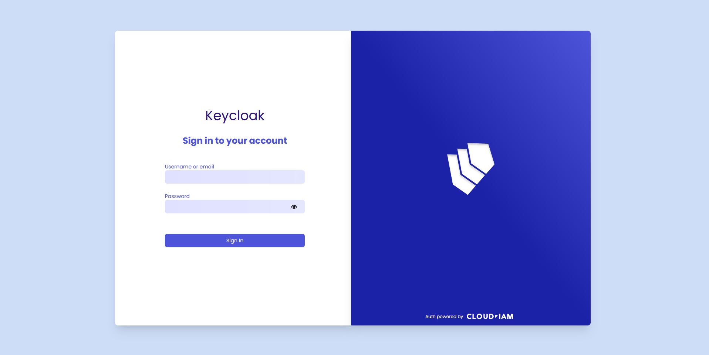
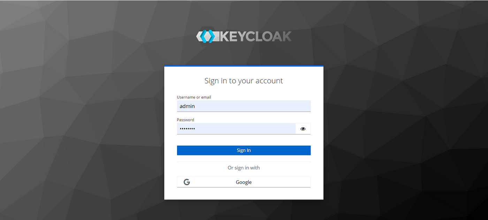
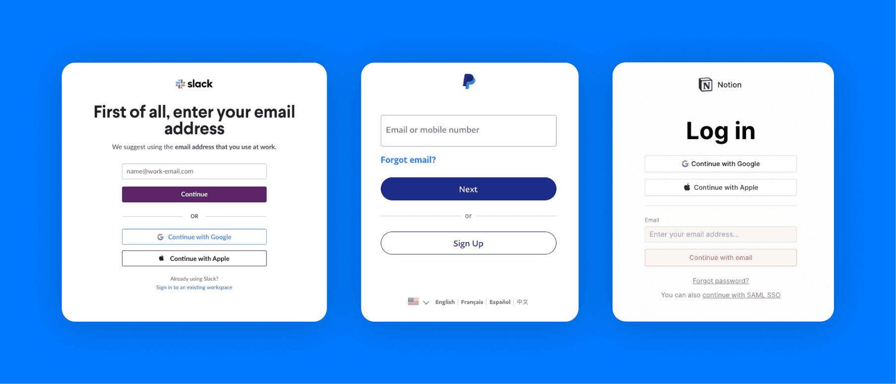
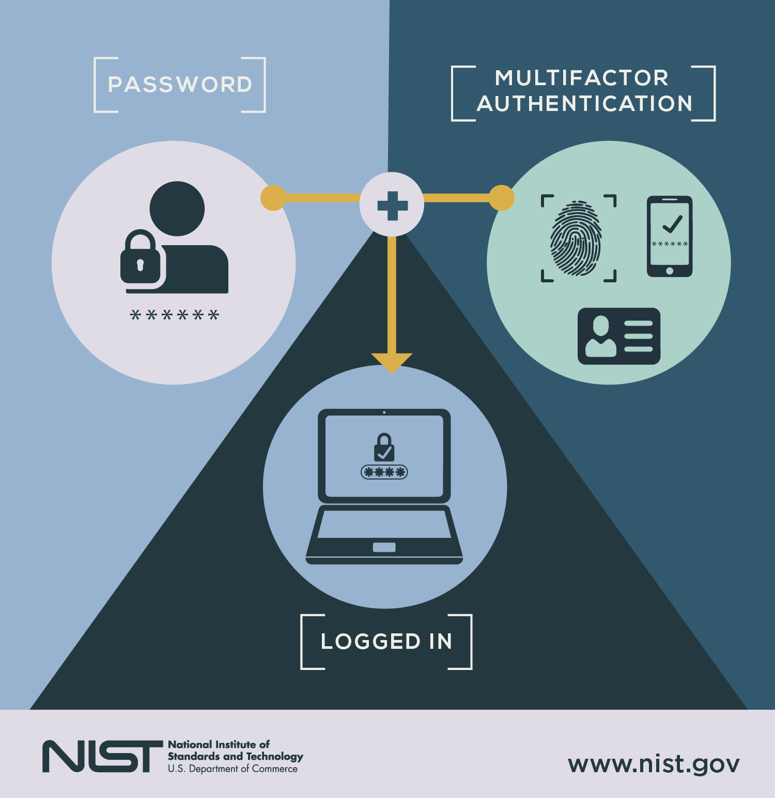

# Titel: Verificatie en aanmeldstromingen vergelijken

---

## 1.0 Standaard login/verificatieflows

### 1.1 Loginmethodes

#### 1.1.1 Username & password

- Gebruiker voert gebruikersnaam en wachtwoord in.
- Systeem controleert of de combinatie geldig is.
- Bij een geldige combinatie wordt de gebruiker ingelogd.

##### 1.1.1.1 Nadelen

- Wachtwoord kan vergeten worden.
- Wachtwoord kan gestolen worden.
- Wachtwoord kan gelekt worden.
- Wachtwoord kan zwak zijn.

##### 1.1.1.1 Voordelen

- Eenvoudig te implementeren.
- Eenvoudig te gebruiken.
- Eenvoudig te begrijpen.
- Meest gebruikte login methode.

#### 1.1.2 Social login

- Gebruiker logt in met een socialmedia-account (bijv. Google, Facebook, Twitter).
- Systeem controleert of de combinatie geldig is.
- Bij een geldige combinatie wordt de gebruiker ingelogd.
- Systeem vraagt toestemming om gegevens te delen met de applicatie.

##### 1.1.2.1 Nadelen

- Gebruiker moet een socialmedia-account hebben.
- Gebruiker moet toestemming geven om gegevens te delen.
- Systeem moet verbinding maken met de socialmedia-API.
- Systeem moet omgaan met verschillende socialmedia-API's.

##### 1.1.2.2 Voordelen

- Gebruiker hoeft geen wachtwoord te onthouden.
- Gebruiker hoeft geen account aan te maken.
- Gebruiker hoeft geen gegevens in te vullen.
- Systeem kan gebruik maken van de gegevens van de socialmedia-account.
- Systeem kan gebruik maken van de beveiliging van de socialmedia-account.
- Systeem kan gebruik maken van de authenticatie van de socialmedia-account.
- Systeem kan gebruik maken van de autorisatie van de socialmedia-account.

### 1.1.3 Passwordless login

- Gebruiker logt in met een e-mailadres of telefoonnummer.
- Systeem stuurt een verificatiecode naar het e-mailadres of telefoonnummer.
- Gebruiker voert de verificatiecode in.
- Systeem controleert of de verificatiecode geldig is.
- Bij een geldige verificatiecode wordt de gebruiker ingelogd.

##### 1.1.3.1 Nadelen

- Gebruiker moet toegang hebben tot het e-mailadres of telefoonnummer.
- Systeem moet omgaan met verschillende e-mail- en telefoonproviders.
- Systeem moet omgaan met verschillende e-mail- en telefoonformaten.
- Systeem moet omgaan met verschillende e-mail- en telefoonbeveiligingen.

##### 1.1.3.2 Voordelen

- Gebruiker hoeft geen wachtwoord te onthouden.
- Gebruiker hoeft geen account aan te maken.
- Gebruiker hoeft geen gegevens in te vullen.
- Systeem kan gebruik maken van de beveiliging van het e-mailadres of telefoonnummer.

#### 1.1.4 MFA

- Gebruiker logt in met een gebruikersnaam en wachtwoord.
- Systeem vraagt om een tweede verificatiemethode (bijv. SMS-code, e-mailcode, authenticator-app).
- Gebruiker voert de tweede verificatiemethode in.
- Systeem controleert of de tweede verificatiemethode geldig is.
- Bij een geldige tweede verificatiemethode wordt de gebruiker ingelogd.
- Systeem vraagt toestemming om gegevens te delen met de applicatie.

#### 1.1.4.1 Nadelen

- Gebruiker moet toegang hebben tot de tweede verificatiemethode.
- Systeem moet omgaan met verschillende verificatiemethoden.

## 1.2 ADR - Verschillende Login methodes

**Datum:** 14-05-2025  
**Status:** In behandeling

### Context

Voor de applicatie is veilige en gebruiksvriendelijke authenticatie essentieel. In deze ADR vergelijken we verschillende
loginmethodes om een onderbouwde keuze te maken die aansluit bij de functionele eisen, gebruikerservaring en
beveiligingsbehoeften van het systeem.

De keuze voor de juiste loginmethode is bepalend voor het vertrouwen van gebruikers, de beveiliging van data en de
schaalbaarheid van het platform.

#### Considered Options

| Forces                    | Password & Username | MFA | Passwordless | Social login |
|---------------------------|---------------------|-----|--------------|--------------|
| Beveiliging               | 0                   | ++  | --           | +-           |
| Gebruikerservaring        | ++                  | 0   | ++           | ++           |
| Implementatiecomplexiteit | ++                  | -+  | 0            | +-           |
| Bekendheid bij gebruikers | ++                  | 0   | +-           | ++           |
| Onderhoud en beheer       | ++                  | ++  | +-           | +-           |

### Decision

We kiezen voor MFA (Multi-Factor Authentication) als standaard authenticatiemethode.

Hoewel traditionele username-wachtwoord combinaties nog steeds breed worden toegepast, zijn ze kwetsbaar voor onder
andere brute force-aanvallen, credential stuffing, en phishing. MFA voegt een extra laag van beveiliging toe door
gebruikers te verplichten twee of meer vormen van verificatie te doorlopen — bijvoorbeeld iets wat ze weten (
wachtwoord), iets wat ze hebben (authenticator app of sms-code), of iets wat ze zijn (biometrie).

In onze context, waar veiligheid en betrouwbaarheid van gebruikersdata essentieel zijn, biedt MFA de juiste balans
tussen veiligheid en gebruikersgemak. Daarnaast sluit deze methode goed aan op mogelijke toekomstige uitbreidingen zoals
single sign-on of federated identity.

### Consequences

* Gebruikers ervaren mogelijk een iets hogere drempel bij het inloggen, maar dit wordt gecompenseerd door verhoogde
  veiligheid.
* De implementatie van MFA vereist integratie met een externe service (zoals Auth0, Firebase, of Microsoft/Google
  Authenticator), wat extra ontwikkeltijd vraagt.
* Phishing-aanvallen worden moeilijker, omdat gebruikers niet alleen hun wachtwoord hoeven in te voeren.
* Gebruiker kan de tweede stap kwijtraken.

*Legenda:*

- ++ Zeer tevreden
- +- Tevreden
- 0 Neutraal
- -+ Ontevreden
- -- Zeer ontevreden

---

## 2.0 Analyseer veiligheid van login met alleen gebruikersnaam/wachtwoord

### 2.1 Risico's

#### 2.1.1 Brute force-aanvallen

- Een aanvaller probeert systematisch alle mogelijk wachtwoorden totdat de juiste combinatie wordt gevonden.
- Dit kan worden voorkomen door een limiet te stellen aan het aantal inlogpogingen en door gebruik te maken van
  CAPTCHA's.
- Daarnaast kan het gebruik van een wachtwoordmanager helpen bij het genereren en opslaan van sterke wachtwoorden.

#### 2.1.2 Credential stuffing

- Gestolen gebruikersnaam & wachtwoord combinaties uit eerdere datalekken worden automatisch getest op andere websites.
- Dit kan worden voorkomen door gebruikers te waarschuwen voor verdachte inlogpogingen en door hen aan te moedigen
  unieke wachtwoorden voor verschillende accounts te gebruiken.
- Daarnaast kan het gebruik van een wachtwoordmanager helpen bij het genereren en opslaan van sterke wachtwoorden.

#### 2.1.3 Phishing

- Gebruikers worden misleid om hun inloggegevens in te voeren op valse websites. Phishing komt veel voor in e-mail,
  sms-berichten en sociale media.
- Dit kan worden voorkomen door gebruikers bewust te maken van de risico's van phishing en hen te leren hoe ze verdachte
  berichten kunnen herkennen.

#### 2.1.4 Keyloggers/ maleware

- kwaadaardige software op het apparaat van gebruiker registreert toetsaanslagen en onderschept inloggegevens.
- Dit kan worden voorkomen door gebruikers te waarschuwen voor verdachte software en hen aan te moedigen
  antivirussoftware te gebruiken.

#### 2.1.5 Wachtwoord hergebruik

- Gebruikers gebruiker bij elke applicatie/ website hetzelfde wachtwoord.
- Dit kan worden voorkomen door gebruikers aan te moedigen unieke wachtwoorden voor verschillende accounts te gebruiken.
- Daarnaast kan het gebruik van een wachtwoordmanager helpen bij het genereren en opslaan van sterke wachtwoorden.

#### 2.1.6 Zwakte van gebruikerswachtwoorden

- Gebruikers gebruiken zwakke wachtwoorden (bijv. "123456", "wachtwoord", "qwerty").
- Dit kan voorkomen worden door een limit te stellen van (1 hoofdletter, 1 unique karakter, 1 cijfer) en een minimum
  aantal
  karakters (8).
- Voor zwakke wachtwoorden kan een wachtwoordmanager helpen bij het genereren en opslaan van sterke wachtwoorden.

---

## 3.0 Veiligheid van login met MFA

Door gebruik te maken van Multi-Factor Authentication (MFA) wordt de kans op een succesvolle aanval aanzienlijk
verkleind. Zelfs als een aanvaller toegang heeft tot het wachtwoord van een gebruiker, kan deze niet inloggen zonder de
tweede of derde verificatiemethode. Dit maakt MFA een van de meest effectieve manieren om accounts te beschermen tegen
ongeautoriseerde toegang.

MFA combineert meerdere verificatiefactoren, die doorgaans in drie categorieën vallen:

- **Iets wat je weet:** zoals een wachtwoord of pincode.
- **Iets wat je hebt:** zoals een hardware-token, een sms-code, of een authenticator-app.
- **Iets wat je bent:** zoals biometrische gegevens (vingerafdruk, gezichtsherkenning).

**Voordelen van MFA**

- **Verhoogde beveiliging:** Zelfs als een van de factoren wordt gecompromitteerd, blijft het account beschermd door de
  andere factoren.
- **Bescherming tegen veelvoorkomende aanvallen:** MFA maakt het moeilijker voor aanvallers om succesvol te zijn bij
  brute force-aanvallen, credential stuffing, phishing, en andere methoden.
- **Flexibiliteit:** Verschillende MFA-methoden kunnen worden gecombineerd om aan de behoeften van gebruikers en
  organisaties te voldoen.

**Voorbeelden van MFA-methoden**

- **SMS-code:** Een eenmalige code die naar het mobiele nummer van de gebruiker wordt gestuurd.
- **E-mailcode:** Een eenmalige code die naar het e-mailadres van de gebruiker wordt gestuurd.
- **Authenticator-app:** Een app (zoals Google Authenticator of Authy) die een eenmalige code genereert op basis van
  tijd of een geheime sleutel.
- **Biometrische verificatie:** Vingerafdrukken, gezichtsherkenning of irisscans.
- **Hardware token:** Een fysiek apparaat dat een eenmalige code genereert of een beveiligingssleutel biedt (zoals
  YubiKey).

**Aanvullende beveiligingsmaatregelen**

- **IP-whitelisting:** Alleen toegang toestaan vanaf een goedgekeurde IP-adres of netwerk.
- **Geolocatie:** Inlogpogingen beperken tot specifieke geografische locaties.
- **Device fingerprinting:** Bekende apparaten herkennen en verdachte apparaten blokkeren.
- **Tijdslimieten:** Beperk de tijd waarin een verificatiecode geldig is.

Door MFA te implementeren in combinatie met deze maatregelen, wordt het risico op ongeautoriseerde toegang tot accounts
drastisch verminderd.

### 3.1 Risico's die verlaagd worden door gebruik van MFA

Zoals besproken in de vorige hoofdstuk, MFA kan helpen bij het verminderen van de risico's van:

- Brute force-aanvallen
- Credential stuffing
- Phishing
- Keyloggers/ maleware
- Wachtwoord hergebruik
- Zwakte van gebruikerswachtwoorden

Kortom, MFA maakt het moeilijker voor aanvallers om jouw account binnen te komen, zelfs als ze jouw gegevens hebben.

### 3.2 Risico's per MFA methode

#### 3.2.1 SMS-code

- SMS kan worden onderschept via SIM-swapping.
- Telefoons kunnen gestolen worden of via malware worden misbruikt.

#### 3.2.2 E-mailcode

- Aanvallers kunnen toegang krijgen tot e-mailaccounts via phishing of onveilige opslag.
- Computers waarop e-mail openstaat kunnen misbruikt worden.

#### 3.2.3 Authenticator-app

- Als de telefoon wordt gestolen of gecompromitteerd, is toegang tot codes mogelijk.
- Herstelprocedures zijn soms zwak (bijv. via e-mail).

#### 3.2.4 Biometrische verificatie

- Biometrische data kan in uitzonderlijke gevallen worden gerepliceerd.
- Onveranderlijke aard van biometrie betekent dat bij lek de schade permanent is.

#### 3.2.5 Hardware token (zoals YubiKey)

- Kan gestolen of verloren worden.
- Gebruikers kunnen vergeten hun token mee te nemen of te koppelen.

#### 3.2.6 Tegenmaatregelen

| MFA methode       | Risico                                   | Tegenmaatregel                                                                     |
|-------------------|------------------------------------------|------------------------------------------------------------------------------------|
| SMS-code          | SIM-swapping, onderschepping             | Niet gebruiken als enige methode beperken tot laag-risico scenario's               |
| E-mailcode        | Toegang tot e-mail via phishing          | E-mailaccounts beschermen met aparte MFA                                           |
| Authenticator-app | Verlies toestel, synchronisatieproblemen | backup codes aanbieden, veilige herstelprocedures                                  |
| Biometrie         | Lek van biometrische data                | Lokale opslag, device-level bescherming, nooit als enige factor                    |   
| Hardware token    | Diefstal, verlies                        | Koppelen aan back-up methode (bijv. authenticator), detectie van verdachte sessies |

---

## 4.0 Vergelijk social login qua veiligheid en privacy

Om de veiligheids en privacyrisico's van social login te beoordelen. WE onderzoeken onder andere Google-, Facebook-, en
Apple-login. Daarnaast worden mitigerende maatregelen voorgesteld om deze risico's te beperken.

### 4.1 Risico's van social login

| Risico                                  | Uitleg                                                                                                                                                                                      |
|-----------------------------------------|---------------------------------------------------------------------------------------------------------------------------------------------------------------------------------------------|
| Afhankelijkheid van derden partij       | Je vertrouwt voor authenticatie volledig op een externe partij (bijv. Google). Bij een storing, wijziging in API-beleid of blokkade ben je als applicatiebeheerder kwetsbaar.               | 
| Gegevensdeling met de identity provider | Social login geeft standaard toegang tot persoonsgegevens (naam, e-mail, soms profielfoto, contacten). Veel gebruikers geven onbewust toestemming voor brede toegang.                       |
| Privacyrisico's voor de gebruiker       | De identity provider (zoals Meta of Google) kan gebruikersactiviteit bijhouden of koppelen aan hun profiel, wat tracking en profiling mogelijk maakt.                                       |
| Beveiligingsincidenten bij de provider  | Als een social login-provider gehackt wordt of een beveiligingsfout maakt, kan dat indirect alle gekoppelde applicaties treffen.                                                            |
| Oncontroleerbare toegangsmethoden       | De eindgebruiker bepaalt zelf hoe hij bij de identity provider inlogt - dit kan zwakke beveiliging (zoals alleen wachtwoord) betekenen, wat je als applicatiebeheerder niet kunt afdwingen. |

### 4.2 Mitigaties en aanbevelingen

| Risico                     | Mitigatie                                                                                                                                                                                                       |
|----------------------------|-----------------------------------------------------------------------------------------------------------------------------------------------------------------------------------------------------------------|
| Afhankelijkheid van derden | Bied alternatieve loginmethodes aan zoals e-mail + wachtwoord of federated login via eigen SSO-provider. Monitor uptime van de provider en stel duidelijke fallbackprocedures op.                               |
| Gegevensdeling             | Gebruik Oauth-scopes minimaal: vraag alleen gegevens op die strikt noodzakelijk zijn (bijv. e-mailadres). Toon aan de gebruiker transparant welke gegevens worden gedeeld.                                      |
| Privacyrisico's            | Stel in dat social login niet standaard alle profielen of permissies accepteert. Gebruik privacyvriendelijke login opties zoals "Sign in with Apple", waarbij gebruikers een anoniem e-mailadres kunnen kiezen. |
| Beveiligingsincidenten     | Implementeer token-verificatie aan de server zijde en beperk sessieduur. Gebruik MFA als extra bescherming bij gevoelige acties binnen je eigen app.                                                            |
| Zwakke toegangsmethoden    | Gebruik risk-based authentication: als het token komt van een onveilige sessie of locatie, verplicht dan aanvullende verificatie in je eigen systeem.                                                           |

### 4.3 Conclusie

Social login is gebruiksvriendelijk, verlaagt drempels voor registratie en verlaagt beheerlast voor wachtwoorden. Maar
het introduceert belangrijke veiligheids- en privacyrisico's zoals afhankelijkheid van derde partijen, gegevensdeling en
verminderde controle over authenticatie.

Daarom is het aan te om:

* Social login aan te bieden als secundaire optie, met een transparant databeleid.
* Scope en permissies minimaal te houden.
* Een fallback en herstelmechanisme te hebben bij storing of blokkades van de provider.
* De eindgebruiker te informeren over wat er gedeeld wordt.

Met passende mitigaties blijft social login een bruikbare optie, mits bewust ingezet.

---

## 5.0 Vergelijk gebruikersflows: traditional login vs. passwordless

### 5.1 Gebruikersflow

#### 5.1.1 Traditional login

1. Gebruiker opent de applicatie.
2. Gebruiker klikt op "Inloggen".
3. Gebruiker voert gebruikersnaam en wachtwoord in.
4. Systeem controleert de inloggegevens.
5. (Optioneel) Systeem vraagt om MFA (bijv. SMS-code).
6. Bij een geldige combinatie wordt de gebruiker ingelogd.

### 5.1.2 Passwordless login

1. Gebruiker opent de applicatie.
2. Gebruiker klikt op "Inloggen".
3. Gebruiker voert e-mailadres of telefoonnummer in.
4. Systeem stuurt een verificatiecode naar het opgegeven e-mailadres of telefoonnummer.
5. Gebruiker ontvangt de verificatiecode.
6. Gebruiker voert de verificatiecode in.
7. Systeem controleert de verificatiecode.
8. Bij een geldige verificatiecode wordt de gebruiker ingelogd.

## 5.2 Vergelijking van de gebruikersflows

| Aspect               | Traditional Login                                              | Passwordless Login                                             |
|----------------------|----------------------------------------------------------------|----------------------------------------------------------------|
| **Gebruiksgemak**    | Kan lastig zijn door wachtwoordbeheer en -onthouding           | Gemakkelijker, geen wachtwoorden nodig                         |
| **Beveiliging**      | Vatbaar voor wachtwoordlekken en phishing                      | Minder kwetsbaar voor phishing en wachtwoorddiefstal           |
| **Snelheid**         | Kan vertraagd worden door wachtwoordherstel en invoer          | Snellere authenticatie door biometrie of eenmalige verificatie |
| **Toegankelijkheid** | Niet ideaal voor mensen die moeite hebben met wachtwoordbeheer | Toegankelijker door alternatieve verificatiemethoden           |
| **Onderhoud**        | Vereist regelmatig wachtwoordupdates en beleid                 | Minder onderhoud nodig, enkel update van verificatiemethoden   |

### 5.3 Conclusie t.a.v gebruiksgemak

Een passwordless login biedt over het algemeen een betere gebruikerservaring. Het elimineert de noodzaak om wachtwoorden
te onthouden en vermindert de kans op beveiligingsproblemen. Hoewel traditionele logins nog steeds gangbaar zijn,
bewegen steeds meer systemen naar wachtwoordloze methoden vanwege hun snelheid, gemak en verbeterde beveiliging.

---

## 6.0 Analyse van gebruikersnaam/wachtwoord-authenticatie in Keycloak

### 6.1 Standaard authenticatie gedrag in Keycloak

Keycloak ondersteunt gebruikersnaam/wachtwoord-authenticatie als standaard loginmethode. Zodra een gebruiker inlog via
het login formulier.

1. Keycloak controleert gebruikersnaam en wachtwoord via de internal user store of een externe identity provider (LDAP,
   AD).
2. Authenticatie verloopt via een authenticatie flow die is gedefinieerd in de admin console (bijv. Browser flow).
3. Na succesvolle authenticatie ontvangt de gebruiker een access token (en eventueel een refresh token).

### 6.2 Beveiligingsmaatregelen in Keycloak

Keycloak biedt meerdere ingebouwde features om deze methode veilig(er) te maken:

#### 6.2.1 Brute force protection

- **Locatie in console:** Realm Settings -> Security Defenses -> Brute Force Detection
- **Beschikbare instellingen:**
    - Maximaal aantal mislukte inlogpogingen
    - Tijdslimiet tussen pogingen
    - Vergrendeling van account voor bepaalde duur
    - Blacklist van IP-adressen.
- Status: Uitgeschakeld *by default*, moet handmatig worden ingeschakeld!

#### 6.2.2 Login policies

- **Locatie:** Realm Settings -> Login
- **Mogelijkheden:**
    - Wachtwoordbeleid configureren: minimale lengte, gebruik van cijfers/letters/symbolen, voorkomen van hergebruik.
    - Inschakelen van verificatie via e-mail of andere factoren.
    - Captcha toevoegen aan login flow (via custom authenticators).

#### 6.2.3 Password policies

- **Locatie:** Realm Settings -> Password Policy
- **Voorbeelden:**
    - Lengte(8-20 karakters)
    - Hoofdletters
    - Cijfers
    - Speciale karakters
    - notUsername
- Je kunt een combinatie instellen als string:
    - minLength(8) and digits(1) and upperCase(1) and specialChars(1)

#### 6.2.4 Logging & Auditing

- **Event logging:** Aan te zetten via *Events* in het admin menu.

- **Registreert:**
    - Login attempts (geslaagd of mislukt)
    - Vergrendelingen
    - Gebruikersaanpassingen

- **Integratie:**
    - Kan worden doorgestuurd naar een **SIEM-systeem** of logserver via **SPI (Service Provider Interface)**.

#### 6.2.5 Session Configuratie

Sessietijd (bijv. inactiviteit, token TTL) is aanpasbaar om risico bij gestolen tokens te minimaliseren:

- **Te vinden via:** Realm Settings → Tokens

### 6.2.6️ Aanbevelingen voor Veilige Configuratie

- Activeer **brute force protection** met strikte limieten (bijv. max. 5 pogingen, vergrendeling 15 min).
- Stel een **sterk wachtwoordbeleid** in:
    - Minimaal 10 tekens
    - Cijfers, hoofdletters, symbolen verplicht
    - Geen gebruik van gebruikersnaam of eerder wachtwoord
- Zorg voor **logging en monitoring** van login attempts en configuratiewijzigingen.
- Gebruik **CAPTCHA of MFA** in de login flow voor extra bescherming.
- Beperk **sessieduur en token-leeftijd** voor gevoelige applicaties.
- Schakel **e-mailbevestiging** in bij registratie of wachtwoordreset.

### 6.2.7 Samenvatting

| Beveiligingsoptie     | Ondersteund?      | Aanbevolen Actie          |
|-----------------------|-------------------|---------------------------|
| Brute Force Protectie | ja                | Inschakelen               |
| Wachtwoordbeleid      | ja                | Strikt beleid instellen   |
| CAPTCHA               | alleen via plugin | Toevoegen indien mogelijk |
| MFA                   | ja                | Toevoegen als extra stap  |
| Event Logging         | ja                | Inschakelen en monitoren  |

---

## 7.0 Vergelijking van MFA-methodes in Keycloak-authenticatiestromen

Keycloak biedt ondersteuning voor verschillende vormen van multi-factor-authenticatie (MFA) via configureerbare
authenticatiestromen. Deze analyse vergelijkt drie gangbare MFA-methodes binnen Keycloak: TOTP, WebAuthn en SMS (via
extensie of externe integratie). De vergelijking richt zich op configuratiegemak, gebruikerservaring en
beveiligingsniveau.

### 7.1 Vergelijking van MFA-methodes

| Methode  | Ondersteund in Keycloak?             | Configuratie vereist?      | Extra componenten nodig?                        |
|----------|--------------------------------------|----------------------------|-------------------------------------------------|
| TOTP     | Ja (Standaard)                       | Nee, direct beschikbaar    | Authenticator-app (zoals Google Authenticator)  |
| WebAuthn | Ja (Standaard)                       | Ja, via authenticator flow | WebAuthn-compatibel device (biometrie/FIDO key) |
| SMS      | Alleen via extensie of custom plugin | Ja, externe provider nodig | SMS gateway (bijv. Twilio, AWS SNS)             |

### 7.2 Configuratie in Keycloak

#### 7.2.1 TOTP (Time-based One-Time Password)

- **Locatie:** Authentication → flows → Browser → Voeg "OTP Form" toe.
- **Gebruiker registreert** een authenticator-app bij eerste login.
- **Beveiliging:** Sterk, afhankelijk van app-integriteit.
- **Nadelen:** Vereist toegang tot mobiele telefoon.

#### 7.2.2 WebAuthn

- **Locatie:** Authentication → Flows → Voeg “WebAuthn” of “WebAuthn Passwordless” toe.
- **Ondersteunt:** Biometrie (vingerafdruk, gezichtsherkenning), FIDO2 keys.
- **Beveiliging:** Zeer hoog – phishing-resistent.
- **Nadelen:** Minder bekend bij eindgebruikers, vereist moderne browsers/hardware.

#### 7.2.3 SMS (via extensie)

- **Niet standaard beschikbaar**, maar kan worden toegevoegd via een custom **Authenticator SPI** of
  community-extensies.
- **Beveiliging:** Gematigd – kwetsbaar voor SIM-swapping.
- **Voordeel:** Bekend voor gebruikers, geen apps nodig.
- **Nadeel:** Extra kosten en infrastructuur.

---

### 7.3 Gebruikerservaring per methode

| Methode  | Gebruikersgemak   | Tijdsimpact                          | Toegankelijkheid        | Potentiële frustratie               |
|----------|-------------------|--------------------------------------|-------------------------|-------------------------------------|
| TOTP     | Matig (app nodig) | Snel (<10s)                          | Alleen mobiel           | Verlies toestel = probleem          |
| WebAuthn | Hoog (1 klik)     | Zeer snel                            | Alleen moderne hardware | Minder bekend/vertrouwd             |
| SMS      | Hoog              | Gemiddeld (afhankelijk van levering) | Brede compatibiliteit   | Vertraging, kosten, betrouwbaarheid |

---

### 7.4 Aanbevelingen

- **TOTP** is geschikt voor algemene toepassingen met beperkte complexiteit.
- **WebAuthn** is ideaal voor applicaties waar **phishing-resistentie** en **gebruiksgemak** topprioriteit zijn (bijv.
  zakelijke toepassingen).
- **SMS** is alleen aan te raden als laagdrempelige backup-optie, **niet als primaire MFA**, vanwege lagere beveiliging.

---

### 7.5 Conclusie

Keycloak biedt flexibele ondersteuning voor MFA via authentication flows. De keuze voor een MFA-methode moet afhangen
van:

- Beoogde gebruikersgroep
- Beschikbare infrastructuur
- Gewenst beveiligingsniveau

**WebAuthn** biedt de beste balans tussen veiligheid en gebruiksgemak, mits hardware en browsers het ondersteunen.

---

## 8.0 Evaluatie van Social Login Fallback-scenario's in Keycloak

### 8.1 Wat is een fallback login?

Een fallback login biedt een alternatieve methode voor toegang als de primaire login faalt.

- Emailadres + wachtwoord
- Magic link via e-mail
- Account recovery via registratie-email
- Andere federated login (e.g., enterprise IdP of overheid ID)

### 8.2 Ondersteuning van fallback in Keycloak

Keycloak biedt geen automatische fallback-mogelijkheid na mislukte login via een social provider. Wel kun je *
*parallelle loginmethoden** aanbieden:

- **Identity brokering:** Meerdere IdP's beschikbaar maken.
- **Username/password login:** Inschakelen naast social login.
- **Account linking:** Gebruikersaccounts koppelen aan meerdere loginmethodes.

### 8.3 Aanpak in Keycloak

1. Stel meerdere identity providers in (bijv. Google, Facebook).
2. Activeer standaard login via `Authentication → Flows → Browser → Forms`.
3. Gebruik de `Review Profile` of `Confirm link` flow bij nieuwe logincombinaties.
4. Optioneel: Configureer custom error handeling (bijv. voor `AccountAlreadyExistsException` of login cancel).

### 8.4 Voor- en nadelen van fallback login

| Aspect         | Voordeel                                                 | Nadeel / Risico                                                 |
|----------------|----------------------------------------------------------|-----------------------------------------------------------------|
| Gebruiksgemak  | Gebruiker heeft altijd een alternatieve weg naar toegang | Verwarring als fallback niet duidelijk gecommuniceerd wordt     |
| Beveiliging    | Voorkomt lockout bij storing of blokkade                 | Tweede loginmethode kan minder veilig zijn dan de eerste        |
| Beheerbaarheid | Meer controle over toegang                               | Complexere flows en verhoogde kans op foutieve accountkoppeling |
| Privacy        | Mogelijkheid tot minder gegevensdeling                   | Gebruiker moet vertrouwen hebben in beide loginroutes           |

### 8.5 UX-overwegingen

- **Transparantie:** Leg duidelijk uit waarom een fallback login wordt aangeboden.
- **Flowduidelijkheid:** Vermijd dat gebruikers per ongeluk een tweede account aanmaken.
- **Keuzevrijheid:** Laat gebruikers expliciet kiezen welke methode ze willen gebruiken.
- **Herstelpad:** Bied duidelijke hulp aan als gebruikers problemen hebben bij toegang (bijv. wachtwoord vergeten, geen
  toegang tot social provider).

### 8.6 ADR - Aanbevelingen voor veilige implementatie

**Datum:** 20-05-2025  
**Status:** In behandeling

### Context

In de huidige Keycloak-configuratie wordt social login ondersteund via Identity Brokering (bijv. Google, Apple,
Facebook). Echter, wanneer deze externe providers tijdelijk niet beschikbaar zijn of een gebruiker geen toegang meer
heeft, kan dit leiden tot lockouts of gebruikersfrustratie.

Om risico’s van afhankelijkheid te beperken, willen we fallback-loginmethodes aanbieden, zoals username/password of
magic link, zonder daarbij afbreuk te doen aan veiligheid en gebruikerservaring.

#### Considered Options

| Forces                              | Alleen social login | Social login met fallback (e-mail/wachtwoord) | Social login + fallback + account linking | Passwordless login only |
|-------------------------------------|---------------------|-----------------------------------------------|-------------------------------------------|-------------------------|
| Gebruikersgemak                     | +-                  | ++                                            | ++                                        | +-                      |
| Beveiliging bij storing third-party | --                  | ++                                            | ++                                        | ++                      |
| Beheerbaarheid / complexiteit       | ++                  | +-                                            | +-                                        | -+                      |
| Privacycontrole voor gebruiker      | -+                  | +-                                            | ++                                        | ++                      |
| Kans op dubbele accounts            | 0                   | 0                                             | ++                                        | +-                      |
| Ondersteuning in Keycloak           | ++                  | ++                                            | +-                                        | +-                      |

### Decision

We kiezen voor de **combinatie van social login met fallback login via e-mail/wachtwoord**, in combinatie met **account
linking via e-mailadres** in Keycloak.  
We implementeren de volgende maatregelen:

- **Meerdere authenticatie-opties** tonen op de loginpagina (IdP’s + standaard login).
- **Account linking** activeren in de identity brokering flow.
- **Review Profile** flow inschakelen bij nieuwe IdP-logins.
- **Gebruikers informeren** over alternatieven bij social login-fouten.
- **Logging en monitoring** instellen voor mislukte loginpogingen.

### Consequences

Gebruikers blijven toegang houden, ook als social login tijdelijk niet werkt.

- Minder afhankelijkheid van derde partijen.
- Betere beveiliging bij social login-failures.
- Iets complexere configuratie van login flows in Keycloak.
- ️Duidelijke communicatie aan de gebruiker is vereist om verwarring te voorkomen.

*Legenda:*

- ++ Zeer tevreden
- +- Tevreden
- 0 Neutraal
- -+ Ontevreden
- -- Zeer ontevreden

---

## 9.0 Passwordless login-opties in Keycloak: Magic Link, E-mail Link & WebAuthn

### 9.1 Passwordless login opties

Passwordless login verwijst naar inlogmethodes waarbij de gebruiker **geen wachtwoord** hoeft te onthouden of in te
voeren. Veelgebruikte vormen zijn:

- **Magic link**: unieke loginlink per e-mail.
- **One-time code (OTP)** via e-mail.
- **WebAuthn**: biometrisch of hardwaregebaseerd (zoals YubiKey, Touch ID).

Keycloak ondersteunt passwordless login via meerdere mechanismen.

### 9.2 Opties voor passwordless login in Keycloak

| Methode           | Ondersteund door Keycloak?           | Uitleg                                                                   |
|-------------------|--------------------------------------|--------------------------------------------------------------------------|
| E-mail Magic Link | Alleen via extensie/custom SPI       | Login via unieke eenmalige link per e-mail                               |
| OTP via e-mail    | Native via Email OTP authenticator   | Eenmalige 6-cijferige code per e-mail                                    |
| WebAuthn          | Native ondersteund sinds Keycloak 7+ | Inloggen met biometrie of beveiligingssleutel (FIDO2/WebAuthn-standaard) |

> *Magic link login is niet standaard aanwezig maar kan worden toegevoegd via community plugins of aangepaste
authenticators.*

### 9.3 Voordelen van passwordless login

| Aspect             | Voordeel                                                                              |
|--------------------|---------------------------------------------------------------------------------------|
| UX                 | Geen wachtwoord onthouden of resetten nodig                                           |
| Beveiliging        | Geen risico op password leaks, credential stuffing of brute force                     |
| Frictie verlagen   | Vooral geschikt voor first-time users of mobiele scenario’s                           |
| Phishing-resistent | WebAuthn beschermt tegen phishing (credential nooit zichtbaar voor gebruiker of site) |

### 9.4 Risico's & mitigaties

| Risico                           | Uitleg                                                                                  | Mogelijke mitigatie                                                   |
|----------------------------------|-----------------------------------------------------------------------------------------|-----------------------------------------------------------------------|
| E-mail overname of interceptie   | Als iemand toegang heeft tot de mailbox, kan hij zich authenticeren                     | E-mail MFA verplichten, link-expiry beperken tot 5-10 minuten         |
| WebAuthn is browsergebonden      | WebAuthn keys zijn apparaat-specifiek, toegang tot ander apparaat = geen login mogelijk | Alternatief aanbieden (e-mail login of federated login)               |
| Onbeschikbaarheid device/sleutel | Gebruiker kan niet inloggen bij verlies of reset van biometrisch device                 | Recovery-methode instellen (bijv. fallback via support of e-mail OTP) |
| Geen ‘shared login’ mogelijk     | Geen toegang delen tussen collega’s mogelijk met WebAuthn                               | Gebruik accountdelegatie of groepsrollen voor gedeelde toegang        |

### 9.5 UX-evaluatie

| Methode    | Wat vinden gebruikers prettig?                                | Wat kan verwarrend zijn?                                         |
|------------|---------------------------------------------------------------|------------------------------------------------------------------|
| Magic link | Zeer laagdrempelig, geen wachtwoord vereist                   | Sommige gebruikers snappen niet dat ze hun mailbox moeten openen |
| E-mail OTP | Bekend patroon, vertrouwd                                     | Bij vertraging in maillevering ontstaat frustratie               |
| WebAuthn   | Eén klik, geen wachtwoord – top UX voor tech-savvy gebruikers | Slechte browser/device ondersteuning kan zorgen voor frustratie  |

### 9.6 Keycloak-configuratie

#### 9.6.1 WebAuthn

Te configureren via:

- `Authentication → Flows → Browser → Add WebAuthn Authenticator`
- Ondersteuning voor: platform authenticators (bijv. Touch ID) en cross-platform (bijv. YubiKey)

#### 9.6.2 OTP via e-mail

- Activeer `Authentication → Flows → OTP` met `Email OTP`
- E-mailadres moet vooraf geverifieerd zijn

#### 9.6.3 Magic Link (custom)

- Plugins: bijv. [keycloak-magic-link](https://github.com/p2-inc/keycloak-magic-link)
- Custom Authenticator via SPI: genereert een login token en stuurt dit via e-mail
- Voorbeeldimplementatie vereist back-end mail service & korte link-levensduur

---

## 10.0 Logging- en monitoringstrategieën voor Keycloak-authenticatie

### 10.1 Overzicht van logtypes in Keycloak

| Logtype          | Beschrijving                                                                                   | Configuratie                                                      |
|------------------|------------------------------------------------------------------------------------------------|-------------------------------------------------------------------|
| **Event logs**   | Registreert user events zoals login (geslaagd/mislukt), logout, registratie, reset password.   | `Realm Settings → Events`                                         |
| **Admin events** | Registreert acties via admin console of API, bijv. user delete, role change, client config.    | `Realm Settings → Admin Events`                                   |
| **Token logs**   | Niet standaard gelogd, maar token-uitgifte is zichtbaar via login events of audit integraties. | Token validatie & metadata via access logs of reverse proxy nodig |
| **Server logs**  | Alle runtime info, inclusief fouten, in JSON of plaintext via WildFly/Quarkus logs.            | `standalone/configuration/logging.properties` of `keycloak.conf`  |

### 10.2 Aanbevolen configuratie

| Aspect                     | Aanbeveling                                                                                                                                                                                    |
|----------------------------|------------------------------------------------------------------------------------------------------------------------------------------------------------------------------------------------|
| **Eventretentie**          | Stel bewaartermijn in naar AVG/beleid – bijv. 90 dagen                                                                                                                                         |
| **Filtering**              | Log alleen relevante events (bijv. `LOGIN`, `LOGIN_ERROR`, `UPDATE_PASSWORD`) om ruis te vermijden                                                                                             |
| **Forwarding**             | Gebruik [SPI (Service Provider Interface)](https://www.keycloak.org/docs/latest/server_development/#_events-spi) om events door te sturen naar externe tools of een message queue (Kafka/AMQP) |
| **Sensitive data masking** | Vermijd logging van plaintext gebruikersdata of tokens (versleutelen of maskeren indien mogelijk)                                                                                              |
| **Admin event logging**    | Altijd inschakelen voor governance: `enable=true`, `includeRepresentation=true`                                                                                                                |

### 10.3 Integratie met externe monitoringtools

| Tool        | Integratiemethode                                                                       |
|-------------|-----------------------------------------------------------------------------------------|
| **ELK**     | Verzamel serverlogs via Filebeat/Logstash, parse op login events (`eventType`, `error`) |
| **Splunk**  | Gebruik HTTP Event Collector (HEC) of syslog agent op het systeem waar Keycloak draait  |
| **Grafana** | Combineer Prometheus metrics van Keycloak-exporter met alerting op login error rates    |
| **SIEM**    | Parse structured logs of forward events via custom SPI plugin                           |

## 11.0 Juridische/AVG-implicaties bij het verwijderen en aanmaken van gebruikers in Keycloak en een eigen IAM-systeem

Het aanmaken en verwijderen van gebruikers in een IDentity & ACcesss Management (IAM)-systeem zoals keycloak valt onder
de Algemene Verordening Gegevnsbescherming (AVG/GDPR). Hieronder worden de belangrijkste verplichtingen en risico's
bespreken aan de hand van relevante artikelen uit de AVG.

### 11.1 AVG-verplichtingen bij aanmaken van gebruikers

#### 11.1.1 Dataminimalisatie - Artikel 5 lid 1c AVG

Alleen persoonsgegevens verzamelen die noodzakelijk zijn voor het doel van verwerking. BIj het aanmaken van een
gebruiker in Keycloak:

- **Toegestaan:** Naam, e-mailadres, rol/informatie.
- **Niet toegestaan zonder noodzaak:** Geboortedatum, telefoonnummer, BSN, tenzij functioneel vereist.

- **Aanbeveling:** Gebruik Keycloak's `User Attrubyte Mapping` om verplichte/optionele velden te beperken.

### 11.2 Transparantie en toestemming - *Art. 13, 6, 7 AVG*

Gebruikers moeten:

- Weten wat er met hun gegevens gebeurt.
- Expliciet toestemming geven als dit de grondslag is.

- **Aanbeveling:**
    - Toon privacyverklaring bij registratie.
    - Log toestemming (eventueel via consent screens of logging)

### 11.3 AVG-verplichtingen bij verwijderen van gebruikers

#### 11.3.1 Recht op vergetelheid - *Artikel 17 AVG*

Gebruikers mogen hun gegevens laten verwijderen als:

- Ze niet meer nodig zijn
- Toestemming wordt ingetrokken
- Er bezwaar is

**Keycloak Implicaties**:

- Verwijderen via de admin-console of API
- Ook gekoppelde data zoals linked identities of history meenemen (tenzij bewaarplicht geldt)

**Aanbeveling**:
Gebruik *soft delete* met retentiebeleid óf automatische data clean-up.

### 11.4 Logging en bewaartermijnen - *Artikelen 5 & 32 AVG*

Logging van bijv. loginpogingen of admin-wijzigingen bevat mogelijk persoonsgegevens.

**Aanbeveling**:

- Stel bewaartermijnen in voor logging (bijv. 180 dagen)
- Anonimiseer oude logs of verwijder ze
- Configureer dit via externe loggingoplossingen of Keycloak zelf

### 11.5 Verantwoordingsplicht en databeheer - *Artikel 30 & 32 AVG*

IAM-beheerders moeten:

- Kunnen aantonen waarom gegevens verzameld zijn.
- Passend beveiligingsmaatregelen treffen

**Aanbeveling**

- Documenteer user lifecycle-processen (aanmaken, wijzigen, verwijderen)
- Gebruik `Admin Event Logging`
- Zet een audittrail op via een SIEM-oplossing

---

## 12.0 Conclusie

### 12.1 ADR - Keycloak tegen eigen IAM-Implementatie

**Datum:** 21-05-2025
**Status:** In behandeling

### Context

Voor het IAM-systeem is een robuuste en flexibele authenticatieoplossing vereist. Keycloak biedt uitgebreide
mogelijkheden voor gebruiksbeheer en beveiliging, maar sommige functionaliteiten vereisen extra configuratie of externe
integraties.

### Considered Options

| Forces                        | Keycloak | Custom oplossing |
|-------------------------------|----------|------------------|
| Beveiliging                   | ++       | ++               |
| Flexibiliteit                 | ++       | ++               |
| Ondersteuning voor SSO & MFA  | ++       | +-               |
| Complexiteit van configuratie | -+       | --               |
| Onderhoud & beheer            | +-       | --               |
| Login methodes                | ++       | +-               |
| AVG                           | ++       | 0                |
| Logging- en Auditing          | +-       | 0                |

### Decision

We kiezen voor Keycloak als IAM-oplossing vanwege de uitgebreide ondersteuning voor SSO, MFA en identity brokering.
Hoewel sommige functionaliteiten extra configuratie vereisen, biedt Keycloak een solide basis voor veilige en schaalbare
authenticatie.

### Consequences

- **Voordelen**
    - Robuuste beveiliging en flexibiliteit
    - Ondersteuning voor moderne authenticatiemethodes zoals WebAuthn en federated login.
    - Open-source en uitbreidbaar via SPI
- **Nadelen**
    - Extra configuratie vereist voor sommige functies zoals SMS-authenticatie en Magic Link login.
    - Complexiteit bij beheer en onderhoud.

*Legenda:*

- ++ Zeer tevreden
- +- Tevreden
- 0 Neutraal
- -+ Ontevreden
- -- Zeer ontevreden

## Bronnen

- [Realm settings Keycloak](https://www.keycloak.org/docs/latest/server_admin/index.html#controlling-login-options)
- [Keycloak Docs – Identity Brokering](https://www.keycloak.org/docs/latest/server_admin/#identity-broker)
- [Keycloak Docs – Authentication Flows](https://www.keycloak.org/docs/latest/server_admin/#authentication-flows)
- [OWASP – Account Recovery Guidelines](https://cheatsheetseries.owasp.org/cheatsheets/Forgot_Password_Cheat_Sheet.html)
- [Elastic](https://www.elastic.co/security/siem)
- [Keycloak developer guide](https://www.keycloak.org/docs/latest/server_development/)
- [AVG](https://eur-lex.europa.eu/legal-content/NL/TXT/?uri=CELEX%3A32016R0679)