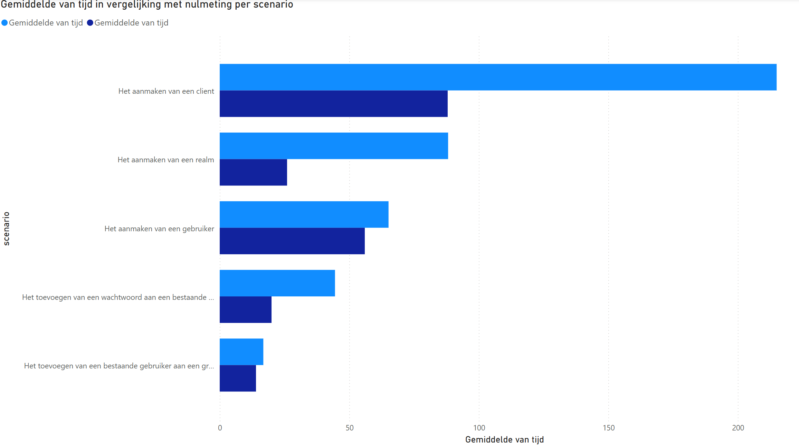

# Eindgebruikersvriendelijkheid beheeroplossing

## Introductie

In dit document staat het onderzoek naar de eindgebruikersvriendelijkheid van de beheeroplossing vastgelegd. In dit onderzoek wordt bepaald hoe makkelijk en prettig Keycloak te gebruiken is voor de eindgebruiker aan de hand van verschillende criteria en scenario's. Deze scenario's worden getest op mensen die nog nooit met Keycloak gewerkt hebben. Op basis van de criteria wordt vervolgens de gebruikersvriendelijkheid bepaald door deze te visualiseren.

## Meetcriteria

Om de gebruikersvriendelijkheid meetbaar te maken zijn er verschillende meetcriteria opgesteld:

- De tijd dat het kost om het scenario en individuele acties uit te voeren, in seconden
- Het aantal verkeerde acties (acties die niet hebben bijgedragen aan het bereiken van het einddoel)
- De tijd dat het kost om verkeerde acties te herstellen, in seconden
- Het aantal acties dat het kost om verkeerde acties te herstellen
- Een beoordeling van de gebruikersvriendelijkheid in de vorm van een cijfer tussen 1 en 10 van de testpersoon zelf

## Scenario's

Dit zijn een aantal veelvoorkomende taken binnen Keycloak om te testen op de onderzoeksdeelnemers:

1. Het aanmaken van een client
   - De client moet van het type "OpenID connect" zijn
   - De client moet herkent worden als "gitea"
   - Er moet geen client authentication zijn
   - Er moet geen authorization zijn
   - In gitea moet er geauthentiseerd kunnen worden met Keycloak, waarbij een access token teruggegeven kan worden
   - Na het inloggen met Keycloak moet er automatisch doorgestuurd worden naar Gitea zonder autorisatie code
   - Gitea's homepagina wordt gehost op <http://localhost:3000/>
   - Vanaf Gitea's homepagina mag overal heen worden doorgestuurd (\*)
   - Er moet gecontroleerd worden of de client succesvol is toegevoegd
2. Het aanmaken van een gebruiker
   - De gebruiker dient zijn e-mailadres te verifiëren
   - De gebruiker moet als "jandeboer" te herkennen zijn in het systeem
   - De gebruiker heeft als e-mailadres "<jandeboer@voorbeeld.nl>"
   - De gebruiker heet Jan de Boer
   - De gebruiker moet in de groep "ontwikkelaars" zitten
3. Het aanmaken van een realm
   - Er moet een nieuwe realm aangemaakt worden genaamd "gitea-sync"
   - Deze realm moet weergegeven worden als "Gitea Sync"
4. Het toevoegen van een wachtwoord aan een bestaande gebruiker
   - Gebruiker "jandeboer" moet het wachtwoord "boer123!" hebben
5. Het toevoegen van een bestaande gebruiker aan een groep
   - De groep "ontwikkelaars" moet de gebruiker "jandeboer" erin hebben

## Resultatennotatie

De resultaten van het onderzoek moeten natuurlijk ergens genoteerd worden. Wat is hier de meest geschikte opties voor? Wat hierbij vooral belangrijk is, is eenvoud. Deze spike is immers getimeboxed en dus is er weinig tijd om allerlei voorbereiding te doen. Er zijn een aantal keuzes:

|                   | Gemakkelijk op te zetten | Flexibel | Leesbaar |
| ----------------- | ------------------------ | -------- | -------- |
| Excel spreadsheet | ✅                       | ✅       | ✅       |
| Database          | ❌                       | ~        | ✅       |
| CSV/JSON          | ~                        | ✅       | ❌       |

Uit deze tabel blijkt dat een Excel spreadsheet de beste oplossing is, omdat dit de enige is die gemakkelijk op te zetten, flexibel én leesbaar is.

Als basis wordt er een [Excel spreadsheet](eindgebruikersvriendelijkheid-beheeroplossing-leeg.xlsx) gebruikt waarbij de persoon, het scenario en de [meetcriteria](#meetcriteria) in de kolommen staan.

## Resultaten

Het onderzoek is gedaan op 6 andere HBO-ICT studenten op de HAN. De resultaten hiervan zijn te vinden in de [ingevulde Excel spreadsheet](eindgebruikersvriendelijkheid-beheeroplossing.xlsx).

### Tijd

In dit diagram staat per scenario de gemiddelde tijdsduur dat de onderzoeksdeelnemers erover gedaan hebben om het succesvol te voltooien (blauw) in vergelijking met de nulmeting (donkerblauw). Deze nulmeting is gedaan op een persoon die al ervaring heeft met Keycloak. De vergelijking hiermee geeft dus een goed beeld van hoeveel tijdsverschil er zit tussen iemand die precies weet hoe hij iets moet doen t.o.v. iemand die nog geen ervaring heeft met Keycloak.

#### Grootste absolute verschil

Wat opvalt is dat het grootste absolute verschil zit in het aanmaken van een client: 127 seconden. Vooral de tweede stap bij het aanmaken van een client, capability config, bleek ingewikkeld. Er staan hier van allerlei termen zoals "standard flow", "implicit flow" en "direct access grants", maar het is te onduidelijk wat deze precies betekenen. Er staan weliswaar knopjes bij voor uitleg, maar deze beschrijving is desondanks vaak te vaag.

Om dit te verbeteren zouden de opties bijvoorbeeld beter gegroepeerd of gevisualiseerd kunnen worden. Zou zo je bijvoorbeeld alles met een authorization code bij elkaar kunnen zetten en gescheiden houden van de rest. Een afbeelding toevoegen ter visualisatie zou bijvoorbeeld ook kunnen helpen.

#### Grootste relatieve verschil

Relatief gezien doen de onderzoeksdeelnemers er veel langer over om een realm aan te maken dan iemand die dat al eerder gedaan heeft: gemiddeld zo'n 240% meer. Dit zit hem vooral in het instellen van de display name van de realm. In plaats van deze in te kunnen stellen in het scherm van het aanmaken van de realm kan dat slechts achteraf gedaan worden. Dit staat tevens niet op dezelfde pagina: daarvoor moet naar een andere pagina genavigeerd worden. Dit was voor veel onderzoeksdeelnemers verwarrend waardoor de tijd snel opliep.

De oplossing hiervoor is simpel: de realm settings moeten ingesteld kunnen worden bij het aanmaken van de realm, of in ieder geval op dezelfde pagina als waarop de realm komt te staan na het aanmaken. Het is immers gewoon overbodig om er een aparte pagina voor te hebben, dus gebruikers verwachten dat ook niet.

In de diagrammen hieronder zien we vergelijkbare resultaten. Dit heeft dan ook vooral te maken met dezelfde redenen als hierboven.

### Fouten

### Herstelacties

### Hersteltijd

### Cijfer

