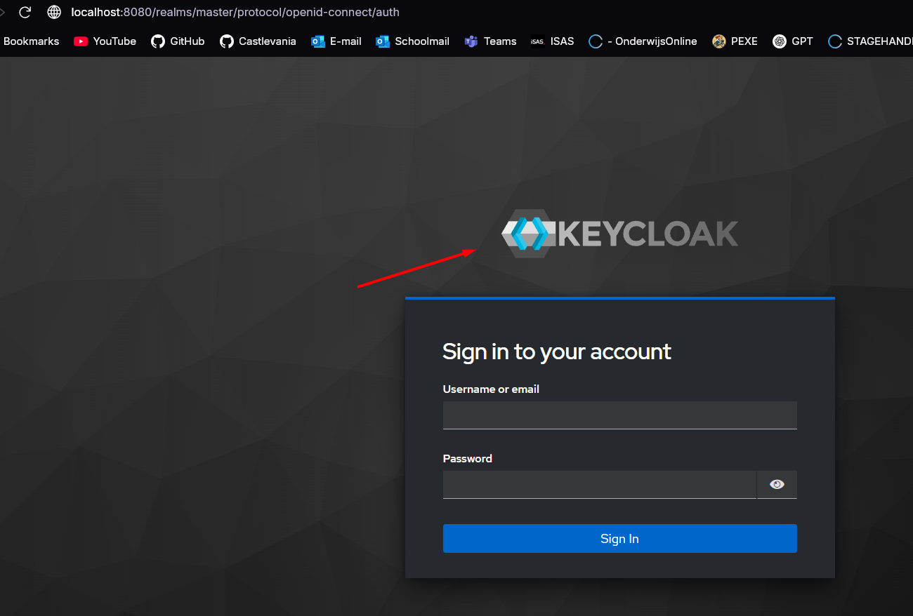
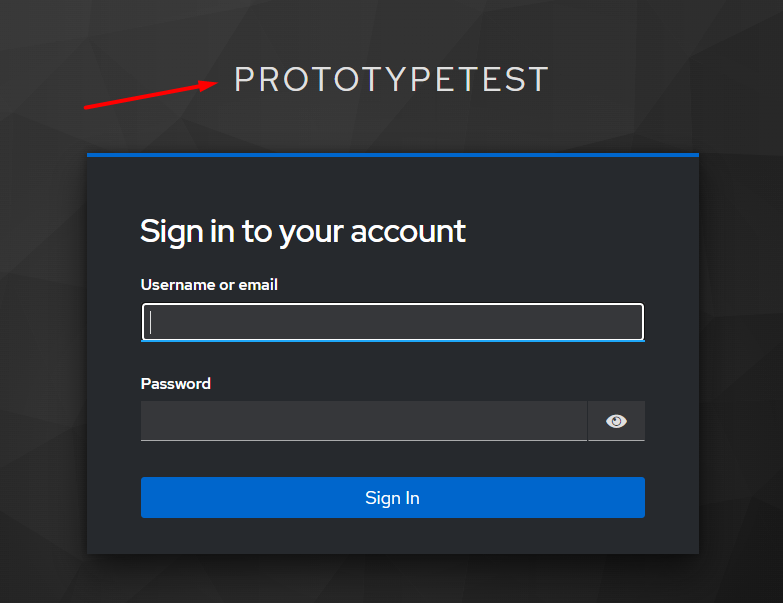
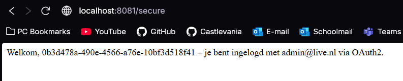
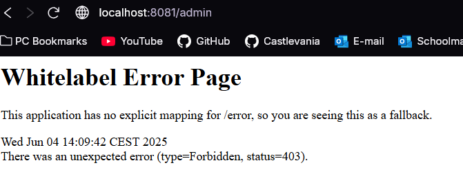

# OAuth2-integratie met Spring Boot en Keycloak

## Inhoudsopgave

1. [Over deze spike](#over-dit-project)
2. [Keycloak opstarten](#keycloak-opstarten)
3. [Spring Boot applicatie starten](#spring-boot-applicatie-starten)
4. [Wat doet de endpoint `/secure`](#wat-doet-de-endpoint-secure)
5. [Wat moet je zien als alles werkt](#wat-moet-je-zien-als-alles-werkt)
6. [Screenshots](#screenshots)

---

## Over deze Spike

Deze Spike demonstreert hoe je minimaal OAuth2-authenticatie via Keycloak integreert in een Spring Boot applicatie. De Spike bevat:

* Een publieke pagina (`/`)
* Een beveiligde pagina (`/secure`)
* Rollen- en gebruikersinfo (`/roles`, `/userinfo`)
* Een alleen voor admins toegankelijke pagina (`/admin`)

---

## Keycloak + Spring opstarten

1. Zorg dat je Keycloak draait op `localhost:8080` (bijv. via Docker):
2. Gebruik de applicatie via een IDE of andere zoals intelIJ of andere methodes en ga naar `localhost:8081/secure` om in te loggen via OAuth2


2. Ga naar `http://localhost:8080` en log in als admin.

3. Maak een realm aan genaamd `PrototypeTest`.

4. Maak een client aan genaamd `springboot-client`:

    * Client type: OpenID Connect
    * Access type: confidential
    * Redirect URI: `http://localhost:8081/login/oauth2/code/keycloak`

5. Voeg gebruikers en rollen toe:

    * Voeg bijvoorbeeld gebruiker `testuser` toe met wachtwoord `test123`.
    * Voeg rol `admin` toe (optioneel, voor toegang tot `/admin`).

---

## Spring Boot applicatie starten

1. Zorg dat de Keycloak server draait (zie [dit hoofdstuk](#keycloak--spring-opstarten)).

2. Start de Spring Boot applicatie (bijv. via IntelliJ of Maven):

```bash
docker compose up  
```

De applicatie draait op `http://localhost:8081`.

---

## Wat doet de endpoint `/secure`

De `/secure`-endpoint is alleen toegankelijk voor geauthenticeerde gebruikers. 
Zodra je succesvol bent ingelogd via Keycloak, zie je een welkomstbericht met je gebruikersnaam en e-mailadres.

**Voorbeeldoutput:**

```
Welkom, testuser – je bent ingelogd met testuser@example.com via OAuth2.
```

Andere interessante endpoints:

* `/` – publieke homepage (geen login nodig)
* `/logout` – logt uit bij Keycloak en Spring Boot
* `/roles` – toont jouw Keycloak-rollen
* `/userinfo` – toont userinfo claims van de ingelogde gebruiker
* `/admin` – alleen toegankelijk met de rol `admin` (let op: zonder deze rol krijg je een foutmelding 403 Forbidden).

---

## Wat moet je zien als alles werkt

1. Bezoek `http://localhost:8081`
2. Klik door naar `/secure`
3. Je wordt doorgestuurd naar Keycloak om in te loggen.
4. Na succesvolle login zie je een welkomst bericht.
5. Ga naar `/roles` of `/userinfo` om meer info te zien.

---

## Screenshots

> Hier screenshots van de volgende situaties:

* Inlogscherm Keycloak via Docker `http://localhost:8080/realms/master/protocol/openid-connect/auth?`
* 
* Inlogscherm van Keycloak via `/secure`
* 
* Succesvolle login op `/secure`
* 
* Beveiligde endpoint `/admin` met foutmelding (zonder rol)
* 

---

