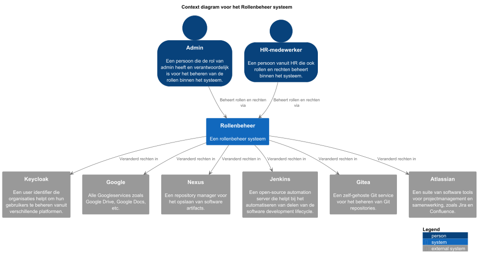
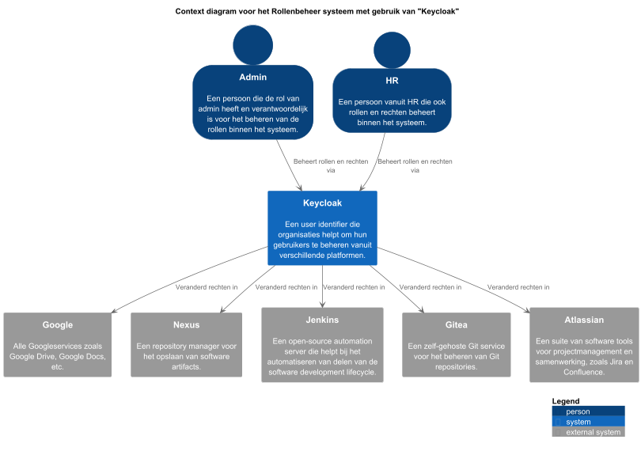

# 2. Context

## 2.1 Probleem

Als iemand momenteel binnen Bold Digital ontslag neemt of een rolverandering krijgt, moeten al zijn of haar bevoegdheden per applicatie afzonderlijk worden aangepast. Denk hierbij aan tools zoals Gitea, Nexus of andere interne systemen. Dit proces is foutgevoelig, tijdrovend en moeilijk schaalbaar, zeker naarmate het aantal applicaties en medewerkers toeneemt. Er is bovendien geen centrale plek waar autorisaties en gebruikersbeheer overzichtelijk geregeld zijn, wat leidt tot verhoogd risico op fouten en mogelijke beveiligingsproblemen, zoals het behouden van onterecht toegang tot gevoelige systemen.

Om dit probleem op te lossen, wil Bold Digital overstappen naar een Single Sign-On (SSO)-oplossing. Hiermee kunnen gebruikers centraal beheerd worden, en hoeven rechten of rollen slechts op één plaats aangepast te worden om effect te hebben op alle aangesloten applicaties. Dit draagt bij aan een efficiënter beheerproces en verhoogde beveiliging.

Wij als team gaan onderzoeken wat een goede oplossing is voor dit probleem. Dit kan een bestaande identiteits- en toegangsbeheertool zijn, zoals Keycloak, of eventueel een op maat gemaakte (custom) oplossing. We zullen hierbij kijken naar criteria zoals gebruiksgemak, uitbreidbaarheid, beveiliging, integratiemogelijkheden met bestaande systemen, en toekomstbestendigheid.

## 2.2 Diagrammen

### 2.2.1 Context diagram van eigen systeem als centraal rollenbeheer applicatie

Rollenbeheer applicatie is een applicatie die is ontwikkeld om de rollen en rechten van medewerkers binnen een organisatie te beheren. De applicatie biedt een centrale plek waar beheerders de rollen en rechten van medewerkers kunnen beheren, zowel binnen de organisatie als binnen externe systemen.

### 2.2.2 Context diagram van Keycloak als centraal rollenbeheer applicatie

Keycloak wordt gebruikt als centraal rollenbeheer applicatie voor de organisatie. Het biedt een centrale plek waar beheerders de rollen en rechten van medewerkers kunnen beheren, zowel binnen de organisatie als binnen externe systemen. De applicatie biedt een centrale plek waar beheerders de rollen en rechten van medewerkers kunnen beheren, zowel binnen de organisatie als binnen externe systemen.

## 2.3 Functionaliteit
De kernfunctionaliteit van de Rollenbeheer applicatie:
- Het beheren van de rollen van medewerkers binnen de organisatie.
- Het beheren van de rechten van medewerkers binnen de organisatie.
- Het beheren van de rechten van medewerkers binnen de applicatie.
- Het beheren van de rechten van medewerkers binnen externe systemen.
- Het automatisch aanpassen van alle rechten van medewerkers wanneer er een rol wordt aangepast.

## 2.4 Gebruikers
* Beheerder: De primaire gebruiker van de applicatie. Deze gebruiker heeft toegang tot alle rechten van de applicatie en kan zelfstandig de rechten van medewerkers aanpassen.

## 2.5 Externe systemen
- Keycloak
- Google (Drive, Calender, etc.)
- Nexus
- Jenkins
- Gitea
- Atlassian (Confluence, Jira)