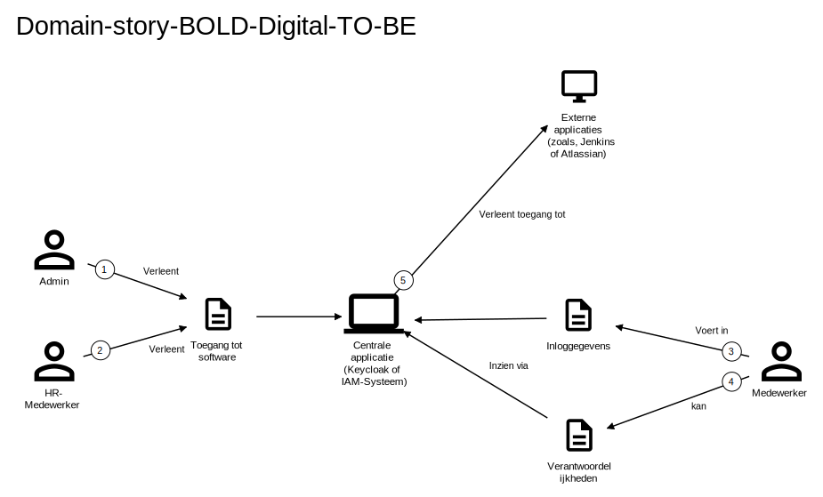

# 3. Functional overview

Om de belangrijkste functionaliteiten van BOLD Digital te beschrijven, hebben we user stories opgesteld. Deze user
stories
beschrijven de functionaliteit vanuit het perspectief van de gebruiker en helpen ons om de behoeften en verwachtingen
van
gebruikers te begrijpen en te documenteren. Daarnaast hebben we een EGON-plaatje gemaakt om de huidige (AS-IS) en
toekomstige (TO-BE) situatie van het inloggen bij de applicatie en het toekennen van rechten aan medewerkers te
visualiseren. Dit EGON-plaatje helpt ons om de huidige situatie te begrijpen en de gewenste situatie te definiëren.

### 3.0.1 Belangrijke gebruikers
Binnen BOLD Digital willen de mensen van HR en de CEO gebruik maken van Keycloak om de rechten van alle gebruikers te beheren. Hieruit blijkt dat er de volgende gebruikers zijn:
- Administrators (CEO + HR-medewerkers)
  - Zij kunnen met Keycloak de rechten van de medewerkers beheren.
- Medewerkers (Werknemers die niet in HR werken)
  - Zij kunnen inloggen op al hun applicaties via Keycloak.

## 3.1 User stories

### 3.1.1 User story 1: Inloggen bij applicatie

Als medewerker van BOLD Digital wil ik kunnen inloggen bij een centrale applicatie, zodat ik toegang heb tot alle
externe applicaties.

### 3.1.2 User story 2: Toegang verlenen aan medewerkers

Als beheerder van BOLD Digital wil ik in staat zijn om rechten toe te kennen aan medewerkers voor verschillende externe
applicaties, zodat zij toegang hebben tot de benodigde functionaliteiten.

### 3.1.3 User story 3: Beheren van rechten

Als beheerder wil ik gemakkelijk de rechten van medewerkers kunnen aanpassen, zodat ik ervoor kan zorgen dat medewerkers
toegang hebben tot de juiste applicaties en functionaliteiten.

## 3.2 Domain story inloggen bij applicatie (AS-IS)

### 3.2.1 EGON-plaatje

### 3.2.2 Uitleg van het EGON-plaatje

Voor nu gebruikt BOLD Digital geen SSO (Single-Sign-On), dat betekent dat je voor elke applicatie een aparte inlog moet
invoeren. Dit kost veel tijd en is niet gebruikelijk.
Het aanpassen van rollen en rechten in de applicatie is ook moeilijk, omdat dit niet centraal geregeld is.

Zoals te zien in het EGON-plaatje, moet je via per applicatie rechten geven aan medewerkers, dat doet de admin of een
HR-medewerker. Medewerkers kunnen hen
verantwoordelijkheden inzien via de applicatie "Classfrog".

### 3.2.3 Verwachtingen domain

Nadat wij alle risico's hebben onderzocht moet er een oplossing komen voor het inloggen bij de applicaties en het
toegang verlenen van de rechten aan medewerkers. Dit moet allemaal op een centrale plek gebeuren.

We hebben nu twee opties:

- Keycloak
- Eigen IAM-Systeem bouwen

Hoe het nu met de domain zit is niet gebruiksvriendelijk en kost veel te veel tijd. Hierdoor kan een oude medewerker nog
bij Gitea bijvoorbeeld of kan die nog dingen aanpassen zonder dat iemand dat door heeft of iemand heeft het te laat
door.

## 3.3 Domain story inloggen bij applicatie (TO-BE)

### 3.3.1 EGON-plaatje

### 3.3.2 Uitleg van het EGON-plaatje

Zoals besproken in de AS-IS situatie, is het nu nog niet mogelijk om in te loggen met SSO. Dit is wel de bedoeling en
daarom hebben we deze EGON-plaatje gemaakt, hierop is te zien hoe een medewerker in een keer kan inloggen bij alle applicaties en hoe een admin of HR-medewerker in een keer rechten kan geven aan medewerkers bij externe applicaties. 
