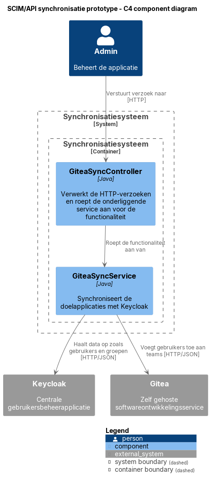
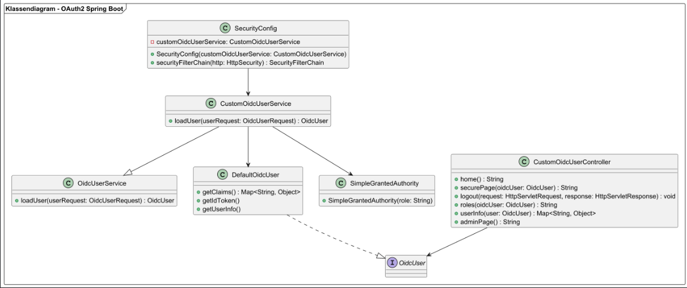
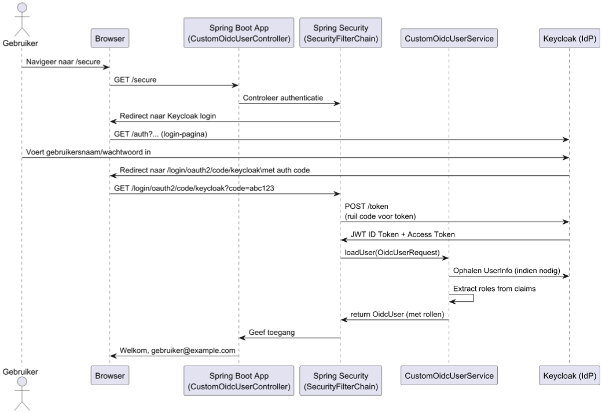
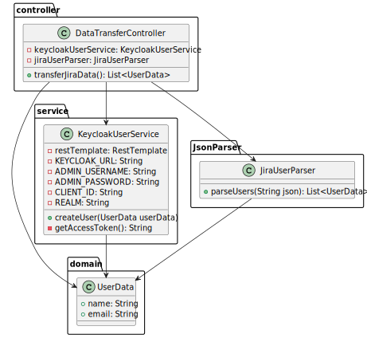
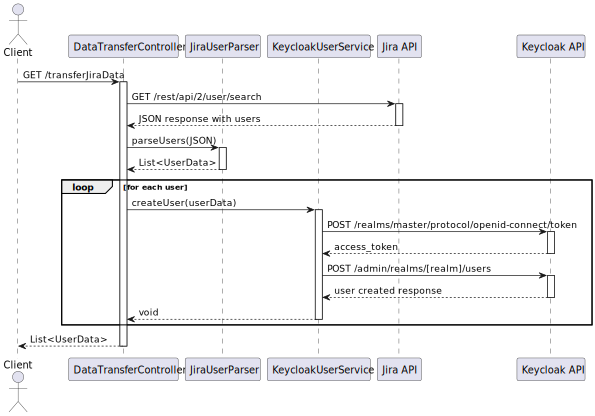
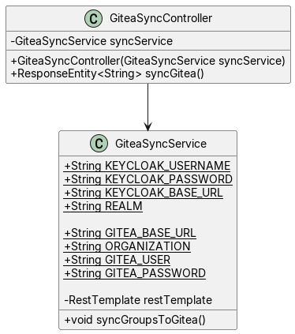
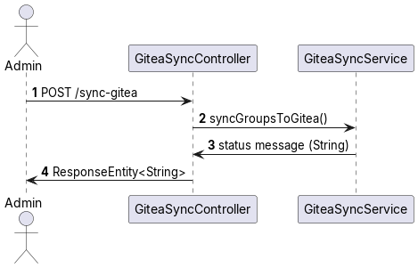

# 7. Software Architecture

Dit hoofdstuk gaat over de architectuur van de software. Het is belangrijk dat je dit goed beschrijft,
zodat je een goed overzicht hebt van de software die je gaat bouwen.

## 7.1 Container diagram

### 7.1.1 Container diagram voor Custom IAM-oplossing met Spring Boot en Vue3

In dit diagram zie je hoe de containers in dit systeem met elkaar en de externe system werken. De fronted maakt API
calls naar de backend.
De backend verwerkt authenticatie met een OAuth2 server.

### 7.1.2 Container diagram voor Centrale IAM-oplossing met Keycloak

* **PlantUML bronbestand:** [container-diagram.puml](/diagram/container/iteratie-3/container-diagram.puml)*

Het container diagram toont de softwarearchitectuur van de centrale IAM-oplossing met Keycloak. De architectuur is
opgezet met een focus op veilige authenticatie en naadloze integratie met bestaande systemen.

De kern van de oplossing bestaat uit een Keycloak authenticatieserver die fungeert als centrale identity provider. Deze
server biedt Single Sign-On (SSO) functionaliteit voor alle geïntegreerde applicaties, gebruikersbeheer en rolgebaseerde
toegangscontrole, en ondersteuning voor verschillende authenticatieprotocollen (OAuth2, OIDC, SAML2).

De oplossing integreert met verschillende interne en externe systemen, waaronder Google Workspace voor cloud diensten (
Drive, Calendar) via OAuth2/OIDC, Nexus voor artifact repository beheer via OIDC, Jenkins voor CI/CD pipeline
authenticatie via OIDC, Gitea voor Git repository toegang via OAuth2, en Atlassian Suite (Confluence & Jira) voor
documentatie en issue tracking via SAML 2.0.

De architectuur is ontworpen met de principes van centrale authenticatie voor alle systemen, gestandaardiseerde
protocollen voor veilige communicatie, flexibele integratie met nieuwe systemen, schaalbaarheid door load balancing, en
hoge beschikbaarheid door redundantie.

#### 7.1.2.1 Dynamisch container diagram voor centrale IAM-oplossing met Keycloak

* **PlantUML bronbestand:** [dynamisch container diagram](/diagram/sso-integratie/login-flow-keycloak-diagram.svg)

Het dynamisch container diagram toont de interactie tussen de gebruiker, de Jenkins server en de Keycloak
authenticatieserver tijdens het Single Sign-On (SSO) proces.
De gebruiker start het SSO-proces door in te loggen op de Jenkins server. De Jenkins server stuurt een
authenticatieverzoek naar de Keycloak server, die de gebruiker om verificatie
verzoekt. Na succesvolle verificatie ontvangt de Jenkins server een toegangstoken van Keycloak, waarmee de gebruiker
toegang krijgt tot Jenkins zonder opnieuw in te loggen. Dit proces
verbetert de gebruikerservaring door naadloze toegang tot Jenkins te bieden met behoud van beveiliging en controle via
Keycloak.

## 7.2 Component diagram

### 7.2.1 Component Diagram - OAuth2 Integratie

Link: [ComponentDiagramOAuthIntegratie.puml](diagram/component-diagram/ComponentDiagramEmil%20.puml)

Toelichting op de componenten:
[Browser / Gebruiker]: Roept beveiligde endpoints aan zoals /secure, wordt doorgestuurd naar Keycloak.

[Spring Boot App]: De hoofdapplicatie die endpoints afhandelt en authenticatie regelt.

[SecurityConfig]: Stelt OAuth2-instellingen in en koppel de CustomOidcUserService.

[CustomOidcUserController]: REST-controller die gebruikersinfo toont en logout afhandelt.

[CustomOidcUserService]: Verwerkt het OIDC-token en haalt rollen op uit claims.

[Keycloak]: Externe Identity Provider die authenticatie verzorgt.

[OidcUserService], [DefaultOidcUser], [SimpleGrantedAuthority]: Spring Security klassen die de authenticatie en autorisatie modelleren.

### 7.2.2 Component Diagram - User Import from Jira

Link: [User Migratie Component Dynamic Component Diagram](/diagram/component-diagram/UserMigratieComponent-Dynamic_Component_Diagram.svg)

### 7.2.3 Component Diagram - SCIM/API synchronisatie

## 7.3 Klassendiagrammen

### 7.3.1 Klassendiagram – OAuth2 Spring Boot Integratie

Link:[KlassediagramOAuthIntegratie.puml](diagram/class-diagram/KlassediagramEmil.puml)

Het klassendiagram geeft een visueel overzicht van de belangrijkste klassen en relaties binnen de Spring Boot-applicatie die OAuth2-authenticatie via Keycloak ondersteunt.
Sommige onderdelen in het diagram zijn echter niet vanzelfsprekend. Deze toelichting beschrijft daarom specifieke onderdelen die extra uitleg verdienen.

#### `CustomOidcUserController`
- Verantwoordelijk voor het afhandelen van HTTP-verzoeken via REST-endpoints (`/`, `/secure`, `/logout`, etc.).
- De annotatie `@GetMapping` bepaalt de route; `@PreAuthorize` wordt gebruikt voor toegangscontrole op basis van rollen.
- De parameter `OidcUser` in methodes zoals `securePage()` en `roles()` wordt automatisch gevuld door Spring Security na een succesvolle login.
- De gebruikte `OidcUser` bevat informatie over de ingelogde gebruiker (zoals naam, e-mail, en rollen).

#### `SecurityConfig`
- Deze klasse stelt de beveiligingsinstellingen in voor de applicatie.
- De methode `securityFilterChain()` configureert de toegangsregels, login en logout, en stelt `CustomOidcUserService` in als gebruiker-verwerker.
- Het diagram toont de methode signature, maar veel gedrag is fluent geconfigureerd met `HttpSecurity`.

#### `CustomOidcUserService`
- Subklasse van `OidcUserService`. Dit betekent dat de standaard gebruikersverwerking wordt uitgebreid met aangepaste logica.
- De override van `loadUser()` wordt automatisch aangeroepen wanneer een gebruiker inlogt via Keycloak.
- Hierin worden claims uit de JWT (zoals `realm_access.roles`) uitgelezen en omgezet in `GrantedAuthority` objecten, bijvoorbeeld `ROLE_admin`.
- Deze rollen zijn noodzakelijk voor autorisatie op endpoints met `@PreAuthorize`.

#### `DefaultOidcUser` en `OidcUser`
- `DefaultOidcUser` is een concrete implementatie van de interface `OidcUser`.
- Bevat methoden zoals `getClaims()`, `getIdToken()`, `getUserInfo()`, die gebruikt worden om informatie over de ingelogde gebruiker te verkrijgen.
- Spring Security maakt automatisch een `DefaultOidcUser` aan na succesvolle login en stelt deze beschikbaar aan controllers.

#### `SimpleGrantedAuthority` en `GrantedAuthority`
- `GrantedAuthority` is een interface in Spring Security die een autorisatierol beschrijft.
- `SimpleGrantedAuthority` is een implementatie waarmee een string-rol (zoals `ROLE_admin`) wordt omgezet in een object dat Spring kan gebruiken.
- Deze autoriteiten worden gebruikt door Spring om toegang toe te kennen of te weigeren via annotaties zoals `@PreAuthorize("hasAuthority('ROLE_admin')")`.

#### 7.3.1.1 Sequentie Diagram - OAuth2 Integratie
Link: [SequentiediagramOAuthIntegratie.puml](sequence-diagram/SequentiediagramEmil.puml)

Toelichting op de sequentie:

Dit sequentiediagram beschrijft het login proces wanneer een gebruiker de beveiligde endpoint `/secure` bezoekt. De Spring Boot-applicatie maakt hierbij gebruik van OAuth2 en OpenID Connect authenticatie via Keycloak.

1. **Gebruiker navigeert naar `/secure`:**  
   De gebruiker probeert een pagina te openen waarvoor authenticatie vereist is.

2. **Spring Security detecteert dat er geen sessie is:**  
   Omdat de gebruiker nog niet is ingelogd, onderbreekt Spring Security de aanvraag en leidt de gebruiker automatisch door naar Keycloak.

3. **Keycloak toont de login pagina:**  
   De gebruiker voert hier zijn gebruikersnaam en wachtwoord in.

4. **Keycloak stuurt autorisatiecode terug naar Spring Boot:**  
   Na succesvolle login stuurt Keycloak de gebruiker terug naar de applicatie, inclusief een `code` in de URL.

5. **Spring Boot wisselt de autorisatiecode in voor tokens:**  
   Spring Boot stuurt deze code naar Keycloak om een access token en ID token te verkrijgen.

6. **`CustomOidcUserService` verwerkt de gebruiker:**  
   Na het verkrijgen van de tokens wordt `CustomOidcUserService` aangeroepen. Deze service:
    - Haalt extra gebruikersinformatie (claims) op
    - Extraheert rollen uit `realm_access.roles`
    - Zet deze rollen om in `GrantedAuthority`-objecten voor gebruik binnen Spring Security

7. **Spring Security rondt de authenticatie af:**  
   De gebruiker wordt geauthenticeerd met een `DefaultOidcUser`, inclusief naam, e-mail en rollen.

8. **Toegang wordt verleend tot `/secure`:**  
   Nu de gebruiker is ingelogd, geeft de controller een persoonlijk welkomstbericht terug.

----
### 7.3.2 Class Diagram - User Import from Jira

#### 7.3.2.1 Sequence diagram - User Import from Jira

Link: [sequence diagram user migratie](diagram/sequence-diagram/sequence-diagram-user-migratie.svg)

- DataTransferController haalt alle userdata op in de vorm van JSON in een string.
- De JiraUserParser zet deze string om naar de Record UserData.
- KeycloakUserService haalt een API-key op en upload de list van UserData.

### 7.3.3 Class Diagram - SCIM/API synchronisatie

#### 7.3.3.1 Sequence Diagram - SCIM/API synchronisatie

