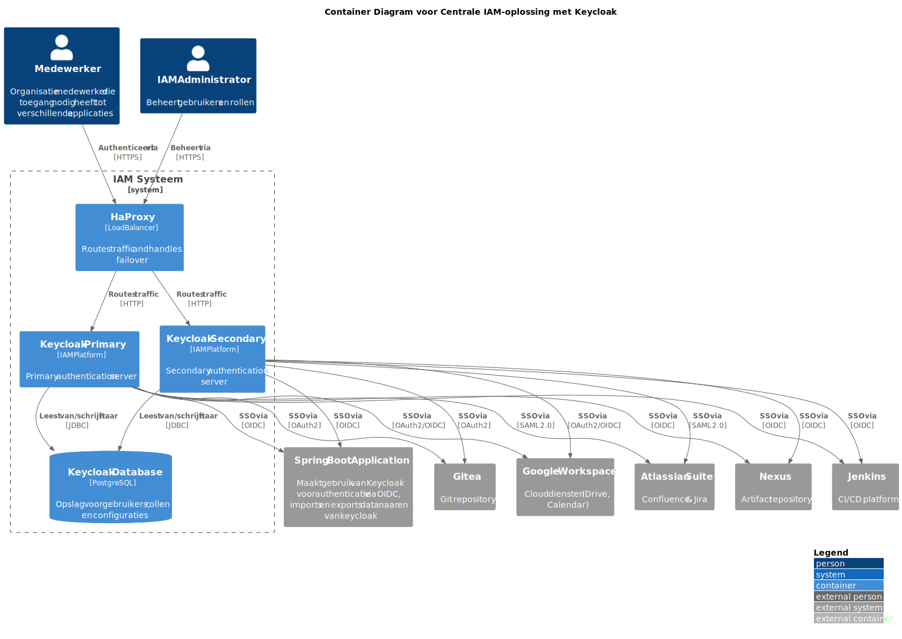
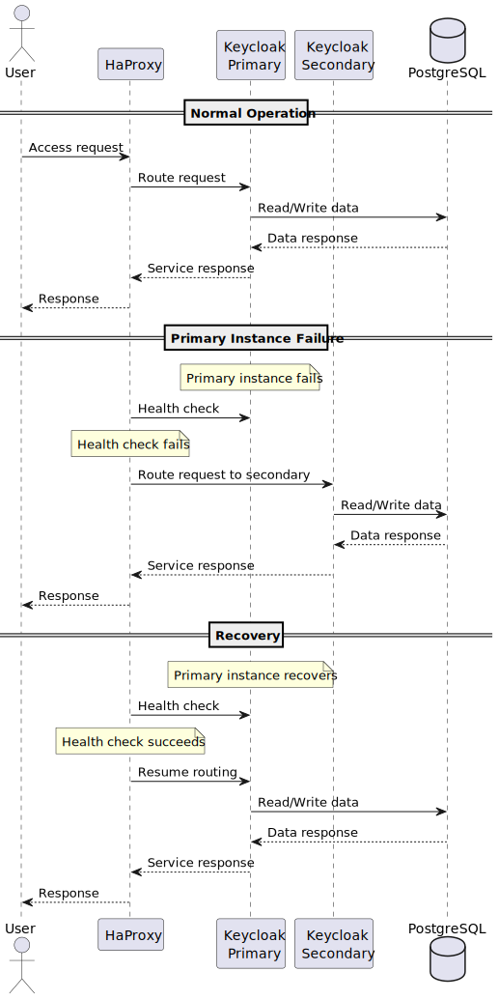

# 10 Infrastructure Architecture

## 10.1 Algemene architectuur
Voor de ontwikkelingsomgeving maken wij gebruik van docker containers. Hiermee kunnen wij de productie-omgevingen lokaal draaien en testen.
Er wordt gebruik gemaakt van de volgende containers:
- [Keycloak docker container](https://hub.docker.com/r/keycloak/keycloak) [Version 26.2.5]
- [PostgreSQL docker container](https://hub.docker.com/_/postgres) [Version 15]
- [Gitea Docker Container](https://hub.docker.com/r/gitea/gitea) [Version 1.23.7]
- [Mailhog Docker Container](https://hub.docker.com/r/mailhog/mailhog) [Version 1.0.1]
- [Jira Docker Container](https://hub.docker.com/r/atlassian/jira-software) [Version 9.12.9]
- [Jenkins Docker Container](https://hub.docker.com/r/jenkins/jenkins) [Version latest]
- [Haproxy Docker Container](https://hub.docker.com/_/haproxy/) [Version 3.1.7]

We maken daarnaast ook gebruik van een Maven [Versie 3.9.9] applicatie met Spring Boot [Versie 3.4.5] om de prototypes te draaien. 

## 10.2 Infrastructure diagram

Het Keycloak fallback prototype infrastructure diagram is hieronder weergegeven:


*PlantUML bronbestand: [container-diagram.puml](../../diagram/container/iteratie-3/container-diagram.puml)*

Het container diagram toont de architectuur van het Keycloak fallback systeem, met focus op de interactie tussen verschillende componenten. De architectuur is opgezet met een focus op hoge beschikbaarheid en veilige authenticatie.

De kern van het systeem bestaat uit twee Keycloak instances (primary en secondary) die achter een HaProxy load balancer draaien. Deze setup zorgt voor automatische failover en load balancing van authenticatieverzoeken. De Keycloak instances delen een centrale PostgreSQL database voor data persistentie.

Externe gebruikers (medewerkers) en administrators interacteren met het systeem via HTTPS-verbindingen naar de HaProxy load balancer. De load balancer verdeelt het verkeer over de Keycloak instances en zorgt voor sticky sessions via cookies.

Het systeem integreert met verschillende externe diensten.


*PlantUML bronbestand: [container-diagram-full.puml](../../diagram/container/iteratie-3/container-diagram-full.puml)*

Het full scope diagram geeft een gedetailleerd overzicht van alle componenten en hun onderlinge relaties in het Keycloak fallback systeem. Dit diagram toont hoe de verschillende services met elkaar communiceren en welke protocollen worden gebruikt.

De architectuur is opgezet met een focus op hoge beschikbaarheid door middel van redundantie, veilige authenticatie en autorisatie, efficiënte load balancing, robuuste data persistentie en integratie met externe diensten.

## 10.3 Keycloak Fallback Infrastructure

### 10.3.1 High Availability Setup
De Keycloak fallback infrastructuur is opgezet met een focus op hoge beschikbaarheid. Het systeem maakt gebruik van HaProxy als load balancer die het verkeer verdeelt over twee Keycloak instances. Voor de persistentie van data wordt een gedeelde PostgreSQL database gebruikt.

### 10.3.2 HaProxy Configuratie
De HaProxy load balancer is specifiek geconfigureerd voor de Keycloak omgeving. Hieronder volgen de belangrijkste aanpassingen en hun doelen:

```haproxy
frontend keycloak_frontend
    bind *:80
    http-request set-header X-Forwarded-Proto http
    http-request set-header X-Forwarded-Host %[req.hdr(host)]
    http-request set-header X-Forwarded-Port 80

    # Redirect root URL naar BDrealm account pagina
    redirect location http://localhost/realms/BDrealm/account if { path / }

    # Redirect /admin naar BDrealm in plaats van master
    redirect location http://localhost/realms/BDrealm/account if { path /admin }
```

De frontend configuratie zorgt voor:
- Correcte proxy headers voor Keycloak omgeving
- Automatische redirects naar de BDrealm voor betere gebruikerservaring
- Veiligere configuratie door redirect van admin pagina's

```haproxy
backend keycloak_backend
    balance leastconn
    cookie AUTH_SESSION_ID prefix nocache
    option httpchk GET /health/ready
    http-check expect status 200
    http-check expect ! rstatus ^5
    default-server inter 2s fall 3 rise 2
```

De backend configuratie implementeert:
- Load balancing met 'leastconn' algoritme voor optimale verdeling voor langere sessies.
- Sticky sessions via AUTH_SESSION_ID cookie
- Uitgebreide health checks voor betrouwbare failover
- Snelle detectie van problemen (2 seconden interval)
- Robuuste failover configuratie (3 fouten voor down, 2 successen voor up)

```haproxy
    server keycloak1 keycloak-primary:8080 check port 9000 cookie s1
    server keycloak2 keycloak-secondary:8080 check port 9000 cookie s2
```

De server configuratie zorgt voor:
- Gebruik van management port (9000) voor health checks
- Unieke cookie identifiers voor correcte sessie routing
- Hoge beschikbaarheid door redundantie

Deze configuratie draagt bij aan de hoge beschikbaarheid door:
1. Automatische failover bij server problemen
2. Efficiënte load balancing tussen instances
3. Betrouwbare sessie persistentie
4. Snelle detectie en herstel van problemen
5. Correcte werking van Keycloak achter een proxy

### 10.3.3 Componenten

1. **HaProxy Load Balancer**
   De HaProxy load balancer vormt het eerste aanspreekpunt voor alle Keycloak verkeer. Dit component is verantwoordelijk voor het distribueren van verkeer over de Keycloak instances, het uitvoeren van health checks voor automatische failover, het implementeren van sticky sessions via cookies en het beheren van proxy headers voor correcte routing.

2. **Keycloak Instances**
   Het systeem maakt gebruik van twee Keycloak instances: een primary instance (port 8081) en een secondary instance (port 8082). Beide instances delen dezelfde configuratie via de centrale database en zijn uitgerust met health check endpoints voor monitoring.

3. **PostgreSQL Database**
   Het hart van de Keycloak infrastructuur wordt gevormd door een PostgreSQL database die gedeeld wordt tussen beide Keycloak instances.

## 10.4 Netwerk Architectuur

De netwerk architectuur is ontworpen met Docker containers waarbij alle componenten in geïsoleerde containers draaien. De interne communicatie verloopt via het Docker network, terwijl externe toegang mogelijk is via geconfigureerde poorten. HaProxy fungeert als enige externe toegangspunt.

### 10.4.1 Monitoring & Health Checks
Het systeem maakt gebruik van ingebouwde health checks, waaronder Keycloak health endpoints op /health, HaProxy health check configuratie, automatische failover bij instance uitval en container health checks in Docker Compose.

### 10.4.2 Deployment Sequence
Hieronder is het deployment sequence diagram weergegeven:



*PlantUML bronbestand: [sequence-diagram.puml](../../diagram/container/iteratie-3/sequence-diagram.puml)*

Het sequence diagram toont de stapsgewijze interactie tussen verschillende componenten tijdens het deployment proces van het Keycloak fallback systeem. Het diagram illustreert de initiële configuratie van de HaProxy load balancer, het opstarten van de PostgreSQL database, de deployment van de Keycloak instances (primary en secondary), de health check processen tussen componenten, de configuratie van de database connecties en de setup van de load balancing regels.

Dit proces zorgt voor een gestructureerde en betrouwbare deployment van het systeem, waarbij elke component in de juiste volgorde wordt geïnitialiseerd en geconfigureerd.
