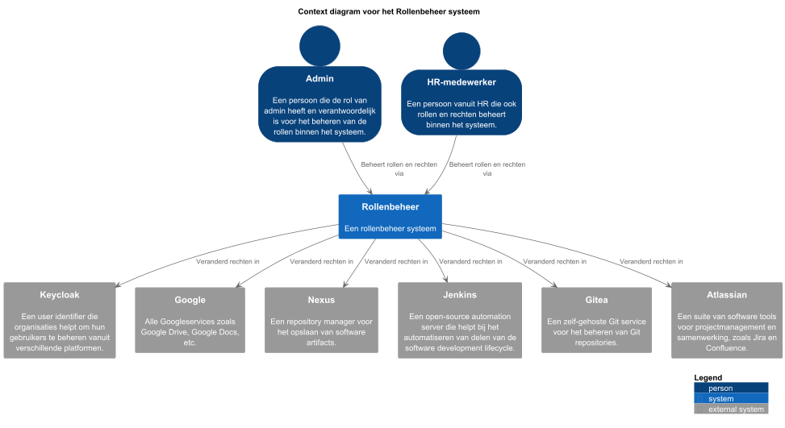
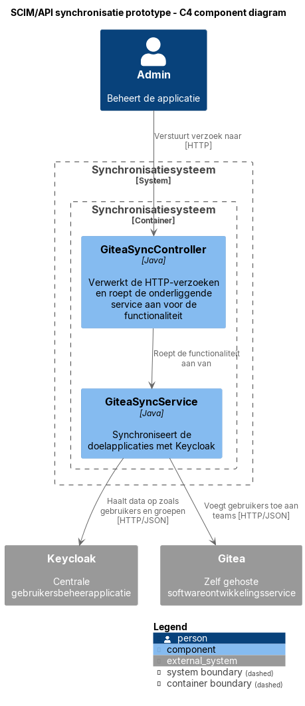
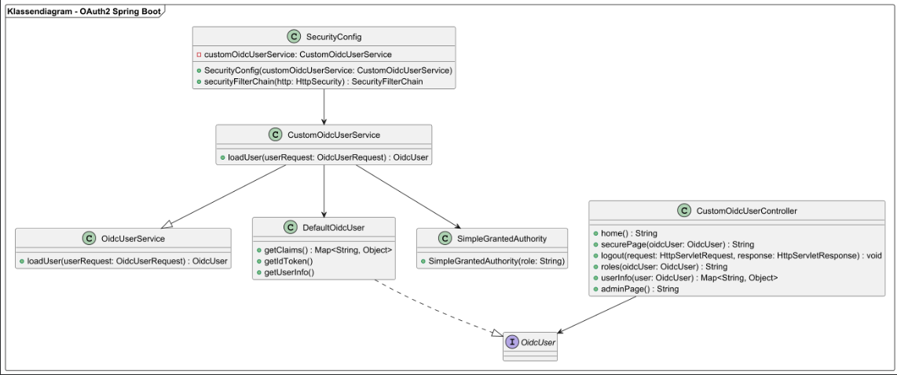
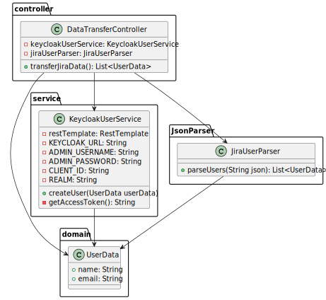
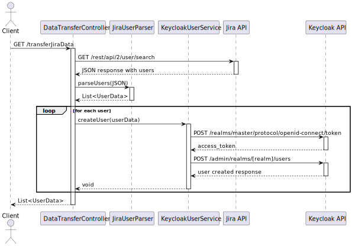
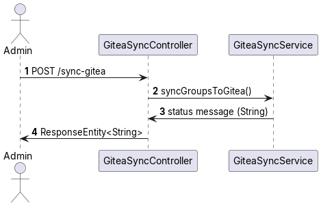
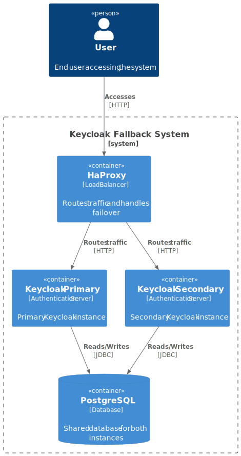

# 1. Introduction

Dit software guidebook dient als centrale documentatie voor het onderzoek naar de meest geschikte oplossing voor rollenbeheer binnen Bold Digital. Het doel is om te bepalen welke van de volgende twee opties het beste aansluit bij de behoeften van het bedrijf:

- Het inzetten van Keycloak als centrale gebruikersbeheerapplicatie.
- Het ontwikkelen van een nieuwe applicatie met Spring Boot en Vue 3 voor centraal gebruikersbeheer.

Bold Digital streeft naar een Single Sign-On (SSO)-oplossing waarmee alle medewerkers kunnen inloggen en waarbij de bevoegdheden van gebruikers centraal beheerd worden.

## 1.2 Doel van dit document
Dit guidebook is bedoeld om:
- De technische keuzes, prototypes en onderzoeksresultaten te documenteren.
- Een basis te bieden voor toekomstige ontwikkeling.

## 1.3 Inhoud van het guidebook
Het Software Guidebook bevat onder andere:
- Beschrijving van architecturale beslissingen.
- Prototypes; een Walking Skeleton en throwaway prototypes.
- Onderzoeken naar onzekerheden rondom de oplossingen.

De Walking Skeleton is te vinden in de [walking-skeleton folder](../walking-skeleton/).  
De documentatie van de onderzoeken bevindt zich in de [onderzoeken folder](../onderzoeken/).

## 1.4 Doelgroep
Dit document is bedoeld voor:
- Ontwikkelaars en software-architecten binnen Bold Digital.
- Besluitvormers binnen Bold Digital die inzicht willen in de opties.

## 1.5 Inhoudsopgave
Hieronder staat een inhoudsopgave, zodat het software guidebook makkelijker is om te navigeren:

1. [Context](#2-context)
2. [Functional Overview](#3-functional-overview)
3. [Quality Overview](#4-quality-overview)
4. [Constraints](#5-constraints)
5. [Principles](#6-principles)
6. [Software Architecture](#7-software-architecture)
7. [Code](#8-code)
8. [Data](#9-data)
9. [Infrastructure Architecture](#10-infrastructure-architecture)
10. [Deployment](#11-deployment)
11. [Operation and Support](#12-operation-and-support)
12. [Development Enviroment](#13-development-enviroment)

# 2. Context

## 2.1 Probleem

Als iemand momenteel binnen Bold Digital ontslag neemt of een rolverandering krijgt, moeten al zijn of haar bevoegdheden per applicatie afzonderlijk worden aangepast. Denk hierbij aan tools zoals Gitea, Nexus of andere interne systemen. Dit proces is foutgevoelig, tijdrovend en moeilijk schaalbaar, zeker naarmate het aantal applicaties en medewerkers toeneemt. Er is bovendien geen centrale plek waar autorisaties en gebruikersbeheer overzichtelijk geregeld zijn, wat leidt tot verhoogd risico op fouten en mogelijke beveiligingsproblemen, zoals het behouden van onterecht toegang tot gevoelige systemen.

Om dit probleem op te lossen, wil Bold Digital overstappen naar een Single Sign-On (SSO)-oplossing. Hiermee kunnen gebruikers centraal beheerd worden, en hoeven rechten of rollen slechts op één plaats aangepast te worden om effect te hebben op alle aangesloten applicaties. Dit draagt bij aan een efficiënter beheerproces en verhoogde beveiliging.

Wij als team gaan onderzoeken wat een goede oplossing is voor dit probleem. Dit kan een bestaande identiteits- en toegangsbeheertool zijn, zoals Keycloak, of eventueel een op maat gemaakte (custom) oplossing. We zullen hierbij kijken naar criteria zoals gebruiksgemak, uitbreidbaarheid, beveiliging, integratiemogelijkheden met bestaande systemen, en toekomstbestendigheid.

## 2.2 Diagrammen

### 2.2.1 Context diagram van eigen systeem als centraal rollenbeheer applicatie

Rollenbeheer applicatie is een applicatie die is ontwikkeld om de rollen en rechten van medewerkers binnen een organisatie te beheren. De applicatie biedt een centrale plek waar beheerders de rollen en rechten van medewerkers kunnen beheren, zowel binnen de organisatie als binnen externe systemen.

### 2.2.2 Context diagram van Keycloak als centraal rollenbeheer applicatie

Keycloak wordt gebruikt als centraal rollenbeheer applicatie voor de organisatie. Het biedt een centrale plek waar beheerders de rollen en rechten van medewerkers kunnen beheren, zowel binnen de organisatie als binnen externe systemen. De applicatie biedt een centrale plek waar beheerders de rollen en rechten van medewerkers kunnen beheren, zowel binnen de organisatie als binnen externe systemen.

## 2.3 Functionaliteit
De kernfunctionaliteit van de Rollenbeheer applicatie:
- Het beheren van de rollen van medewerkers binnen de organisatie.
- Het beheren van de rechten van medewerkers binnen de organisatie.
- Het beheren van de rechten van medewerkers binnen de applicatie.
- Het beheren van de rechten van medewerkers binnen externe systemen.
- Het automatisch aanpassen van alle rechten van medewerkers wanneer er een rol wordt aangepast.

## 2.4 Gebruikers
* Beheerder: De primaire gebruiker van de applicatie. Deze gebruiker heeft toegang tot alle rechten van de applicatie en kan zelfstandig de rechten van medewerkers aanpassen.

## 2.5 Externe systemen
- Keycloak
- Google (Drive, Calender, etc.)
- Nexus
- Jenkins
- Gitea
- Atlassian (Confluence, Jira)

# 3. Functional overview

Om de belangrijkste functionaliteiten van BOLD Digital te beschrijven, hebben we user stories opgesteld. Deze user
stories
beschrijven de functionaliteit vanuit het perspectief van de gebruiker en helpen ons om de behoeften en verwachtingen
van
gebruikers te begrijpen en te documenteren. Daarnaast hebben we een EGON-plaatje gemaakt om de huidige (AS-IS) en
toekomstige (TO-BE) situatie van het inloggen bij de applicatie en het toekennen van rechten aan medewerkers te
visualiseren. Dit EGON-plaatje helpt ons om de huidige situatie te begrijpen en de gewenste situatie te definiëren.

# 3.1 Belangrijke gebruikers
Binnen BOLD Digital willen de mensen van HR en de CEO gebruik maken van Keycloak om de rechten van alle gebruikers te beheren. Hieruit blijkt dat er de volgende gebruikers zijn:
- Administrators (CEO + HR-medewerkers)
  - Zij kunnen met Keycloak de rechten van de medewerkers beheren.
- Medewerkers (Werknemers die niet in HR werken)
  - Zij kunnen inloggen op al hun applicaties via Keycloak.

## 3.2 User stories

### 3.2.1 User story 1: Inloggen bij applicatie

Als medewerker van BOLD Digital wil ik kunnen inloggen bij een centrale applicatie, zodat ik toegang heb tot alle
externe applicaties.

### 3.2.2 User story 2: Toegang verlenen aan medewerkers

Als beheerder van BOLD Digital wil ik in staat zijn om rechten toe te kennen aan medewerkers voor verschillende externe
applicaties, zodat zij toegang hebben tot de benodigde functionaliteiten.

### 3.2.3 User story 3: Beheren van rechten

Als beheerder wil ik gemakkelijk de rechten van medewerkers kunnen aanpassen, zodat ik ervoor kan zorgen dat medewerkers
toegang hebben tot de juiste applicaties en functionaliteiten.

## 3.3 Domain story inloggen bij applicatie (AS-IS)

### 3.3.1 EGON-plaatje


### 3.3.2 Uitleg van het EGON-plaatje

Voor nu gebruikt BOLD Digital geen SSO (Single-Sign-On), dat betekent dat je voor elke applicatie een aparte inlog moet
invoeren. Dit kost veel tijd en is niet gebruikelijk.
Het aanpassen van rollen en rechten in de applicatie is ook moeilijk, omdat dit niet centraal geregeld is.

Zoals te zien in het EGON-plaatje, moet je via per applicatie rechten geven aan medewerkers, dat doet de admin of een
HR-medewerker. Medewerkers kunnen hen
verantwoordelijkheden inzien via de applicatie "Classfrog".

### 3.3.3 Verwachtingen domain

Nadat wij alle risico's hebben onderzocht moet er een oplossing komen voor het inloggen bij de applicaties en het
toegang verlenen van de rechten aan medewerkers. Dit moet allemaal op een centrale plek gebeuren.

We hebben nu twee opties:

- Keycloak
- Eigen IAM-Systeem bouwen

Hoe het nu met de domain zit is niet gebruiksvriendelijk en kost veel te veel tijd. Hierdoor kan een oude medewerker nog
bij Gitea bijvoorbeeld of kan die nog dingen aanpassen zonder dat iemand dat door heeft of iemand heeft het te laat
door.

## 3.4 Domain story inloggen bij applicatie (TO-BE)

### 3.4.1 EGON-plaatje


### 3.4.2 Uitleg van het EGON-plaatje

Zoals besproken in de AS-IS situatie, is het nu nog niet mogelijk om in te loggen met SSO. Dit is wel de bedoeling en
daarom hebben we deze EGON-plaatje gemaakt, hierop is te zien hoe een medewerker in een keer kan inloggen bij alle applicaties en hoe een admin of HR-medewerker in een keer rechten kan geven aan medewerkers bij externe applicaties. 

# 4. Quality attributes
Tijdens het ontwerp en de evaluatie van de Single Sign-On (SSO)-oplossing voor Bold Digital worden zes vooraf gedefinieerde kwaliteitseisen gehanteerd:
interoperabiliteit, fouttolerantie, modulariteit, aanpasbaarheid, integriteit en vertrouwelijkheid.
Deze eisen vormen een toetsingskader voor architectuurkeuzes en implementatiebeslissingen.
De oplossing moet vóór het einde van het project, op 30 juni 2025, voldoen aan deze eisen.
Elke eigenschap wordt aantoonbaar beoordeeld aan de hand van concrete criteria.
Zo moet de oplossing minstens twee bestaande applicaties kunnen koppelen, de verwachte downtime mag niet meer bedragen dan één minuut per maand, configuraties moeten beheersbaar zijn zonder dat codewijzigingen nodig zijn, en gevoelige gegevens zoals tokens moeten veilig worden opgeslagen en verzonden.
Deze kwaliteitsdoelen zijn haalbaar binnen de beschikbare teamcapaciteit en worden gedragen door de betrokken stakeholders, waaronder DevOps, security en beheer.

# Lijst met kwaliteitseisen
- Interoperabiliteit
- Fault tolerance
- Modularity
- Modifiability
- Integrity
- Confidentiality

## 4.1 Welke kwaliteitseisen zijn het meest belangrijk voor deze software?
Hoewel alle bovenstaande aspecten relevant zijn, zijn een aantal kwaliteitseisen cruciaal voor het slagen van de SSO-oplossing. Deze worden hieronder toegelicht.

### 4.1.1 Modularity
Modulariteit is essentieel om de oplossing schaalbaar en onderhoudbaar te houden. Het systeem moet eenvoudig uitbreidbaar zijn met nieuwe applicaties of functies, zonder dat bestaande onderdelen aangepast hoeven te worden. Denk aan een scheiding tussen authenticatie, gebruikersbeheer en autorisatie.
Een modulaire aanpak maakt het mogelijk om een bestaande identity provider zoals Keycloak te gebruiken, terwijl aanvullende componenten zoals audit logging of analytics apart kunnen worden toegevoegd.
Dit ondersteunt hergebruik, onafhankelijk testen en flexibel beheer.

### 4.1.2 Confidentiality
Vertrouwelijkheid is cruciaal in een SSO-context, gezien de verwerking van gevoelige gegevens zoals gebruikersidentiteiten, rollen, tokens en toegangsrechten.
Indien deze informatie in verkeerde handen valt, kan dit leiden tot datalekken of ongeautoriseerde toegang tot kritieke systemen.
De oplossing moet daarom voorzien in:

- Veilige communicatie (bijv. via TLS),
- Sterke authenticatie (bijv. MFA),
- Versleuteling van tokens,
- Beperking van toegangsrechten volgens het least privilege-principe, en
- Gedetailleerde logging zonder privacygevoelige informatie prijs te geven.

### 4.2.3 Fault Tolerance
Fouttolerantie is noodzakelijk omdat de SSO-oplossing een centrale toegangspoort vormt tot andere systemen. Wanneer deze dienst niet beschikbaar is, kunnen gebruikers mogelijk niet meer inloggen op kritieke applicaties zoals Gitea of Nexus, wat directe impact heeft op de dagelijkse werkzaamheden. Een storing in SSO mag dan ook niet leiden tot uitval van andere applicaties. De oplossing moet daarom ontworpen worden met mechanismen voor hoge beschikbaarheid, zoals redundante instanties, automatische failover en load balancing. Daarnaast is het belangrijk om monitoring en alerting te integreren, zodat incidenten snel kunnen worden gedetecteerd en opgelost voordat ze escaleren. Ook caching van tokens of sessies kan helpen om tijdelijk beperkte functionaliteit te behouden bij een gedeeltelijke storing. Een betrouwbare en veerkrachtige SSO-oplossing verhoogt het vertrouwen van gebruikers, ondersteunt continuïteit van bedrijfsprocessen en beperkt het risico op productiviteitsverlies bij technische problemen.
### 4.2.3 Interoperability
Interoperabiliteit betekent dat de oplossing goed moet kunnen samenwerken met zowel bestaande interne tools zoals Gitea en Nexus, als externe cloudapplicaties.
Hiervoor moet ondersteuning aanwezig zijn voor gangbare protocollen zoals OAuth2, OpenID Connect en eventueel SAML.
Ongeacht de gebruikte programmeertaal of technologie moet een applicatie zich eenvoudig kunnen aansluiten op de SSO-infrastructuur.
Dit verhoogt de toepasbaarheid en vermindert de afhankelijkheid van specifieke systemen.

# 5. Beperkingen

Dit hoofdstuk beschrijft de belangrijkste beperkingen die invloed hebben op de architectuur- en implementatiebeslissingen voor het gebruikersbeheersysteem bij Bold Digital, uitgevoerd door team Castlevania van de HAN.

## 5.1 Technische Beperkingen

### 5.1.1 Technologiestack
- De oplossing is Keycloak als centrale authenticatie- en autorisatieservice
- Een eigen Spring Boot applicatie wordt ontwikkeld die werkt met Keycloak
- Frontend ontwikkeling wordt gedaan met Vue 3
- Het systeem moet integratie ondersteunen met de volgende applicaties:
  - Jenkins
  - Gitea
  - Atlassian (Confluence, Jira)

### 5.1.2 Integratievereisten
- Moet Single Sign-On (SSO) functionaliteit ondersteunen via Keycloak
- Moet kunnen integreren met alle genoemde applicaties
- Moet standaard authenticatieprotocollen ondersteunen (OAuth2, OpenID Connect)
- Moet gecentraliseerde gebruikersbeheer mogelijkheden bieden
- Moet rollen per applicatie kunnen beheren

## 5.2 Project Beperkingen

### 5.2.1 Tijd en Team
- Projectduur: 8 weken (exclusief vakantiedagen)
- Teamgrootte: 5 studenten
- Beperkte beschikbaarheid door studie- en vakantieperiodes
- Omgevingen voor de applicaties moeten door het projectteam zelf worden ingericht

### 5.2.2 Beveiligingseisen
- Moet veilige gebruikersauthenticatie en -autorisatie ondersteunen via Keycloak
- Moet audit trails bijhouden voor gebruikers toegang en wijzigingen
- Gebruikers mogen niet meer rechtstreeks op individuele applicaties kunnen inloggen

## 5.3 Operationele Beperkingen

### 5.3.1 Onderhoud en Ondersteuning
- De oplossing moet onderhoudbaar zijn door het Bold Digital team
- Moet duidelijke documentatie bieden voor toekomstig
- Moet migratiestappen documenteren voor bestaande gebruikersdata

# 6. Principles

## 6.1 Programmeer principes

### 6.1.1 Programmeertaal

Om tot een werkende walking skeleton te komen moeten we natuurlijk de programmeertaal en frameworks die door BOLD
Digital
gebruikt gebruiken.

De volgende programmeertalen en frameworks moeten gebruikt worden zodat ze goed kunnen aansluiten bij de BOLD Digital
stack:

- JAVA(17)
- Spring Boot
- Vue3

Deze programmeertalen gebruik je alleen als je aan de constructie fase zit en je moet de custom oplossing gaan bouwen.

## 6.2 Agile principes

### 6.2.1 Sub-issues

Om goed voortgang te kunnen boeken in de iteratie is ervoor gekozen om sub-issues te koppelen aan de spike issues.

Elke sub-issue is een taak die uitgevoerd moet worden om de spike te kunnen voltooien. Een sub-issue mag niet langer dan
4 uur duren, zodat het team snel kan schakelen en de voortgang goed in de gaten kan houden.

**Alle regels op een rijtje:**

- Sub-issues moeten gekoppeld zijn aan de spike issues.
- Sub-issues mogen niet langer duren dan 4 uur.
- Sub-issues moeten duidelijk beschrijven wat er gedaan moet worden.
- Sub-issues hebben acceptatiecriteria die duidelijk beschrijven wat er gedaan moet worden om de sub-issue te kunnen
  sluiten.

### 6.2.2 Pull-requests

Als een teamgenoot iets heeft gedaan en het is af! Dan moet er een pull-request worden aangemaakt. Een teamgenoot mag
nooit naar main pushen zonder dat er een pull-request is aangemaakt.

De pull-request wordt minimaal door 1 teamgenoot bekeken en goedgekeurd voordat het naar main wordt gepusht.

## 6.3 Design principes

### 6.3.1 Single Responsibility Principle

Elke klasse heeft een duidelijke verantwoordelijkheid:

- **DataTransferController:** haalt data op uit Jira en stuurt deze naar Keycloak.

- **GiteaSyncController:** triggert synchronisatie van groepen naar Gitea.

- **KeycloakUserService:** verantwoordelijk voor gebruikersbeheer in Keycloak.

- **GiteaSyncService:** verantwoordelijk voor de Gitea synchronisatie.

- **JiraUserParser:** verantwoordelijk voor het parsen van JSON-data naar UserData.

#### 6.3.1.1 Waarom het Single Responsibility Principle?

Voorkomt dat klassen te complex worden.

- Maakt het makkelijker om bugs op te sporen en te verhelpen.
- Zorgt dat wijzigingen in één functionaliteit niet onbedoeld andere delen van het systeem beïnvloeden.

Als elke klasse maar één verantwoordelijkheid heeft, blijft de codebase overzichtelijk en logisch gestructureerd.

### 6.3.2 Dependency Injection

Klassen zoals `DataTransferController`, `GiteaSyncController`, en services krijgen hun afhankelijkheden via constructors
geïnjecteerd. Dit volgt het principe van `Inversion of Control` en maakt de code testbaar en uitbreidbaar.

#### 6.3.2.1 Waarom het Dependency Injection principe?

- Maakt de code flexibel en testbaar, doordat afhankelijkheden losgekoppeld zijn van de implementatie.
- Zorgt voor betere samenwerking tussen componenten, zonder dat ze elkaar direct aanmaken of beheren.
- Ondersteunt unit testing, want je kunt eenvoudig mocks of stubs injecteren.

Door afhankelijkheden in te injecteren, worden klassen minder afhankelijk van concrete implementaties.

### 6.3.3 Open/Closed Principle

De code is open voor uitbreiding, maar gesloten voor wijziging. Nieuwe functionaliteit kan eenvoudig worden toegevoegd
zonder bestaande klassen aan te passen, door bijvoorbeeld nieuwe services of controllers toe te voegen.

#### 6.3.3.1 Waarom het Open/Closed Principle?

- Voorkomt dat je bestaande werkende code moet aanpassen bij nieuwe features (minder risico op regressies).
- Stimuleert het gebruik van extensies (zoals nieuwe services of modules) in plaats van wijzigingen.
- Bevordert een robuuste architectuur waarin nieuwe eisen soepel kunnen worden geïntegreerd.

Nieuwe functionaliteit toevoegen zonder bestaande code te breken, maakt het systeem duurzaam en wendbaar.

# 7. Software Architecture

Dit hoofdstuk gaat over de architectuur van de software. Het is belangrijk dat je dit goed beschrijft,
zodat je een goed overzicht hebt van de software die je gaat bouwen.

# 7.1 Container diagram

## 7.1.1 Container diagram voor Custom IAM-oplossing met Spring Boot en Vue3

In dit diagram zie je hoe de containers in dit systeem met elkaar en de externe system werken. De fronted maakt API
calls naar de backend.
De backend verwerkt authenticatie met een OAuth2 server.

## 7.1.2 Container diagram voor Centrale IAM-oplossing met Keycloak


* **PlantUML bronbestand:** [container-diagram.puml](./diagram/container/iteratie-3/container-diagram.puml)*

Het container diagram toont de softwarearchitectuur van de centrale IAM-oplossing met Keycloak. De architectuur is
opgezet met een focus op veilige authenticatie en naadloze integratie met bestaande systemen.

De kern van de oplossing bestaat uit een Keycloak authenticatieserver die fungeert als centrale identity provider. Deze
server biedt Single Sign-On (SSO) functionaliteit voor alle geïntegreerde applicaties, gebruikersbeheer en rolgebaseerde
toegangscontrole, en ondersteuning voor verschillende authenticatieprotocollen (OAuth2, OIDC, SAML2).

De oplossing integreert met verschillende interne en externe systemen, waaronder Google Workspace voor cloud diensten (
Drive, Calendar) via OAuth2/OIDC, Nexus voor artifact repository beheer via OIDC, Jenkins voor CI/CD pipeline
authenticatie via OIDC, Gitea voor Git repository toegang via OAuth2, en Atlassian Suite (Confluence & Jira) voor
documentatie en issue tracking via SAML 2.0.

De architectuur is ontworpen met de principes van centrale authenticatie voor alle systemen, gestandaardiseerde
protocollen voor veilige communicatie, flexibele integratie met nieuwe systemen, schaalbaarheid door load balancing, en
hoge beschikbaarheid door redundantie.

### 7.1.2.1 Dynamisch container diagram voor centrale IAM-oplossing met Keycloak


* **PlantUML bronbestand:** [dynamisch container diagram](./diagram/sso-integratie/login-flow-keycloak-diagram.svg)


Het dynamisch container diagram toont de interactie tussen de gebruiker, de Jenkins server en de Keycloak
authenticatieserver tijdens het Single Sign-On (SSO) proces.
De gebruiker start het SSO-proces door in te loggen op de Jenkins server. De Jenkins server stuurt een
authenticatieverzoek naar de Keycloak server, die de gebruiker om verificatie
verzoekt. Na succesvolle verificatie ontvangt de Jenkins server een toegangstoken van Keycloak, waarmee de gebruiker
toegang krijgt tot Jenkins zonder opnieuw in te loggen. Dit proces
verbetert de gebruikerservaring door naadloze toegang tot Jenkins te bieden met behoud van beveiliging en controle via
Keycloak.

# 7.2 Component diagram

## 7.2.1 Component Diagram - OAuth2 Integratie


Link: [ComponentDiagramOAuthIntegratie.puml](diagram/component-diagram/ComponentDiagramEmil%20.puml)


Toelichting op de componenten:
[Browser / Gebruiker]: Roept beveiligde endpoints aan zoals /secure, wordt doorgestuurd naar Keycloak.

[Spring Boot App]: De hoofdapplicatie die endpoints afhandelt en authenticatie regelt.

[SecurityConfig]: Stelt OAuth2-instellingen in en koppel de CustomOidcUserService.

[CustomOidcUserController]: REST-controller die gebruikersinfo toont en logout afhandelt.

[CustomOidcUserService]: Verwerkt het OIDC-token en haalt rollen op uit claims.

[Keycloak]: Externe Identity Provider die authenticatie verzorgt.

[OidcUserService], [DefaultOidcUser], [SimpleGrantedAuthority]: Spring Security klassen die de authenticatie en autorisatie modelleren.

## 7.2.2 Component Diagram - User Import from Jira


Link: [User Migratie Component Dynamic Component Diagram](/diagram/component-diagram/UserMigratieComponent-Dynamic_Component_Diagram.svg)

## 7.2.3 Component Diagram - SCIM/API synchronisatie



# 7.3 Klassendiagrammen

## 7.3.1 Klassendiagram – OAuth2 Spring Boot Integratie




Link:[KlassediagramOAuthIntegratie.puml](diagram/class-diagram/KlassediagramEmil.puml)

Het klassendiagram geeft een visueel overzicht van de belangrijkste klassen en relaties binnen de Spring Boot-applicatie die OAuth2-authenticatie via Keycloak ondersteunt.
Sommige onderdelen in het diagram zijn echter niet vanzelfsprekend. Deze toelichting beschrijft daarom specifieke onderdelen die extra uitleg verdienen.

### `CustomOidcUserController`
- Verantwoordelijk voor het afhandelen van HTTP-verzoeken via REST-endpoints (`/`, `/secure`, `/logout`, etc.).
- De annotatie `@GetMapping` bepaalt de route; `@PreAuthorize` wordt gebruikt voor toegangscontrole op basis van rollen.
- De parameter `OidcUser` in methodes zoals `securePage()` en `roles()` wordt automatisch gevuld door Spring Security na een succesvolle login.
- De gebruikte `OidcUser` bevat informatie over de ingelogde gebruiker (zoals naam, e-mail, en rollen).

### `SecurityConfig`
- Deze klasse stelt de beveiligingsinstellingen in voor de applicatie.
- De methode `securityFilterChain()` configureert de toegangsregels, login en logout, en stelt `CustomOidcUserService` in als gebruiker-verwerker.
- Het diagram toont de methode signature, maar veel gedrag is fluent geconfigureerd met `HttpSecurity`.

### `CustomOidcUserService`
- Subklasse van `OidcUserService`. Dit betekent dat de standaard gebruikersverwerking wordt uitgebreid met aangepaste logica.
- De override van `loadUser()` wordt automatisch aangeroepen wanneer een gebruiker inlogt via Keycloak.
- Hierin worden claims uit de JWT (zoals `realm_access.roles`) uitgelezen en omgezet in `GrantedAuthority` objecten, bijvoorbeeld `ROLE_admin`.
- Deze rollen zijn noodzakelijk voor autorisatie op endpoints met `@PreAuthorize`.

### `DefaultOidcUser` en `OidcUser`
- `DefaultOidcUser` is een concrete implementatie van de interface `OidcUser`.
- Bevat methoden zoals `getClaims()`, `getIdToken()`, `getUserInfo()`, die gebruikt worden om informatie over de ingelogde gebruiker te verkrijgen.
- Spring Security maakt automatisch een `DefaultOidcUser` aan na succesvolle login en stelt deze beschikbaar aan controllers.

### `SimpleGrantedAuthority` en `GrantedAuthority`
- `GrantedAuthority` is een interface in Spring Security die een autorisatierol beschrijft.
- `SimpleGrantedAuthority` is een implementatie waarmee een string-rol (zoals `ROLE_admin`) wordt omgezet in een object dat Spring kan gebruiken.
- Deze autoriteiten worden gebruikt door Spring om toegang toe te kennen of te weigeren via annotaties zoals `@PreAuthorize("hasAuthority('ROLE_admin')")`.


### 7.3.1.1 Sequentie Diagram - OAuth2 Integratie
Link: [SequentiediagramOAuthIntegratie.puml](sequence-diagram/SequentiediagramEmil.puml)


Toelichting op de sequentie:

Dit sequentiediagram beschrijft het login proces wanneer een gebruiker de beveiligde endpoint `/secure` bezoekt. De Spring Boot-applicatie maakt hierbij gebruik van OAuth2 en OpenID Connect authenticatie via Keycloak.

1. **Gebruiker navigeert naar `/secure`:**  
   De gebruiker probeert een pagina te openen waarvoor authenticatie vereist is.

2. **Spring Security detecteert dat er geen sessie is:**  
   Omdat de gebruiker nog niet is ingelogd, onderbreekt Spring Security de aanvraag en leidt de gebruiker automatisch door naar Keycloak.

3. **Keycloak toont de login pagina:**  
   De gebruiker voert hier zijn gebruikersnaam en wachtwoord in.

4. **Keycloak stuurt autorisatiecode terug naar Spring Boot:**  
   Na succesvolle login stuurt Keycloak de gebruiker terug naar de applicatie, inclusief een `code` in de URL.

5. **Spring Boot wisselt de autorisatiecode in voor tokens:**  
   Spring Boot stuurt deze code naar Keycloak om een access token en ID token te verkrijgen.

6. **`CustomOidcUserService` verwerkt de gebruiker:**  
   Na het verkrijgen van de tokens wordt `CustomOidcUserService` aangeroepen. Deze service:
    - Haalt extra gebruikersinformatie (claims) op
    - Extraheert rollen uit `realm_access.roles`
    - Zet deze rollen om in `GrantedAuthority`-objecten voor gebruik binnen Spring Security

7. **Spring Security rondt de authenticatie af:**  
   De gebruiker wordt geauthenticeerd met een `DefaultOidcUser`, inclusief naam, e-mail en rollen.

8. **Toegang wordt verleend tot `/secure`:**  
   Nu de gebruiker is ingelogd, geeft de controller een persoonlijk welkomstbericht terug.

----
## 7.3.2 Class Diagram - User Import from Jira



### 7.3.2.1 Sequence diagram - User Import from Jira



Link: [sequence diagram user migratie](diagram/sequence-diagram/sequence-diagram-user-migratie.svg)

- DataTransferController haalt alle userdata op in de vorm van JSON in een string.
- De JiraUserParser zet deze string om naar de Record UserData.
- KeycloakUserService haalt een API-key op en upload de list van UserData.

## 7.3.3 Class Diagram - SCIM/API synchronisatie


### 7.3.3.1 Sequence Diagram - SCIM/API synchronisatie



# 8. Code

# 8.1 Code backend

# 8.2 Logging Keycloak Code

Om een custom logging optie binnen keycloak op te zetten, moet er een .jar bestand in de "/opt/keycloak/providers/" van keycloak gedaan worden. Voor een diepere uitleg van dat process zie het [deployment](#keycloak-logging-deployment) hoofdstuk.
Om de .jar op te zetten wordt er gebruik gemaakt van een Maven project. Hierin worden de volgende dependencies gebruikt: 
```pom.xml
        <dependency>
            <groupId>org.keycloak</groupId>
            <artifactId>keycloak-core</artifactId>
            <version>${keycloak.version}</version>
            <scope>provided</scope>
        </dependency>
        <dependency>
            <groupId>org.keycloak</groupId>
            <artifactId>keycloak-server-spi</artifactId>
            <version>${keycloak.version}</version>
            <scope>provided</scope>
        </dependency>
        <dependency>
            <groupId>org.keycloak</groupId>
            <artifactId>keycloak-server-spi-private</artifactId>
            <version>${keycloak.version}</version>
            <scope>provided</scope>
        </dependency>
        <dependency>
            <groupId>org.keycloak</groupId>
            <artifactId>keycloak-services</artifactId>
            <version>${keycloak.version}</version>
            <scope>provided</scope>
        </dependency>
```
# 8.3.1 Uitleg Classes
Eerst moet er een class die EventListenerProviderFactory extend en een EventListenerProvider extend opgezet worden. De factory maakt een instantie van de EventListenerProvider-class aanmaken. De EventListenerProvider-class heeft twee onEvent functies, een voor een admin-event en een voor een user-event.
Hier binnen wordt gecheckt of de event degene is die gewenst is. Zo ja, wordt uigevoerd wat gewenst is. Binnen de EventListenerProvider moet een unieke ID ingesteld worden. Deze moet later bij de deployment ingevuld worden.

[documentatie keycloak event](https://www.keycloak.org/docs-api/latest/javadocs/org/keycloak/events/package-summary.html)
# 8.3.2 Class Diagram Logging


# 9. Data

BOLD Digital heeft gevraagd of we konden onderzoeken of de data van hun medewerkers kan worden overgezet naar Keycloak,
zodat medewerkers niet rechtstreeks op een applicatie afzonderlijk kunnen inloggen.

## 9.1 Data opslag

De data wordt binnen de applicatie opgeslagen in docker containers van Postgres databases. Deze worden automatisch ingericht. De Keycloak database wordt ingericht door het [realm-export.json](../walking-skeleton/realm-export.json) bestand, dit is wel enkel test-data. Dit moet niet op productie gerunt worden. Jira richt zelf zijn database in.

## 9.2 Data overzetten

Vanuit onderzoeken die gedaan zijn door ons kunnen we concluderen dat de data van externe applicaties zoals Jira en
Jenkins in Keycloak kunnen worden overgezet. Dit is te zien in het prototype "[data transfer](../walking-skeleton/src/main/java/nl/han/pexe/controller/DataTransferController.java)". Hier kan de email en de naam van het account opgehaald worden, en in Keycloak gezet worden. 

Groepen, medewerkers en beheerders kunnen worden overgezet naar Keycloak, zodat BOLD Digital de data van hun medewerkers
heel eenvoudig kunnen overzetten zonder moeite.

Ook is gebleken dat accounts vanuit keycloak naar andere applicaties gezet kan worden. Zo kunnen accounts in bulk overgezet worden naar Gitea. Dit is te zien in het "[Gitea sync](../walking-skeleton/src/main/java/nl/han/pexe/controller/GiteaSyncController.java)" onderzoek.

## 9.3 Data beheer

BOLD Digital kan de data beheren door middel van Keycloak, zodat medewerkers niet rechtstreeks op een applicatie
kunnen inloggen, maar alleen via Keycloak. Dit zorgt ervoor dat de data van medewerkers beter beveiligd is en dat
er minder kans is op datalekken. Keycloak biedt ook de mogelijkheid om gebruikers te beheren, zoals het toevoegen,
verwijderen en bewerken van gebruikers. Dit maakt het beheer van de data eenvoudiger en efficiënter
en zorgt ervoor dat BOLD Digital meer controle heeft over de toegang tot hun applicaties.

# 10 Infrastructure Architecture

# 10.1 Algemene architectuur
Voor de ontwikkelingsomgeving maken wij gebruik van docker containers. Hiermee kunnen wij de productie-omgevingen lokaal draaien en testen.
Er wordt gebruik gemaakt van de volgende containers:
- [Keycloak docker container](https://hub.docker.com/r/keycloak/keycloak) [Version 26.2.5]
- [PostgreSQL docker container](https://hub.docker.com/_/postgres) [Version 15]
- [Gitea Docker Container](https://hub.docker.com/r/gitea/gitea) [Version 1.23.7]
- [Mailhog Docker Container](https://hub.docker.com/r/mailhog/mailhog) [Version 1.0.1]
- [Jira Docker Container](https://hub.docker.com/r/atlassian/jira-software) [Version 9.12.9]
- [Jenkins Docker Container](https://hub.docker.com/r/jenkins/jenkins) [Version latest]
- [Haproxy Docker Container](https://hub.docker.com/_/haproxy/) [Version 3.1.7]

We maken daarnaast ook gebruik van een Maven [Versie 3.9.9] applicatie met Spring Boot [Versie 3.4.5] om de prototypes te draaien. 

# 10.2 Infrastructure diagram

Het Keycloak fallback prototype infrastructure diagram is hieronder weergegeven:


*PlantUML bronbestand: [container-diagram.puml](../../diagram/container/iteratie-3/container-diagram.puml)*

Het container diagram toont de architectuur van het Keycloak fallback systeem, met focus op de interactie tussen verschillende componenten. De architectuur is opgezet met een focus op hoge beschikbaarheid en veilige authenticatie.

De kern van het systeem bestaat uit twee Keycloak instances (primary en secondary) die achter een HaProxy load balancer draaien. Deze setup zorgt voor automatische failover en load balancing van authenticatieverzoeken. De Keycloak instances delen een centrale PostgreSQL database voor data persistentie.

Externe gebruikers (medewerkers) en administrators interacteren met het systeem via HTTPS-verbindingen naar de HaProxy load balancer. De load balancer verdeelt het verkeer over de Keycloak instances en zorgt voor sticky sessions via cookies.

Het systeem integreert met verschillende externe diensten.



*PlantUML bronbestand: [container-diagram-full.puml](../../diagram/container/iteratie-3/container-diagram-full.puml)*

Het full scope diagram geeft een gedetailleerd overzicht van alle componenten en hun onderlinge relaties in het Keycloak fallback systeem. Dit diagram toont hoe de verschillende services met elkaar communiceren en welke protocollen worden gebruikt.

De architectuur is opgezet met een focus op hoge beschikbaarheid door middel van redundantie, veilige authenticatie en autorisatie, efficiënte load balancing, robuuste data persistentie en integratie met externe diensten.

# 10.3 Keycloak Fallback Infrastructure

## 10.3.1 High Availability Setup
De Keycloak fallback infrastructuur is opgezet met een focus op hoge beschikbaarheid. Het systeem maakt gebruik van HaProxy als load balancer die het verkeer verdeelt over twee Keycloak instances. Voor de persistentie van data wordt een gedeelde PostgreSQL database gebruikt.

## 10.3.2 HaProxy Configuratie
De HaProxy load balancer is specifiek geconfigureerd voor de Keycloak omgeving. Hieronder volgen de belangrijkste aanpassingen en hun doelen:

```haproxy
frontend keycloak_frontend
    bind *:80
    http-request set-header X-Forwarded-Proto http
    http-request set-header X-Forwarded-Host %[req.hdr(host)]
    http-request set-header X-Forwarded-Port 80

    # Redirect root URL naar BDrealm account pagina
    redirect location http://localhost/realms/BDrealm/account if { path / }

    # Redirect /admin naar BDrealm in plaats van master
    redirect location http://localhost/realms/BDrealm/account if { path /admin }
```

De frontend configuratie zorgt voor:
- Correcte proxy headers voor Keycloak omgeving
- Automatische redirects naar de BDrealm voor betere gebruikerservaring
- Veiligere configuratie door redirect van admin pagina's

```haproxy
backend keycloak_backend
    balance leastconn
    cookie AUTH_SESSION_ID prefix nocache
    option httpchk GET /health/ready
    http-check expect status 200
    http-check expect ! rstatus ^5
    default-server inter 2s fall 3 rise 2
```

De backend configuratie implementeert:
- Load balancing met 'leastconn' algoritme voor optimale verdeling voor langere sessies.
- Sticky sessions via AUTH_SESSION_ID cookie
- Uitgebreide health checks voor betrouwbare failover
- Snelle detectie van problemen (2 seconden interval)
- Robuuste failover configuratie (3 fouten voor down, 2 successen voor up)

```haproxy
    server keycloak1 keycloak-primary:8080 check port 9000 cookie s1
    server keycloak2 keycloak-secondary:8080 check port 9000 cookie s2
```

De server configuratie zorgt voor:
- Gebruik van management port (9000) voor health checks
- Unieke cookie identifiers voor correcte sessie routing
- Hoge beschikbaarheid door redundantie

Deze configuratie draagt bij aan de hoge beschikbaarheid door:
1. Automatische failover bij server problemen
2. Efficiënte load balancing tussen instances
3. Betrouwbare sessie persistentie
4. Snelle detectie en herstel van problemen
5. Correcte werking van Keycloak achter een proxy

## 10.3.3 Componenten

1. **HaProxy Load Balancer**
   De HaProxy load balancer vormt het eerste aanspreekpunt voor alle Keycloak verkeer. Dit component is verantwoordelijk voor het distribueren van verkeer over de Keycloak instances, het uitvoeren van health checks voor automatische failover, het implementeren van sticky sessions via cookies en het beheren van proxy headers voor correcte routing.

2. **Keycloak Instances**
   Het systeem maakt gebruik van twee Keycloak instances: een primary instance (port 8081) en een secondary instance (port 8082). Beide instances delen dezelfde configuratie via de centrale database en zijn uitgerust met health check endpoints voor monitoring.

3. **PostgreSQL Database**
   Het hart van de Keycloak infrastructuur wordt gevormd door een PostgreSQL database die gedeeld wordt tussen beide Keycloak instances.

## 10.4 Netwerk Architectuur

De netwerk architectuur is ontworpen met Docker containers waarbij alle componenten in geïsoleerde containers draaien. De interne communicatie verloopt via het Docker network, terwijl externe toegang mogelijk is via geconfigureerde poorten. HaProxy fungeert als enige externe toegangspunt.

### 10.4.1 Monitoring & Health Checks
Het systeem maakt gebruik van ingebouwde health checks, waaronder Keycloak health endpoints op /health, HaProxy health check configuratie, automatische failover bij instance uitval en container health checks in Docker Compose.

### 10.4.2 Deployment Sequence
Hieronder is het deployment sequence diagram weergegeven:


*PlantUML bronbestand: [sequence-diagram.puml](../../diagram/container/iteratie-3/sequence-diagram.puml)*

Het sequence diagram toont de stapsgewijze interactie tussen verschillende componenten tijdens het deployment proces van het Keycloak fallback systeem. Het diagram illustreert de initiële configuratie van de HaProxy load balancer, het opstarten van de PostgreSQL database, de deployment van de Keycloak instances (primary en secondary), de health check processen tussen componenten, de configuratie van de database connecties en de setup van de load balancing regels.

Dit proces zorgt voor een gestructureerde en betrouwbare deployment van het systeem, waarbij elke component in de juiste volgorde wordt geïnitialiseerd en geconfigureerd.

# 11. Deployment

## 11.1 Vereisten

- Docker & Docker Compose
- GitHub desktop of command line interface
- Toegang tot de repository met de Keycloak fallback prototype code
- Maven 3.9.9
- Java 17 of hoger

---

## 11.2 Installatie

**Stap 1:** Clone de repository: [Repository URL](https://github.com/AIM-ENE-feb25/castlevania)
- Gebruik de volgende commando's om de repository te klonen en naar de juiste map te navigeren.

```bash

git clone [repository-url](https://github.com/AIM-ENE-feb25/castlevania)

cd producten/walking-skeleton/

```

**Stap 2:** Start de containers:

Start Docker op en voer het volgende commando uit in de terminal om de containers te starten:

```bash

docker-compose up

```

**Stap 3:** Wacht tot alle services gestart zijn (ongeveer 30 seconden)

**Stap 4:** Start de Spring boot applicatie
Voer het volgende commando uit in de terminal om de Spring Boot applicatie te starten:

```bash
mvn spring-boot:run
```

---

## 11.3 Configuratie

### 11.3.1 Keycloak Instances

- Primary instance: http://localhost:8081

- Secondary instance: http://localhost:8082

- Admin console: http://localhost:8081/admin

- Admin credentials: admin/admin

#### 11.3.1.2 Keycloak Logging Deployment

Indien een custom keycloak logging optie toegevoegd moet worden, kan dit toegevoegd worden dmv. een Maven project
bestand.
Voor het maken van de benodigde Maven project, zie [code](#logging-keycloak-code).

Binnen de Maven project, in de resources folder, moet een file genaamd "
org.keycloak.events.EventListenerProviderFactory" komen.
Hierin moet de path naar de EventListenerProviderFactory staan, zodat keycloak weet waar hij dat kan vinden.

Hierna moet het gepackaged worden. Dit kan door de volgende command uit te voeren binnen het project:

```shell
mvn clean package
```

Binnen de target folder staat een .jar bestand. Deze moet insert worden binnen de keycloak instance(s). Dit moet in de "
/opt/keycloak/providers/" folder van keycloak komen.
Dan moet het volgende aan het docker compose stuk van keycloak worden toegevoegd:

```yaml
command:
  start-dev
  --spi-events-listener-provider=<id-van-event>
  --spi-events-listener-<id-van-event>-enabled=true
```

Het ID is wat bij de code is ingevoerd.

### 11.3.2 HaProxy

- Load balancer: http://localhost

- Health check endpoint: /health

- Sticky sessions: AUTH_SESSION_ID cookie

### 11.3.3 PostgreSQL

- Database: keycloak

- Username: keycloak

- Password: password

- Port: 5432 (intern)

### 11.3.4 Jira setup

```
Database Type: PostgreSQL
Hostname: jira-db
Port: 5432
Database: jiradb
Username: jira
Password: jira
Schema: public
```

### 11.3.5 Jenkins setup

```
JAVA_OPTS=-Djenkins.install.runSetupWizard=false
```

### 11.3.6 Gitea setup

```
USER_UID: 1000
USER_GID: 1000
GITEA__database__DB_TYPE: postgres
GITEA__database__HOST: postgres:5432
GITEA__database__NAME: keycloak
GITEA__database__USER: keycloak
GITEA__database__PASSWD: password
```

### 11.3.7 Mailhog setup

**Geen speciale environment variabels die nodig zijn hierbij**

---

## 11.4 Verificatie

1. Controleer of alle containers draaien:

```bash

docker-compose ps

```

2. Test de health checks:

```bash

curl http://localhost/health

```

3. Verifieer de load balancing:

```bash

curl -I http://localhost

```

---

## 11.5 Troubleshooting

### 11.5.1 Container Issues

- Check container logs: `docker-compose logs [service-name]`

- Verifieer container status: `docker-compose ps`

- Herstart specifieke service: `docker-compose restart [service-name]`

### 11.5.2 HaProxy Issues

- Check HaProxy configuratie: `docker-compose exec haproxy haproxy -c -f /usr/local/etc/haproxy/haproxy.cfg`

- Bekijk HaProxy logs: `docker-compose logs haproxy`

### 11.5.3 Keycloak Issues

- Check Keycloak logs: `docker-compose logs keycloak-primary`

- Verifieer database connectie: `docker-compose logs postgres`

## 11.6 Keycloak basic configuratie

### 11.6.1 Realm aanmaken

1. Ga naar de Keycloak admin
   console: [Realm instelling op master](http://localhost:8081/admin/master/console/#/master/realms)
2. Klik op "Create realm" om een nieuwe realm aan te maken.
3. Voer een naam in of import een realm via een bestaan JSON bestand.

### 11.6.2 Client aanmaken

1. Ga naar de Keycloak admin
   console: [Realm instelling op master](http://localhost:8081/admin/master/console/#/master/realms)
2. Selecteer de realm die je hebt aangemaakt.
3. Klik op "Clients" in het menu aan de linkerkant.
4. Klik op "Create client" om een nieuwe client aan te maken.
5. Kies de gewenste authenticatie methode (bijvoorbeeld `openid-connect` of `saml`).
6. Vul de vereiste informatie in, zoals de client ID, redirect URI's en andere instellingen.

### 11.6.3 Gebruiker aanmaken

1. Ga naar de Keycloak admin
   console: [Realm instelling op master](http://localhost:8081/admin/master/console/#/master/realms)
2. Selecteer de realm die je hebt aangemaakt.
3. Klik op "Users" in het menu aan de linkerkant.
4. Klik op "Add user" om een nieuwe gebruiker aan te maken.
5. Vul de vereiste informatie in, zoals gebruikersnaam, e-mailadres en wachtwoord.
6. Klik op "Save
7. Nadat de gebruiker is aangemaakt, kun je extra informatie toevoegen, zoals rollen en groepen. En het is belangrijk
   dat een temporary wachtwoord wordt ingesteld voor de gebruiker.

### 11.6.4 Groepen aanmaken
1. Ga naar de Keycloak admin
   console: [Realm instelling op master](http://localhost:8081/admin/master/console/#/master/realms)
2. Selecteer de realm die je hebt aangemaakt.
3. Klik op "Groups" in het menu aan de linkerkant.
4. Klik op "Create group" om een nieuwe groep aan te maken.
5. Voer een naam in voor de groep en klik op "Save".
6. Nadat de groep is aangemaakt, kun je gebruikers toevoegen aan de groep door naar de gebruikerslijst te gaan en
   de gewenste gebruikers te selecteren. Klik vervolgens op "Add to group" en kies de groep waaraan je de gebruikers wilt
   toevoegen.
7. Je kunt ook rollen toewijzen aan de groep door naar de "Roles" tab te gaan en de gewenste rollen te selecteren.
   Klik vervolgens op "Add selected" om de rollen toe te wijzen aan de groep.

### 11.6.5 Realm instellingen
1. Ga naar de Keycloak admin
   console: [Realm instelling op master](http://localhost:8081/admin/master/console/#/master/realms)
2. Selecteer de realm die je hebt aangemaakt.
3. Klik op "Realm settings" in het menu aan de linkerkant.
4. Hier kun je verschillende instellingen configureren, zoals de naam van de realm, het thema, de
   authenticatie methoden en andere opties zoals: Email instellingen, login instellingen en meer.

## 11.7 Client opzetten via Keycloak voor Gitea bijvoorbeeld

Om een client op te zetten via Keycloak, volg je deze stappen:
We vertellen hier ook hoe je de client kunt gebruiken in een externe applicatie zoals Gitea of Jenkins.

1. Log in op de Keycloak admin console.
2. Selecteer de gewenste realm (bijvoorbeeld `bold`).
3. Klik op "Clients" in het menu aan de linkerkant.
4. Klik op "Create client" om een nieuwe client aan te maken.
5. Kies de gewenste authenticatie methode (bijvoorbeeld `openid-connect` of `saml`).
    - Meeste externe applicaties gebruiken `openid-connect`. Hiervoor is er een onderzoek
      gedaan. [Onderzoek](../onderzoeken/iteratie-1/rbac-keycloak-analyse/rbac-keycloak.md) (Hoofdstuk ADR-002)
6. Vul de vereiste informatie in, zoals de client ID, redirect URI's en andere instellingen.
7. Zorg ervoor dat als je met `openid-connect` werkt, je de juiste scopes en rollen configureert voor de client. Vooral
   de client authenticatie moet je `Token exchange` aanzetten.
8. Klik op "Save" om de client aan te maken.
9. Configureer de client verder indien nodig, zoals het instellen van toegangsrechten, secret keys en andere
   instellingen.
10. Ga naar de gewenste externe applicatie (bijvoorbeeld Gitea of Jenkins) en configureer deze om de nieuwe client te
    gebruiken
    voor authenticatie via Keycloak.
11. Met dit voorbeeld gebruiken we even Gitea, login met de admin gebruiker en ga naar de instellingen van Gitea.
12. Ga naar "Authentication sources" en klik op "Add Authentication Source".
13. Kies "OpenID Connect" als type en vul de vereiste informatie in, zoals de client ID, secret key en
    de Keycloak server URL.
14. Voer de Auto Discovery URL in, bijvoorbeeld
    `http://keycloak:8080/auth/realms/bold/.well-known/openid-configuration`.
    - Deze link is te vinden via Realm instellingen in Keycloak. Als je helemaal naar beneden scrollt, dan zie je
      de link staan voor zowel `SAML` en `OpenID`.
15. Voeg als additional scopes `openid`, `email` en `profile` toe.
16. Klik op "Save" om de authenticatiebron toe te voegen.
17. Test de authenticatie door in te loggen op de externe applicatie met een gebruiker die is geregistreerd in Keycloak.

## 11.8 Keycloak en Sprintboot OAuth2 integratie

1. Ga naar `localhost:8080` en log in als admin.
    Met Username: `Admin` en Wachtwoord: `Admin`
    
2. Maak een nieuwe realm aan, bijvoorbeeld `bold`.
3. Maak een nieuwe client aan:
   - Ga naar de `Clients` sectie en klik op `Create`.
   - Vul de volgende gegevens in:
     - Client ID: `spring-boot-app`
     - Client Protocol: `openid-connect`
     - Redirect URI: `http://localhost:8080/login/oauth2/code/keycloak`
     - Web Origins: `http://localhost:8080`
     - Base URL: `http://localhost:8080/`
     - Access Type: `confidential`
   - Klik op `Save`.

4. Zorg ervoor dat Client authentication is ingesteld op:
   - Standard flow: enabled
   - Standard Token Exchange: enabled
   - Direct Access Grants: enabled
   - OAuth 2.0 Device Authorization Grant: enabled

5. Nadat je de client hebt aangemaakt, ga je naar de `Client scopes` sectie en voeg je de volgende scopes toe:
   - `profile`
   - `email`

6. Ga naar je springboot applicatie map.
7. Controleer of je client secret is ingesteld in Keycloak en niet leeg is en noteer deze in de applicatie.properties van de Spring
   Boot applicatie bij client secret. Je kan de client secret vinden in de `Credentials` tab van de client.

8. Je kunt nu naar de Spring Boot applicatie gaan op http://localhost:8081/secure en inloggen met de gebruiker alice en het
   wachtwoord alicepass.

9. En je daarna uitloggen via de http://localhost:8081/logout endpoint.


## 11.9 Jira data export naar Keycloak
1. Ga naar de instantie van Jira (default: http://localhost:8083).
2. Setup de database zoals [hier](#1134-jira-setup) is gemeld
3. Start de Spring Boot applicatie zoal [hier](#112-installatie) is beschreven.
4. Ivm met prototyping staan alle inloggegevens en keycloak gegevens hardcoded in de classes. Verander deze naar de juiste waarden.
5. Stuur een GET-request naar de endpoint <base-url>/transferJiraData waarbij base-url de url is van de Spring Boot applicatie (default: http://localhost:8080)

## 11.10 Gitea synchroniseren met Keycloak

Hiervoor moet een POST request gestuurd worden naar <http://localhost:8080/sync-gitea>. Geen data vereist. Wat wel nodig is, is een access token van Keycloak. Deze moet meegegeven worden in de authorization header, bijvoorbeeld: `Authorization: Bearer <TOKEN>`.

Om het uit te voeren kan je dit hierboven allemaal zelf doen, of je maakt gebruikt van het handige [shell script](../walking-skeleton/scripts/sync-gitea.sh).

# 12. Operation and support

Dit hoofdstuk beschrijft de operationele en ondersteuningsaspecten van de software. Het is belangrijk om deze aspecten
goed te documenteren, zodat je weet hoe
de software gebruikt wordt en hoe je deze kunt ondersteunen.

## 12.1 Docker gebruik

Voor de prototypes die beschikbaar zijn gesteld in de repository, is het gebruik van Docker essentieel. Docker biedt een
gestandaardiseerde omgeving waarin
de applicaties kunnen draaien, wat zorgt voor consistentie en eenvoud in deployment. De Dockerfiles en
docker-compose.yml bestanden zijn opgenomen in de
Walking skeleton map in de repository. De Docker file bevat configuratie van het hoofd applicatie zoals Keycloak, maar
biedt ook de mogelijkheid om te werken met Jira, Jenkins, Postgres en Gitea.

Het is wel belangrijk om te weten dat alle Docker containers draaien op de Keycloak-network. Dit netwerk heeft ook een
alias `keycloak` die gebruikt wordt in
Gitea en Jenkins voor de SSO-integratie. Dit zorgt ervoor dat de applicaties elkaar kunnen vinden en communiceren binnen
het netwerk.

### 12.1.1 Docker hostname

De Docker containers zijn geconfigureerd om te draaien op de hostname `keycloak`. Dit betekent dat alle applicaties die
geïntegreerd zijn met Keycloak, zoals Gitea en Jenkins, deze hostname gebruiken voor Single Sign-On (SSO) integratie.

Het is wel van belang om te weten dat je deze hostname niet kan gebruiken in je lokale browser, maar je moet gebruik
maken van `localhost:8081, localhost:8082 of localhost` om in te kunnen loggen met Keycloak.

Als je probeert in te loggen met Gitea "`localhost:3000`" dan word je verstuurd naar de Gitea omgeving, daaruit kun je
kiezen
om in te loggen met Keycloak je wordt verwezen naar `keycloak:8080` en dat werkt niet, omdat je geen localhost hebt
gebruikt in je URL in de browser. Als je `keycloak:8080` veranderd naar `localhost:8081` dan kan je inloggen met
Keycloak en je wordt dan
doorverwezen naar een 500 internal server error, dit heeft te maken met Gitea die een bepaalde pagina niet kan vinden,
dit probleem komt ook voor bij Jenkins.

## 12.2 Requirements

### 12.2.1 Welke requirements worden afgedekt?

De volgende requirements worden afgedekt door de software:

- **Authenticatie en autorisatie**: De software biedt een centrale authenticatie- en autorisatieoplossing via Keycloak,
  die
  Single Sign-On (SSO) functionaliteit ondersteunt voor alle geïntegreerde applicaties.
- **Integratie met bestaande systemen**: De software integreert met verschillende interne en externe systemen, zoals
  Gitea, Jenkins en Jira, voor een naadloze gebruikerservaring.
- **Beveiliging**: De software maakt gebruik van gestandaardiseerde protocollen zoals OAuth2, OIDC en SAML2 voor veilige
  communicatie en authenticatie.
- **Schaalbaarheid en hoge beschikbaarheid**: De architectuur is ontworpen met het oog op schaalbaarheid door load
  balancing
  en hoge beschikbaarheid door redundantie.
- **Documentatie en ondersteuning**: Er is uitgebreide documentatie beschikbaar over de architectuur, configuratie en
  gebruik van de software, evenals ondersteuning via de elaboratiegroep.
- **Docker ondersteuning**: De software is gecontaineriseerd met Docker, wat zorgt voor een gestandaardiseerde
  omgeving en eenvoud in deployment. De Dockerfiles en docker-compose.yml bestanden zijn beschikbaar in de repository.
- **HAproxy**: De software maakt gebruik van HAproxy zodat je geen zorgen hoeft te maken over de load balancing en geen
  zorgen hoeft te maken als een van de Keycloak servers uitvalt.

### 12.2.2 Welke requirements worden niet afgedekt?

De volgende requirements worden niet afgedekt door de software:

- **Gebruikersinterface**: De software biedt geen specifieke gebruikersinterface voor de eindgebruikers, aangezien het
  zich richt op de backend authenticatie en autorisatie. Alleen de Keycloak admin console en de externe applicaties zijn
  beschikbaar voor beheer.

## 12.3 Errors bekijken

Om fouten te bekijken in verandering die je door brengt tijdens het ontwikkelen van de software, kun je de logs bekijken
via terminal en of via Docker. Natuurlijk is ook een pipeline mogelijk om de logs te bekijken in een CI/CD-omgeving,
maar dat gaat alleen over de code die je schrijft.

Je kunt logs van Keycloak, Gitea of Jenkins bekijken via de terminal of via de Docker app als je op een specifieke
container klikt.

## 12.4 Code veranderingen

Als je aan de slag gaat met programmeren en je maakt veranderingen in de code, dan is het belangrijk om te weten dat je
jouw
applicatie opnieuw moet opstarten om wijzigingen te kunnen zien. Dit moet je doen, omdat er geen live server is opzet

## 12.6 Health Checks en Monitoring

### 12.6.1 HAProxy Health Checks
HAProxy voert automatisch health checks uit op de Keycloak instances om de beschikbaarheid te garanderen. Deze checks zijn geconfigureerd in de HAProxy configuratie:

```haproxy
backend keycloak_backend
    option httpchk GET /health/ready
    http-check expect status 200
    http-check expect ! rstatus ^5
    default-server inter 2s fall 3 rise 2
```

Deze configuratie zorgt voor:
- **Frequentie**: Health checks elke 2 seconden (`inter 2s`)
- **Failover**: Server wordt als 'down' gemarkeerd na 3 mislukte checks (`fall 3`)
- **Herstel**: Server wordt weer als 'up' gemarkeerd na 2 succesvolle checks (`rise 2`)
- **Endpoint**: Controleert de `/health/ready` endpoint van Keycloak
- **Verwachting**: Verwacht een HTTP 200 status code
- **Foutdetectie**: Detecteert 5xx server errors

### 12.6.2 Keycloak Health Status
Keycloak biedt verschillende health check endpoints:
- `/health/ready`: Controleert of Keycloak klaar is voor gebruik
- `/health/live`: Controleert of Keycloak actief is
- `/health/started`: Controleert of Keycloak is gestart

Deze endpoints zijn beschikbaar op de management port (9000) van elke Keycloak instance.

### 12.6.3 Monitoring in Docker
Je kunt de health status van de containers monitoren via Docker:

```bash
# Bekijk de status van alle containers
docker-compose ps

# Bekijk de logs van HAProxy
docker-compose logs haproxy

# Bekijk de logs van Keycloak instances
docker-compose logs keycloak-primary
docker-compose logs keycloak-secondary
```

### 12.6.4 Troubleshooting Health Checks
Als er problemen zijn met de health checks:

1. **Controleer HAProxy logs**:
   ```bash
   docker-compose logs haproxy | grep "health"
   ```

2. **Verifieer Keycloak health endpoints**:
   ```bash
   curl http://localhost:8081/health/ready
   curl http://localhost:8082/health/ready
   ```

3. **Controleer management port**:
   - Zorg dat port 9000 bereikbaar is voor health checks
   - Verifieer dat de Keycloak instances luisteren op deze port

4. **Controleer netwerk connectiviteit**:
   ```bash
   docker-compose exec haproxy ping keycloak-primary
   docker-compose exec haproxy ping keycloak-secondary
   ```

### 12.6.5 Automatische Failover
Het systeem voert automatisch failover uit wanneer:
- Een Keycloak instance niet meer reageert
- De health check endpoint een fout retourneert
- De server 3 opeenvolgende health checks faalt

De failover is transparant voor gebruikers dankzij:
- Sticky sessions via AUTH_SESSION_ID cookie
- Automatische herverdeling van verkeer
- Behoud van actieve sessies

# 13. Development Environment

## 1. Overzicht
Hieronder staat een overzicht van: 
- Gebruikte tools 
- Gebruikte versies in de omgeving
- Gebruikte Docker containers

## 2. Benodigde applicaties & programeer taal
- Java [Versie 17]
- Docker [Versie 28.2.2]


## 3. Build- en Deploymentproces
- Build-tool: [Maven 3.9.9]
- CI/CD-pipeline: [GitHub Actions] 
  - `backend-pipeline.yaml` 
  - `compose-pipeline.yaml`
- Spring Boot [Versie 3.4.5]

## 4. Configuratie en Instellingen
- Configuratiebestanden: [`application.properties`, `haproxy.cfg`]
- Import van data [`realm-export.json`] (Alleen voor testdoeleinden, niet voor productiegebruik)
  - Bevat testgebruikers en rollen voor het testen van de authenticatie en autorisatie
  - Inclusief test-realm configuratie voor Keycloak
  - Gebruikt voor het valideren van de security architectuur en integratie

## 5. Samenwerking en versiebeheer
- [Github-project](https://github.com/orgs/AIM-ENE-feb25/projects/6)
- [Git-repository](https://github.com/AIM-ENE-feb25/castlevania)
- Code review-processen.

## 6. Docker containers
- [Keycloak docker container](https://hub.docker.com/r/keycloak/keycloak) [Version 26.2.5]
- [PostgreSQL docker container](https://hub.docker.com/_/postgres) [Version 15]
- [Gitea Docker Container](https://hub.docker.com/r/gitea/gitea) [Version 1.23.7]
- [Mailhog Docker Container](https://hub.docker.com/r/mailhog/mailhog) [Version 1.0.1]
- [Jira Docker Container](https://hub.docker.com/r/atlassian/jira-software) [Version 9.12.9]
- [Jenkins Docker Container](https://hub.docker.com/r/jenkins/jenkins) [Version latest]
- [Haproxy Docker Container](https://hub.docker.com/_/haproxy/) [Version 3.1.7]